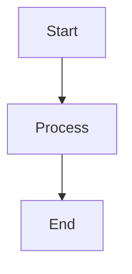

# Northbound Wiki Documentation

## What is this project?

This is the **Northbound Wiki** - internal documentation for an organization building games on the s&box platform. The wiki documents:

- **CoreLib**: Northbound's shared library providing foundational systems for all projects
- **Engineering practices**: How the team works, codes, and collaborates
- **Editor tooling**: Custom tools built on CoreLib's Workbench framework
- **Integration patterns**: How to work with third-party libraries and s&box features

### Audience
Internal team members at Northbound who are:
- Building games using CoreLib
- Contributing to CoreLib itself
- Creating editor tools and extensions
- Learning team conventions and patterns

## Core technical concepts

### CoreLib systems
- **Enhanced Input**: Action-based input system with contexts, bindings, and rebinding support
- **Interaction System**: Discovery-based interactions with validation and UI prompts
- **State & Events**: Centralized observable state and typed event dispatching
- **Definitions**: Data-driven game content authoring with stable IDs and validation
- **Workbench**: Editor framework with working copy pattern, undo/redo, and validation

### Key terminology
- **Definition**: Authored data template (e.g., WeaponDefinition) loaded at runtime
- **Stable ID**: Unique identifier that persists (format: `{category}_{name}`)
- **Working Copy**: Editable copy of data with change tracking before save
- **Context**: Collection of input actions active during a game state
- **Interactable**: Object implementing IInteractable that can be interacted with
- **Server-authoritative**: Server owns truth; clients predict and reconcile

### Platform context
- **s&box**: Game development platform by Facepunch (creators of Garry's Mod)
- Built on C# with Unity-like component model
- Network replication and prediction built-in
- Editor tooling uses Razor UI framework

## Documentation structure

### Navigation (docs.json)
- **Home**: Organization overview, philosophy, how we work
- **Handbook**: Engineering principles, coding standards, workflow (git, PRs, releases)
- **CoreLib**: System documentation for all CoreLib features
- **Integrations**: Third-party library usage (GameEvents, etc.)
- **Reference**: Conventions for naming, folder structure, terminology

### Page organization patterns
- **Overview pages**: Introduce concepts with cards showing key features
- **Concepts pages**: Deep dive into terminology and architecture
- **Usage pages**: Practical how-to guides with code examples
- **Debugging pages**: Common issues, debug tools, troubleshooting
- **Best practices**: Patterns, anti-patterns, testing strategies

## Content strategy

### General principles
- Document just enough for user success - not too much, not too little
- Prioritize accuracy and usability over completeness
- Make content evergreen when possible
- Check existing patterns for consistency before adding new content
- Avoid duplication unless done for strategic reasons (like cross-referencing)
- Start by making the smallest reasonable changes

### Writing standards
- **Voice**: Second-person ("you"), active voice, present tense
- **Tone**: Professional but approachable, like an experienced teammate
- **Code examples**: Must be realistic and tested, show both basic and advanced usage
- **Prerequisites**: State requirements at start of procedural content
- **Language tags**: Always specify language for code blocks (csharp, json, mermaid, etc.)

### Component usage patterns

**Use CardGroup/Card for:**
- Feature overviews (what the system provides)
- Comparing options (pros/cons, when to use)
- Related page navigation at bottom of pages

**Use Tabs/Tab for:**
- Alternative approaches (by feature vs by layer)
- Different contexts (client vs server, runtime vs editor)
- Examples showing variations

**Use Steps/Step for:**
- Sequential procedures (setup, migration, release process)
- Getting started guides
- Multi-step workflows

**Use AccordionGroup/Accordion for:**
- Expandable details that might overwhelm the page
- FAQ-style content
- Troubleshooting issues with solutions

**Use Mermaid diagrams for:**
- Architecture relationships (assembly dependencies)
- Flow diagrams (interaction discovery, event dispatch)
- State machines (input contexts)

**Use callouts (Note/Warning/Info/Tip) for:**
- Important caveats or gotchas
- Best practice recommendations
- Common mistakes to avoid

## Technical conventions

### Code patterns
```csharp
// CoreLib uses these naming conventions:
public class WeaponDefinition : Definition  // PascalCase classes
public interface IInteractable             // I prefix for interfaces
private float _currentHealth;              // _camelCase for private fields
public float MaxHealth { get; set; }       // PascalCase properties
public void ApplyDamage(float amount)      // PascalCase methods, camelCase params
```

### Definition ID format
```
{category}_{name}
weapon_pistol
item_health_pack
ability_fireball
```

### Namespace mapping
Namespaces match folder structure:
- `CoreLib/Runtime/Input/` → `namespace CoreLib.Input`
- `MyGame/code/Runtime/Player/` → `namespace MyGame.Player`

### Assembly organization
- `CoreLib.Runtime.asmdef` - Runtime systems
- `CoreLib.Editor.asmdef` - Editor tooling
- `Game.Runtime.asmdef` - Game code (references CoreLib.Runtime)
- `Game.Editor.asmdef` - Game editor tools (references CoreLib.Editor)

## Mintlify requirements

### Frontmatter (required on ALL pages)
```yaml
---
title: "Page Title"
icon: "icon-name"  # FontAwesome icon
description: "Brief description for SEO and navigation"
---
```

### File format
- **Format**: MDX (Markdown + React components)
- **File naming**: Match page path in docs.json (e.g., `corelib/input/overview.mdx`)
- **Internal links**: Use relative paths (`/handbook/code-style`, not absolute URLs)
- **Images**: Include alt text for accessibility

### Common Mintlify components
```mdx
<CardGroup cols={2}>
  <Card title="Title" icon="icon-name" href="/path">
    Description
  </Card>
</CardGroup>

<Tabs>
  <Tab title="Option 1">Content</Tab>
  <Tab title="Option 2">Content</Tab>
</Tabs>

<Steps>
  <Step title="First step">Details</Step>
  <Step title="Second step">Details</Step>
</Steps>

<AccordionGroup>
  <Accordion title="Question" icon="icon-name">
    Answer
  </Accordion>
</AccordionGroup>

<Note>Helpful information</Note>
<Warning>Important caveat</Warning>
<Info>Additional context</Info>
<Tip>Best practice</Tip>
```

### Mermaid diagrams


## Git workflow

### Branch strategy
- **main**: Stable release branch
- **feature/{name}**: New features and content
- **fix/{name}**: Bug fixes
- **docs/{name}**: Documentation updates

### Commit conventions
```
type(scope): brief description

Longer explanation if needed

Co-Authored-By: Claude Sonnet 4.5 <noreply@anthropic.com>
```

Types: feat, fix, docs, style, refactor, test, chore

### Important rules
- NEVER use `--no-verify` when committing
- NEVER skip or disable pre-commit hooks
- Ask how to handle uncommitted changes before starting work
- Create a new branch when no clear branch exists for changes
- Commit frequently throughout development

## Working relationship

### Collaboration principles
- Push back on ideas when you have better suggestions - cite sources and explain reasoning
- ALWAYS ask for clarification rather than making assumptions about technical details
- NEVER lie, guess, or make up information about CoreLib APIs or s&box features
- If unsure about CoreLib implementation details, ask the user or note it as a placeholder

### When editing pages
1. Read the existing page first to understand current content
2. Check related pages for consistency in terminology and patterns
3. Look at similar pages for formatting conventions
4. Make incremental changes rather than complete rewrites (unless requested)
5. Preserve accurate technical information even when improving formatting

## Common pitfalls to avoid

### Don't
- Skip frontmatter on any MDX file
- Use absolute URLs for internal links
- Include untested or theoretical code examples
- Make assumptions about CoreLib implementation without checking
- Add unnecessary complexity (keep it simple)
- Over-engineer solutions or add speculative features
- Create new pages when editing existing ones would suffice

### Do
- Reference existing pages as examples when creating new content
- Use consistent terminology from `reference/terminology.mdx`
- Follow naming conventions from `reference/naming.mdx`
- Check folder structure conventions in `reference/folder-structure.mdx`
- Link to related pages at the bottom of content pages
- Keep code examples focused and practical

## Quick reference

### File locations
- Navigation config: `docs.json`
- Homepage: `index.mdx`
- Handbook: `handbook/*.mdx`
- CoreLib docs: `corelib/**/*.mdx`
- Editor docs: `editor/**/*.mdx`
- Reference: `reference/*.mdx`

### Key concepts to understand
- CoreLib is the shared foundation library
- Definitions are data-driven content with stable IDs
- Workbench is the editor framework
- Server-authoritative architecture for networking
- Input uses contexts and action bindings
- Interactions use discovery and validation

### When in doubt
- Check existing pages for patterns
- Ask the user for clarification on technical details
- Start with minimal changes
- Reference the actual codebase patterns (don't invent)
