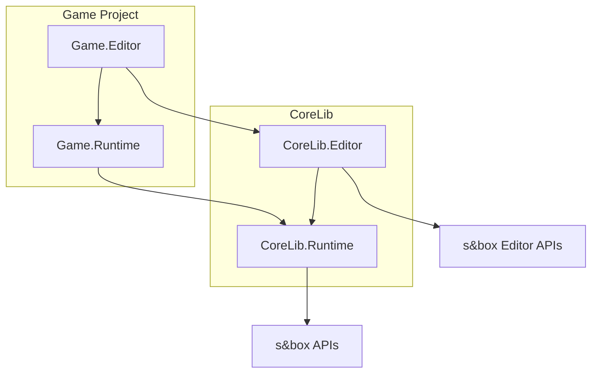
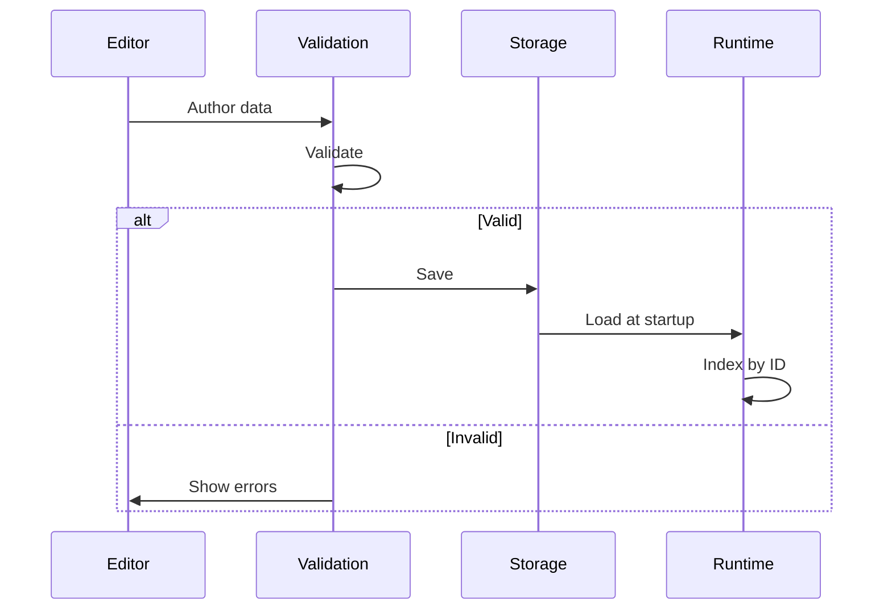
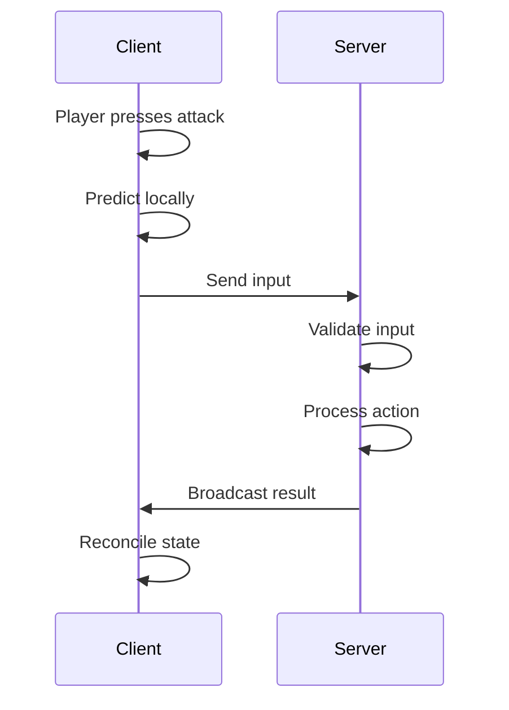

<Info>
This page explains the high-level architecture of CoreLib, including how systems are organised and the patterns they follow.
</Info>

---

## Assembly structure

CoreLib is split into multiple assemblies to enforce clean separation:



<CardGroup cols={2}>
  <Card title="CoreLib.Runtime" icon="play">
    - Gameplay systems (input, interactions, state)
    - Definition types and loading
    - No editor dependencies
  </Card>
  <Card title="CoreLib.Editor" icon="window">
    - Workbench framework
    - System-specific editors
    - Debug and inspection tools
  </Card>
</CardGroup>

<Warning>
Runtime code must **never** reference editor assemblies. This is enforced by assembly definitions.
</Warning>

---

## Layer architecture

Every CoreLib system follows a consistent three-layer architecture:

<Tabs>
  <Tab title="Data layer">
    **Definitions and configuration**

    ```csharp
    public class InputActionDefinition : Definition
    {
        public string Id { get; set; }
        public string DisplayName { get; set; }
        public InputType Type { get; set; }
        public List<InputBinding> DefaultBindings { get; set; }
    }
    ```

    - Pure data, no behaviour
    - Authored in the editor
    - Serialised and loaded at runtime
    - Validated at authoring time
  </Tab>
  <Tab title="Runtime layer">
    **Behaviour and execution**

    ```csharp
    public class InputSystem
    {
        public bool IsActionPressed(string actionId)
        {
            var action = _actions[actionId];
            return action.CurrentState.IsPressed;
        }

        public void ProcessFrame()
        {
            foreach (var action in _activeActions)
            {
                action.Update();
            }
        }
    }
    ```

    - Consumes validated definition data
    - Implements runtime behaviour
    - Server-authoritative where applicable
    - Performance-conscious
  </Tab>
  <Tab title="Editor layer">
    **Authoring and tooling**

    ```csharp
    public class InputEditorApp : WorkbenchApp
    {
        protected override void BuildUI()
        {
            // Input authoring UI
        }

        protected override void OnValidate(ValidationContext context)
        {
            // Real-time validation
        }
    }
    ```

    - Visual authoring tools
    - Real-time validation
    - Debug visualisation
    - Built on Workbench framework
  </Tab>
</Tabs>

---

## System architecture pattern

All major CoreLib systems share this structure:

```
System/
├── Definitions/
│   ├── SystemDefinition.cs        # Data types
│   └── SystemConfig.cs            # Configuration
├── Runtime/
│   ├── SystemManager.cs           # Main runtime class
│   ├── SystemContext.cs           # Runtime state
│   └── Internal/                  # Implementation details
├── Editor/
│   ├── SystemEditorApp.cs         # Workbench app
│   ├── Inspectors/                # Custom inspectors
│   └── Validation/                # Validation rules
└── Shared/
    └── SystemConstants.cs         # Shared constants
```

### Key classes

| Class type | Purpose | Location |
|-----------|---------|----------|
| Definition | Data container | Runtime |
| Manager | Runtime orchestration | Runtime |
| Context | Current state | Runtime |
| EditorApp | Authoring UI | Editor |
| Validator | Data validation | Editor |

---

## Data flow



<Note>
Data flows from editor → storage → runtime. Runtime never writes back to definitions.
</Note>

---

## Server-client architecture

For networked systems, CoreLib follows a server-authoritative model:

<CardGroup cols={2}>
  <Card title="Server" icon="server" color="#16A34A">
    - Owns game state
    - Processes all actions
    - Validates inputs
    - Broadcasts state
  </Card>
  <Card title="Client" icon="display" color="#3B82F6">
    - Collects input
    - Predicts outcomes
    - Renders state
    - Reconciles with server
  </Card>
</CardGroup>



---

## Definition system

All authored data uses the Definition system:

<Tabs>
  <Tab title="Base class">
    ```csharp
    public abstract class Definition
    {
        /// <summary>
        /// Stable identifier for this definition.
        /// </summary>
        public string Id { get; set; }

        /// <summary>
        /// Called after loading to resolve references.
        /// </summary>
        public virtual void OnLoaded() { }
    }
    ```
  </Tab>
  <Tab title="Registry">
    ```csharp
    public static class Definitions
    {
        public static T Get<T>(string id) where T : Definition;
        public static bool TryGet<T>(string id, out T definition);
        public static IEnumerable<T> GetAll<T>() where T : Definition;
    }
    ```
  </Tab>
  <Tab title="Usage">
    ```csharp
    // At runtime
    var weaponDef = Definitions.Get<WeaponDefinition>("weapon_pistol");

    // Safe lookup
    if (Definitions.TryGet<ItemDefinition>(itemId, out var item))
    {
        // Use item
    }
    ```
  </Tab>
</Tabs>

See [Definitions Overview](/corelib/definitions/overview) for details.

---

## Event system

CoreLib provides a typed event system for decoupled communication:

```csharp
// Define an event
public struct PlayerDamagedEvent
{
    public Player Player;
    public float Damage;
    public DamageSource Source;
}

// Subscribe
Events.On<PlayerDamagedEvent>(OnPlayerDamaged);

// Dispatch
Events.Dispatch(new PlayerDamagedEvent
{
    Player = player,
    Damage = 25f,
    Source = DamageSource.Weapon
});
```

See [Events](/corelib/state/events) for details.

---

## Extension points

CoreLib is designed to be extended by game code:

<AccordionGroup>
  <Accordion title="Custom definitions" icon="file-plus">
    Create game-specific definition types:

    ```csharp
    public class WeaponDefinition : Definition
    {
        public float Damage { get; set; }
        public float FireRate { get; set; }
        public string ModelPath { get; set; }
    }
    ```
  </Accordion>

  <Accordion title="System hooks" icon="plug">
    Hook into system events:

    ```csharp
    InputSystem.OnContextChanged += HandleContextChange;
    InteractionSystem.OnInteractionStarted += HandleInteraction;
    ```
  </Accordion>

  <Accordion title="Editor extensions" icon="window">
    Build on Workbench for custom tools:

    ```csharp
    public class WeaponEditorApp : WorkbenchApp
    {
        // Custom weapon authoring
    }
    ```
  </Accordion>

  <Accordion title="Validation rules" icon="shield">
    Add custom validation:

    ```csharp
    [ValidationRule(typeof(WeaponDefinition))]
    public class WeaponValidation : IValidationRule
    {
        public void Validate(ValidationContext context)
        {
            // Custom validation logic
        }
    }
    ```
  </Accordion>
</AccordionGroup>

---

## Performance considerations

<CardGroup cols={2}>
  <Card title="Definition caching" icon="database">
    All definitions are loaded and indexed once at startup
  </Card>
  <Card title="Object pooling" icon="recycle">
    Frequently used objects are pooled to avoid allocation
  </Card>
  <Card title="Lazy initialisation" icon="clock">
    Systems initialise on first use where appropriate
  </Card>
  <Card title="Update batching" icon="layer-group">
    Updates are batched for efficiency
  </Card>
</CardGroup>

See [Performance Philosophy](/handbook/performance-philosophy) for more.

---

## Summary

<CardGroup cols={3}>
  <Card title="Layered" icon="layer-group">
    Data, Runtime, Editor separation
  </Card>
  <Card title="Validated" icon="shield">
    Errors caught at authoring time
  </Card>
  <Card title="Extensible" icon="puzzle-piece">
    Clear extension points
  </Card>
</CardGroup>

---

## Related pages

<CardGroup cols={2}>
  <Card title="Using CoreLib" icon="download" href="/corelib/using-corelib">
    Setting up CoreLib in your project
  </Card>
  <Card title="Architecture Conventions" icon="sitemap" href="/handbook/architecture-conventions">
    Broader architectural patterns
  </Card>
</CardGroup>
