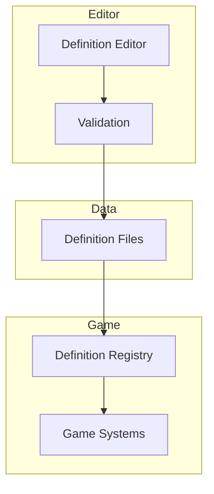

<Info>
The **Definitions** system provides a framework for type-safe, validated data authoring with stable identifiers.
</Info>

---

## What are Definitions?

Definitions are authored data objects that describe game content:

<CardGroup cols={2}>
  <Card title="Weapons" icon="gun">
    Damage, fire rate, magazine size
  </Card>
  <Card title="Items" icon="box">
    Properties, effects, icons
  </Card>
  <Card title="Abilities" icon="wand-magic-sparkles">
    Cooldowns, costs, effects
  </Card>
  <Card title="NPCs" icon="user">
    Stats, behavior, drops
  </Card>
</CardGroup>

---

## Why use Definitions?

<Tabs>
  <Tab title="Without Definitions">
    ```csharp
    // Scattered, error-prone, hard to tune
    public class Pistol : Weapon
    {
        public override float Damage => 25f;
        public override float FireRate => 2f;
        public override int MagazineSize => 12;
        public override string ModelPath => "models/pistol.vmdl";
    }

    // Every weapon needs a new class
    // Changing values requires code changes
    // No validation until runtime
    ```
  </Tab>
  <Tab title="With Definitions">
    ```csharp
    // Clean, validated, data-driven
    public class WeaponDefinition : Definition
    {
        public float Damage { get; set; }
        public float FireRate { get; set; }
        public int MagazineSize { get; set; }
        public string ModelPath { get; set; }
    }

    // Usage
    var pistol = Definitions.Get<WeaponDefinition>("weapon_pistol");
    ApplyDamage(pistol.Damage);

    // Data authored in editor
    // Validated at authoring time
    // Easy to tune and iterate
    ```
  </Tab>
</Tabs>

---

## Core concepts



<AccordionGroup>
  <Accordion title="Definition classes" icon="code">
    C# classes that define the shape of your data:

    ```csharp
    public class ItemDefinition : Definition
    {
        public string DisplayName { get; set; }
        public string Icon { get; set; }
        public int MaxStack { get; set; }
        public ItemRarity Rarity { get; set; }
    }
    ```
  </Accordion>

  <Accordion title="Stable IDs" icon="fingerprint">
    Unique identifiers that don't change:

    - Referenced by ID, not index
    - Survive data restructuring
    - Safe for saves/networking
  </Accordion>

  <Accordion title="Validation" icon="shield">
    Catch errors at authoring time:

    - Required fields
    - Value ranges
    - Reference integrity
    - Custom rules
  </Accordion>

  <Accordion title="Registry" icon="database">
    Runtime access to definitions:

    ```csharp
    var def = Definitions.Get<ItemDefinition>("item_healthpack");
    ```
  </Accordion>
</AccordionGroup>

---

## Quick example

### Define the type

```csharp
public class WeaponDefinition : Definition
{
    [Required]
    public string DisplayName { get; set; }

    [Range(1, 1000)]
    public float Damage { get; set; }

    [Range(0.1f, 10f)]
    public float FireRate { get; set; }

    [Range(1, 100)]
    public int MagazineSize { get; set; }

    [AssetPath("models/*.vmdl")]
    public string ModelPath { get; set; }

    [Reference(typeof(AmmoDefinition))]
    public string AmmoTypeId { get; set; }
}
```

### Author in editor

Create definitions using the editor tools with validation feedback.

### Use at runtime

```csharp
public class Weapon
{
    private WeaponDefinition _definition;

    public Weapon(string definitionId)
    {
        _definition = Definitions.Get<WeaponDefinition>(definitionId);
    }

    public void Fire()
    {
        // Use definition data
        SpawnProjectile(_definition.Damage);
        PlayAnimation(_definition.FireRate);
    }
}
```

---

## Features

| Feature | Description |
|---------|-------------|
| **Type safety** | Compile-time checking for definition types |
| **Validation** | Attribute-based and custom validation |
| **References** | Type-safe references between definitions |
| **Inheritance** | Base definitions with overrides |
| **Localisation** | Integrated text localisation |
| **Versioning** | Migration support for schema changes |

---

## In this section

<CardGroup cols={2}>
  <Card title="Stable IDs" icon="fingerprint" href="/corelib/definitions/stable-ids">
    Understanding and using stable identifiers
  </Card>
  <Card title="Authoring" icon="pen" href="/corelib/definitions/authoring">
    Creating definition types and data
  </Card>
  <Card title="Validation" icon="shield" href="/corelib/definitions/validation">
    Validating definition data
  </Card>
</CardGroup>
