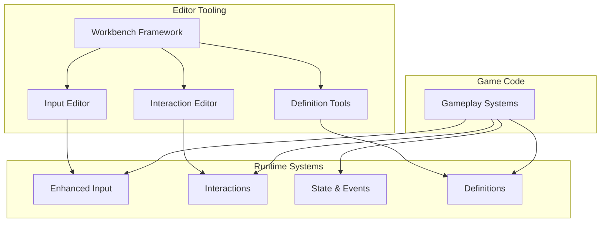

<Info>
**CoreLib** is Northbound's shared library that provides foundational systems for building games on s&box.
</Info>

---

## What is CoreLib?

CoreLib is a collection of **reusable systems** that solve common game development problems:

<CardGroup cols={2}>
  <Card title="Enhanced Input" icon="gamepad" href="/corelib/input/overview">
    Contextual, rebindable input handling with editor tooling
  </Card>
  <Card title="Interactions" icon="hand-pointer" href="/corelib/interactions/overview">
    Player-world interaction system with discovery and validation
  </Card>
  <Card title="State & Events" icon="database" href="/corelib/state/overview">
    Shared state management and event dispatching
  </Card>
  <Card title="Definitions" icon="file-code" href="/corelib/definitions/overview">
    Type-safe data authoring with stable IDs
  </Card>
</CardGroup>

Plus comprehensive **editor tooling** built on a shared [Workbench](/editor/workbench/overview) framework.

---

## Why CoreLib exists

<Tabs>
  <Tab title="Problem">
    Without shared infrastructure, each game project would:
    - Solve the same problems differently
    - Accumulate technical debt
    - Have inconsistent patterns
    - Duplicate tooling effort
  </Tab>
  <Tab title="Solution">
    CoreLib provides:
    - Battle-tested implementations
    - Consistent patterns across projects
    - Shared editor tooling
    - Documented conventions
  </Tab>
</Tabs>

<Note>
CoreLib is **not** a general-purpose framework. It's designed for Northbound's specific needs and conventions.
</Note>

---

## Core principles

<AccordionGroup>
  <Accordion title="Editor-first" icon="window">
    Systems that benefit from authoring have proper editor tooling. No "edit the JSON" workflows.
  </Accordion>

  <Accordion title="Data vs behaviour" icon="split">
    Data is authored and validated in the editor. Behaviour lives in code. These concerns are separated.
  </Accordion>

  <Accordion title="Server-authoritative" icon="server">
    Gameplay-affecting systems treat the server as the source of truth. Clients handle prediction and presentation.
  </Accordion>

  <Accordion title="Validation-first" icon="shield">
    Errors are caught at authoring time, not runtime. Invalid states are prevented where possible.
  </Accordion>

  <Accordion title="Clean APIs" icon="broom">
    Complex internals are acceptable if they enable simple, explicit external APIs.
  </Accordion>
</AccordionGroup>

---

## System overview

---

## Getting started

<Steps>
  <Step title="Understand the architecture">
    Read how CoreLib is structured and the patterns it uses.

    <Card title="CoreLib Architecture" icon="diagram-project" href="/corelib/architecture" horizontal />
  </Step>

  <Step title="Set up your project">
    Learn how to add CoreLib to a game project.

    <Card title="Using CoreLib" icon="download" href="/corelib/using-corelib" horizontal />
  </Step>

  <Step title="Explore specific systems">
    Dive into the systems relevant to your work.

    <CardGroup cols={2}>
      <Card title="Enhanced Input" icon="gamepad" href="/corelib/input/overview" />
      <Card title="Interactions" icon="hand-pointer" href="/corelib/interactions/overview" />
    </CardGroup>
  </Step>
</Steps>

---

## What CoreLib is NOT

<Warning>
CoreLib has a specific scope. It does not replace or duplicate s&box functionality.
</Warning>

| CoreLib handles | s&box handles |
|-----------------|---------------|
| Input abstraction & rebinding | Raw input APIs |
| Interaction discovery | Basic component system |
| Shared state patterns | Networking fundamentals |
| Data definition validation | Asset loading |

We build **on top of** s&box, not alongside it.

---

## Contributing to CoreLib

Improvements to CoreLib benefit all projects. When making changes:

<CardGroup cols={2}>
  <Card title="Understand the pillars" icon="compass" href="/handbook/pillars">
    Changes should align with our engineering principles
  </Card>
  <Card title="Document your changes" icon="book" href="/handbook/commits-and-prs">
    Update this wiki alongside code changes
  </Card>
</CardGroup>

See [How We Work](/home/how-we-work) for more on our CoreLib-first mindset.

---

## Quick links

<CardGroup cols={3}>
  <Card title="Input System" icon="gamepad" href="/corelib/input/overview">
    Contextual input handling
  </Card>
  <Card title="Interactions" icon="hand-pointer" href="/corelib/interactions/overview">
    Player-world interactions
  </Card>
  <Card title="State & Events" icon="database" href="/corelib/state/overview">
    Shared state management
  </Card>
  <Card title="Definitions" icon="file-code" href="/corelib/definitions/overview">
    Type-safe data authoring
  </Card>
  <Card title="Workbench" icon="wrench" href="/editor/workbench/overview">
    Editor framework
  </Card>
  <Card title="Debug Tools" icon="bug" href="/editor/extending/debug-tools">
    Runtime debugging
  </Card>
</CardGroup>
