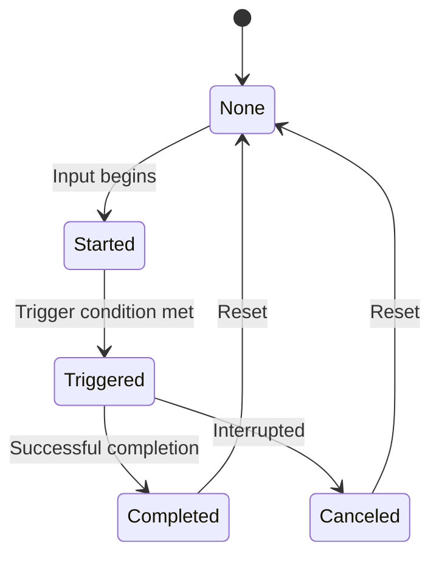

Actions are the core building blocks of Enhanced Input. Each action represents a named input operation with a typed value.

---

## Action types

Enhanced Input provides four typed action handles:

<CardGroup cols={2}>
  <Card title="BoolAction" icon="toggle-on">
    **Boolean state actions**

    Use for buttons and digital inputs

    Examples: Jump, Fire, Interact, Menu Select
  </Card>
  <Card title="FloatAction" icon="gauge">
    **Single-axis analog actions**

    Use for 1D analog inputs

    Examples: Trigger pressure, Scroll wheel, Throttle
  </Card>
  <Card title="Vector2Action" icon="arrows-up-down-left-right">
    **Two-axis actions**

    Use for 2D movement and look

    Examples: WASD movement, Mouse look, Left stick
  </Card>
  <Card title="Vector3Action" icon="cube">
    **Three-axis actions**

    Use for 3D positioning

    Examples: Flight controls, VR controller position
  </Card>
</CardGroup>

---

## Creating actions

Actions are defined as GameResource assets in the editor:

<Steps>
  <Step title="Open Input Editor">
    Open the **Input Editor** window (search for "Input Editor" in the tool menu).

    The Input Editor has two main docks:
    - **Asset Browser** (left) - Browse and create actions/contexts
    - **Inspector** (right) - Configure selected asset
  </Step>

  <Step title="Create action">
    In the **Asset Browser** dock (left side):
    1. Find the **Actions** section
    2. Click the **+** button next to "Actions"
    3. Type a name (e.g., "jump") and press Enter
  </Step>

  <Step title="Configure properties">
    In the **Inspector** dock (right side):

    | Property | Description |
    |----------|-------------|
    | **Name** | Action identifier (e.g., "jump") |
    | **S&box Action** | Native s&box input action to read from |
    | **Value Type** | Bool, Float, Vector2, or Vector3 |
    | **Modifiers** | Transform pipeline (optional) |
    | **Triggers** | Activation conditions (optional) |
  </Step>

  <Step title="Save">
    Press **Ctrl+S** to save. This automatically generates type-safe handles.
  </Step>
</Steps>

---

## Typed handles

After code generation, you get strongly-typed handles:

```csharp
public static partial class EnhancedInput
{
    // BoolAction
    public static BoolAction Jump { get; } = new("jump");
    public static BoolAction Fire { get; } = new("fire");

    // FloatAction
    public static FloatAction Accelerate { get; } = new("accelerate");

    // Vector2Action
    public static Vector2Action Move { get; } = new("move");
    public static Vector2Action Look { get; } = new("look");

    // Vector3Action
    public static Vector3Action FlightStick { get; } = new("flight_stick");
}
```

<Tip>
**Benefits of typed handles:**
- IntelliSense support
- Compile-time type checking
- Refactoring safety
- No string typos
</Tip>

---

## Action phases

Actions progress through distinct phases during their lifecycle:



<AccordionGroup>
  <Accordion title="None" icon="circle" iconType="regular">
    **No active input**

    The default/idle state. Action is not being triggered.
  </Accordion>

  <Accordion title="Started" icon="play">
    **Initial activation**

    Fires on the first frame of press/activation. Always fires exactly once per activation.
  </Accordion>

  <Accordion title="Triggered" icon="bolt">
    **Main event**

    When the trigger condition is met. Behavior depends on trigger type:
    - **Press**: Fires once
    - **Hold**: Fires after hold duration (optionally repeats)
    - **Tap**: Fires on successful quick press
    - **DoubleTap**: Fires on second tap
  </Accordion>

  <Accordion title="Completed" icon="check">
    **Successful completion**

    Fired when an action completes successfully:
    - Hold finishes
    - Tap succeeds
    - Button released (Released trigger)
  </Accordion>

  <Accordion title="Canceled" icon="xmark">
    **Interrupted or failed**

    Fired when an action is interrupted:
    - Released too early (Hold, Tap)
    - Second tap too late (DoubleTap)
    - Chord condition broken (Chorded)
  </Accordion>
</AccordionGroup>

---

## Accessing values

Each action type provides typed value access:

<Tabs>
  <Tab title="BoolAction">
    ```csharp
    BoolAction jump = EnhancedInput.Jump;

    // Value access
    bool isActive = jump.Value;        // Currently active
    bool isHeld = jump.IsActive;       // Same as Value

    // Phase queries
    bool started = jump.Started;       // First frame
    bool triggered = jump.Triggered;   // Trigger fired
    bool completed = jump.Completed;   // Just completed
    bool canceled = jump.Canceled;     // Just canceled

    // Timing
    float holdTime = jump.HoldTime;    // Seconds held
    InputActionPhase phase = jump.Phase;
    ```
  </Tab>

  <Tab title="FloatAction">
    ```csharp
    FloatAction accelerate = EnhancedInput.Accelerate;

    // Value access
    float value = accelerate.Value;    // 0.0 to 1.0 (or -1.0 to 1.0)

    // Phase queries (same as BoolAction)
    bool started = accelerate.Started;
    bool triggered = accelerate.Triggered;

    // Timing
    float holdTime = accelerate.HoldTime;
    ```
  </Tab>

  <Tab title="Vector2Action">
    ```csharp
    Vector2Action move = EnhancedInput.Move;

    // Value access
    Vector2 value = move.Value;        // (-1,-1) to (1,1)
    float x = move.Value.x;
    float y = move.Value.y;

    // Phase queries
    bool started = move.Started;
    bool triggered = move.Triggered;

    // Timing
    float holdTime = move.HoldTime;
    ```
  </Tab>

  <Tab title="Vector3Action">
    ```csharp
    Vector3Action flight = EnhancedInput.FlightStick;

    // Value access
    Vector3 value = flight.Value;      // 3D vector
    float x = flight.Value.x;
    float y = flight.Value.y;
    float z = flight.Value.z;

    // Phase queries (same as others)
    bool started = flight.Started;
    bool triggered = flight.Triggered;
    ```
  </Tab>
</Tabs>

---

## Events vs polling

Enhanced Input supports both event-driven and polling patterns:

<Tabs>
  <Tab title="Events (Recommended)">
    **Use events for discrete actions** (jump, shoot, interact):

    ```csharp
    public class PlayerController : InputComponent
    {
        protected override void RegisterInputBindings()
        {
            // Event callbacks
            Bind(EnhancedInput.Jump).OnTriggered(OnJump);
            Bind(EnhancedInput.Fire).OnTriggered(OnFire);
            Bind(EnhancedInput.Interact).OnTriggered(OnInteract);

            // Multiple phases
            Bind(EnhancedInput.ChargeAttack)
                .OnStarted(OnChargeStart)
                .OnCompleted(OnChargeRelease)
                .OnCanceled(OnChargeCancel);
        }

        void OnJump() { /* ... */ }
        void OnFire() { /* ... */ }
    }
    ```

    **Benefits:**
    - No missed inputs (called exactly once per event)
    - Clear separation of concerns
    - Automatic lifecycle management with InputComponent
  </Tab>

  <Tab title="Polling">
    **Use polling for continuous state** (movement, camera, aim):

    ```csharp
    public class PlayerController : Component
    {
        protected override void OnUpdate()
        {
            // Continuous state - poll every frame
            var moveInput = EnhancedInput.Move.Value;
            var lookInput = EnhancedInput.Look.Value;

            CharacterController.Move(moveInput * MoveSpeed * Time.Delta);
            CameraController.Rotate(lookInput * LookSensitivity * Time.Delta);

            // Digital state polling
            if (EnhancedInput.Fire.IsActive)
            {
                ContinueFiring(); // Called every frame while held
            }
        }
    }
    ```

    **Use when:**
    - Need per-frame updates
    - Continuous/analog state
    - Camera or movement control
  </Tab>
</Tabs>

<Info>
**Rule of thumb:**
- **Events**: Discrete actions (jump, shoot, menu navigation)
- **Polling**: Continuous state (movement, camera, analog aim)
</Info>

---

## Event API

All action types share a common event API:

```csharp
// Phase-specific events
action.OnStarted += () => { /* First frame */ };
action.OnTriggered += () => { /* Trigger fired */ };
action.OnCompleted += () => { /* Success */ };
action.OnCanceled += () => { /* Interrupted */ };

// Generic event with full data
action.OnEvent += (InputActionEvent evt) =>
{
    Log.Info($"Phase: {evt.Phase}, Value: {evt.Value}, HoldTime: {evt.HoldTime}");
};
```

### InputActionEvent struct

```csharp
public readonly struct InputActionEvent
{
    string ActionName { get; }           // "jump"
    InputActionPhase Phase { get; }      // Started, Triggered, etc.
    InputValue Value { get; }            // Typed value
    float Timestamp { get; }             // Time.Now
    float HoldTime { get; }              // Duration held
    bool IsActive { get; }               // Non-zero value
}
```

---

## Common API

All action types implement this common interface:

```csharp
// Phase state (polling)
bool Started { get; }         // True on first frame
bool Triggered { get; }       // True when triggered
bool Completed { get; }       // True on completion
bool Canceled { get; }        // True when canceled

// Current state
InputActionPhase Phase { get; }  // Current phase
float HoldTime { get; }          // Time held (seconds)
bool IsActive { get; }           // Has non-zero value

// Events
event Action OnStarted;
event Action OnTriggered;
event Action OnCompleted;
event Action OnCanceled;
event Action<InputActionEvent> OnEvent;
```

---

## Usage patterns

<AccordionGroup>
  <Accordion title="Simple button press" icon="hand-pointer">
    ```csharp
    protected override void RegisterInputBindings()
    {
        Bind(EnhancedInput.Jump).OnTriggered(Jump);
    }

    void Jump()
    {
        if (IsGrounded)
            Velocity += Vector3.Up * JumpForce;
    }
    ```
  </Accordion>

  <Accordion title="Hold to charge" icon="battery-half">
    ```csharp
    // Configure with Hold trigger in editor (2s duration)
    protected override void RegisterInputBindings()
    {
        Bind(EnhancedInput.ChargeAttack)
            .OnStarted(StartCharge)      // Begin visual
            .OnCompleted(ReleaseCharge)   // Fire at full charge
            .OnCanceled(CancelCharge);   // Released early
    }

    void StartCharge() { /* Show charge effect */ }
    void ReleaseCharge() { /* Fire charged attack */ }
    void CancelCharge() { /* Cancel with feedback */ }
    ```
  </Accordion>

  <Accordion title="Continuous firing" icon="gun">
    ```csharp
    protected override void OnUpdate()
    {
        // Poll for continuous action
        if (EnhancedInput.Fire.IsActive)
        {
            // Called every frame while held
            FireWeapon();
        }
    }
    ```
  </Accordion>

  <Accordion title="Analog movement" icon="arrows-up-down-left-right">
    ```csharp
    protected override void OnUpdate()
    {
        var move = EnhancedInput.Move.Value; // Vector2, already deadzone applied
        var wishVelocity = new Vector3(move.x, 0, move.y) * MoveSpeed;
        CharacterController.Move(wishVelocity * Time.Delta);
    }
    ```
  </Accordion>

  <Accordion title="Query phase state" icon="circle-question">
    ```csharp
    protected override void OnUpdate()
    {
        var jump = EnhancedInput.Jump;

        if (jump.Started)
            Log.Info("Jump just pressed");

        if (jump.Triggered)
            Log.Info("Jump triggered");

        if (jump.Completed)
            Log.Info("Jump completed");

        if (jump.Canceled)
            Log.Info("Jump canceled");
    }
    ```
  </Accordion>
</AccordionGroup>

---

## Static API access

Beyond typed handles, you can use the static `InputApi`:

```csharp
using CoreLib.EnhancedInput.Api;

// Create actions programmatically
BoolAction jump = InputApi.BoolAction("jump");
FloatAction throttle = InputApi.FloatAction("throttle");
Vector2Action move = InputApi.Vector2Action("move");

// Query phase
InputActionPhase phase = InputApi.GetPhase("jump");
float holdTime = InputApi.GetHoldTime("jump");
bool isActive = InputApi.IsActive("jump");

// Query values (typed)
bool pressed = InputApi.GetBool("jump");
float value = InputApi.GetFloat("throttle");
Vector2 moveVec = InputApi.GetVector2("move");

// Subscribe to events
InputApi.AddTriggeredHandler("jump", OnJump);
InputApi.RemoveTriggeredHandler("jump", OnJump);
```

<Warning>
**Prefer typed handles** (`EnhancedInput.Jump`) over string-based API (`InputApi.GetBool("jump")`) for type safety and refactoring support.
</Warning>

---

## Related pages

<CardGroup cols={3}>
  <Card title="Modifiers" icon="sliders" href="/corelib/input/modifiers">
    Transform action values
  </Card>
  <Card title="Triggers" icon="hand-pointer" href="/corelib/input/triggers">
    Control when actions fire
  </Card>
  <Card title="Usage Patterns" icon="code" href="/corelib/input/usage-patterns">
    Real-world examples
  </Card>
</CardGroup>
