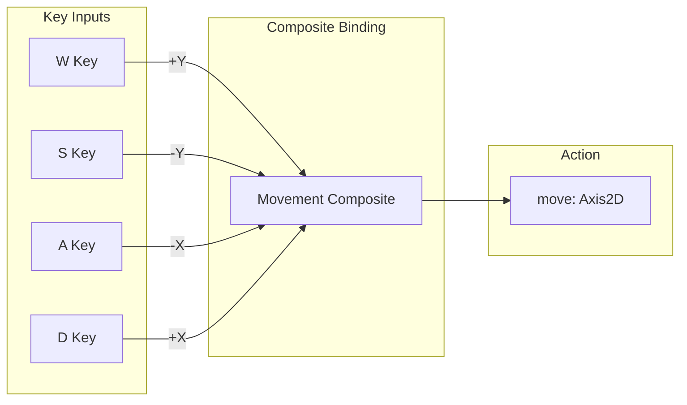
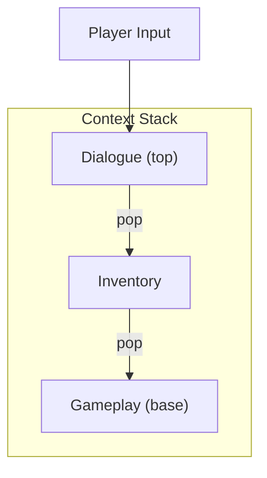
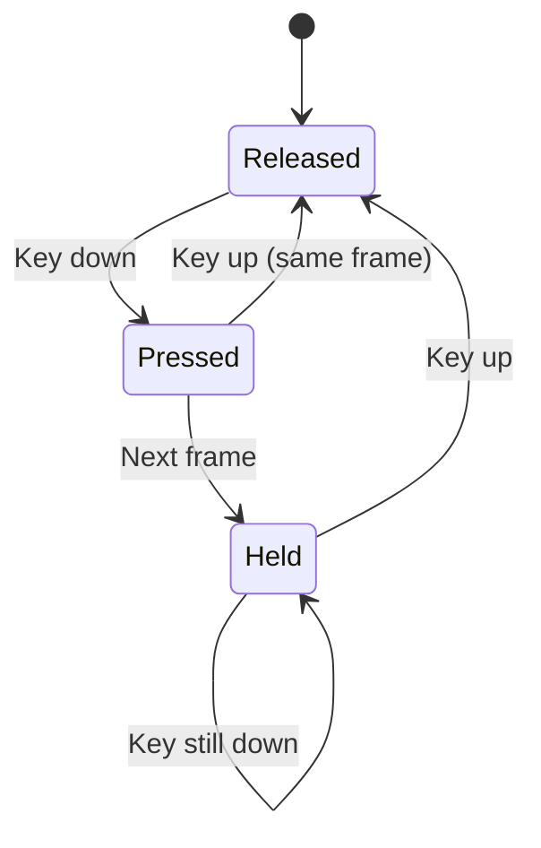

<Info>
This page explains the fundamental concepts of the Enhanced Input system in detail.
</Info>

---

## Input actions

An **Input Action** represents a player intent, independent of how it's triggered.

```csharp
public class InputActionDefinition : Definition
{
    public string Id { get; set; }           // "jump"
    public string DisplayName { get; set; }  // "Jump"
    public InputActionType Type { get; set; } // Digital, Axis1D, Axis2D
}
```

<Tabs>
  <Tab title="Digital actions">
    **On/off state actions**

    - Have pressed, held, released states
    - Examples: Jump, Fire, Interact, Crouch

    ```csharp
    if (InputSystem.IsActionPressed("jump"))  // Just pressed
    if (InputSystem.IsActionHeld("fire"))     // Currently held
    if (InputSystem.IsActionReleased("aim"))  // Just released
    ```
  </Tab>
  <Tab title="Axis actions">
    **Value-based actions**

    - Return continuous values
    - Axis1D: single float (-1 to 1)
    - Axis2D: Vector2 for 2D input

    ```csharp
    float throttle = InputSystem.GetAxis1D("throttle");
    Vector2 move = InputSystem.GetAxis2D("movement");
    Vector2 look = InputSystem.GetAxis2D("look");
    ```
  </Tab>
</Tabs>

---

## Input bindings

A **Binding** connects hardware input to an action.

```csharp
public class InputBinding
{
    public string ActionId { get; set; }     // Which action
    public InputSource Source { get; set; }  // Which key/button
    public List<InputModifier> Modifiers { get; set; } // Shift, Ctrl, etc.
}
```

### Binding types

<CardGroup cols={2}>
  <Card title="Simple binding" icon="keyboard">
    Single key to action

    `Space` → `jump`
  </Card>
  <Card title="Modified binding" icon="plus">
    Key with modifier

    `Shift + Space` → `super_jump`
  </Card>
  <Card title="Composite binding" icon="arrows-up-down-left-right">
    Multiple keys to axis

    `WASD` → `movement`
  </Card>
  <Card title="Multi-binding" icon="layer-group">
    Multiple bindings per action

    `Space` OR `Controller A` → `jump`
  </Card>
</CardGroup>

### Composite bindings

For axis actions, composite bindings combine multiple inputs:



---

## Input contexts

A **Context** defines which actions are active in a given game state.

```csharp
public class InputContextDefinition : Definition
{
    public string Id { get; set; }              // "gameplay"
    public List<string> ActionIds { get; set; } // Active actions
    public bool BlocksLowerContexts { get; set; } // Prevents fall-through
}
```

### Context stacking

Contexts form a stack. The top context is the primary source of input:



<Tabs>
  <Tab title="Blocking contexts">
    ```csharp
    // Menu context blocks gameplay input
    var menuContext = new InputContextDefinition
    {
        Id = "menu",
        BlocksLowerContexts = true  // Gameplay won't receive input
    };
    ```
  </Tab>
  <Tab title="Layered contexts">
    ```csharp
    // HUD context allows gameplay input through
    var hudContext = new InputContextDefinition
    {
        Id = "hud",
        BlocksLowerContexts = false  // Gameplay still works
    };
    ```
  </Tab>
</Tabs>

---

## Input sources

An **Input Source** is a specific hardware input:

| Category | Examples |
|----------|----------|
| **Keyboard** | A, Space, Escape, F1 |
| **Mouse** | LeftButton, RightButton, MouseX, MouseY |
| **Gamepad** | A, B, LeftStick, RightTrigger |

### Source properties

```csharp
public class InputSource
{
    public InputDevice Device { get; set; }     // Keyboard, Mouse, Gamepad
    public string SourceId { get; set; }        // Specific input
    public InputSourceType SourceType { get; set; } // Digital, Axis
}
```

---

## Modifiers

**Modifiers** alter how bindings work:

<AccordionGroup>
  <Accordion title="Key modifiers" icon="keyboard">
    Require additional keys to be held:

    - Shift + Key
    - Ctrl + Key
    - Alt + Key

    ```csharp
    new InputBinding
    {
        ActionId = "sprint",
        Source = new InputSource("Keyboard", "W"),
        Modifiers = { new KeyModifier("Shift") }
    };
    ```
  </Accordion>

  <Accordion title="Dead zones" icon="circle">
    Filter out small axis movements:

    ```csharp
    new InputBinding
    {
        ActionId = "move",
        Source = new InputSource("Gamepad", "LeftStick"),
        Modifiers = { new DeadZone(0.15f) }
    };
    ```
  </Accordion>

  <Accordion title="Scale" icon="up-right-and-down-left-from-center">
    Multiply axis values:

    ```csharp
    new InputBinding
    {
        ActionId = "look",
        Source = new InputSource("Mouse", "Delta"),
        Modifiers = { new Scale(sensitivity) }
    };
    ```
  </Accordion>

  <Accordion title="Invert" icon="rotate">
    Flip axis direction:

    ```csharp
    new InputBinding
    {
        ActionId = "look_y",
        Source = new InputSource("Mouse", "DeltaY"),
        Modifiers = { new Invert() }  // Inverted Y-axis
    };
    ```
  </Accordion>
</AccordionGroup>

---

## Action states

Digital actions have several queryable states:



| State | Description | Method |
|-------|-------------|--------|
| **Pressed** | Just pressed this frame | `IsActionPressed()` |
| **Held** | Currently held down | `IsActionHeld()` |
| **Released** | Just released this frame | `IsActionReleased()` |
| **Value** | Raw input value | `GetActionValue()` |

---

## Binding resolution

When multiple bindings exist for an action, the system resolves them:

<Steps>
  <Step title="Check active context">
    Only bindings in the active context are considered
  </Step>
  <Step title="Filter by source availability">
    Only bindings for connected devices are active
  </Step>
  <Step title="Apply modifiers">
    Check if required modifiers are satisfied
  </Step>
  <Step title="Combine values">
    For axis actions, combine multiple source values
  </Step>
</Steps>

---

## Binding conflicts

The system detects and handles binding conflicts:

<CardGroup cols={2}>
  <Card title="Same-context conflict" icon="triangle-exclamation" color="#EAB308">
    Two actions bound to same key in same context

    **Resolution:** Warning in editor, undefined behaviour at runtime
  </Card>
  <Card title="Cross-context binding" icon="check" color="#16A34A">
    Same key bound in different contexts

    **Resolution:** Allowed — contexts are mutually exclusive
  </Card>
</CardGroup>

---

## Summary

| Concept | Purpose |
|---------|---------|
| **Action** | What the player wants to do |
| **Binding** | How the player does it |
| **Context** | When actions are available |
| **Source** | Physical input device/key |
| **Modifier** | Alters binding behaviour |

---

## Related pages

<CardGroup cols={2}>
  <Card title="Runtime Usage" icon="code" href="/corelib/input/runtime-usage">
    Using these concepts in code
  </Card>
  <Card title="Input Editor" icon="window" href="/editor/tools/input-editor">
    Authoring in the editor
  </Card>
</CardGroup>
