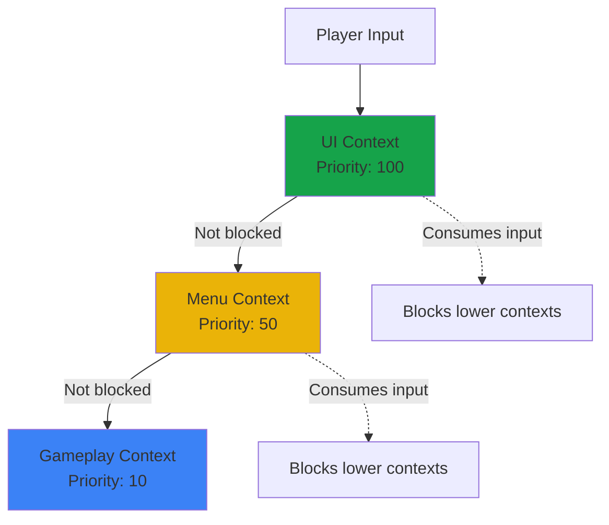
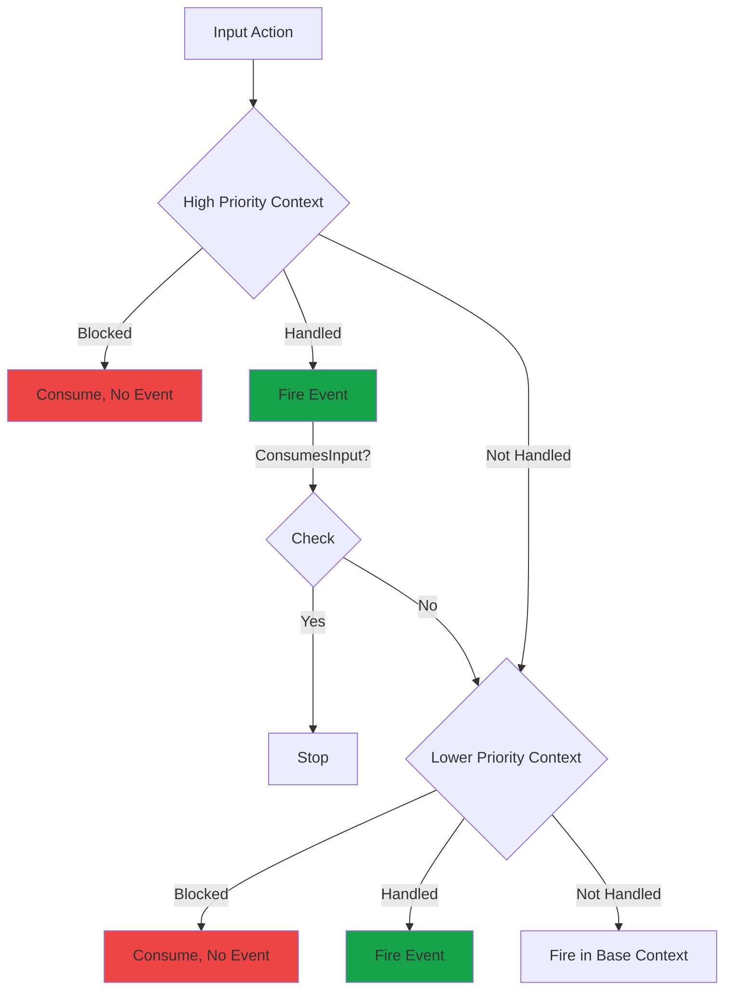

Input contexts organize actions into priority-based groups, enabling automatic input blocking for UI overlays, menus, and game state transitions.

---

## What are contexts?

A **context** is a collection of input actions with a priority level. Contexts are evaluated from highest to lowest priority, allowing UI to automatically block gameplay input.

```csharp
public class InputContext
{
    string Id { get; }                  // Unique identifier
    string Name { get; }                // Display name
    int Priority { get; set; }          // Higher = evaluated first
    bool IsEnabled { get; set; }        // Can be toggled
    bool ConsumesInput { get; set; }    // Blocks lower contexts

    HashSet<string> HandledActions { get; }  // Actions this context handles
    HashSet<string> BlockedActions { get; }  // Actions to consume without firing
}
```

---

## Priority system

Contexts are evaluated from **highest to lowest priority**:



### Recommended priority ranges

<CardGroup cols={3}>
  <Card title="UI Overlays" color="#16A34A">
    **Priority: 100+**

    Inventory, pause menu, dialogs, tooltips

    Should consume input
  </Card>
  <Card title="Modal States" color="#EAB308">
    **Priority: 50-99**

    Main menus, cutscenes, loading screens

    Usually consume input
  </Card>
  <Card title="Gameplay" color="#3B82F6">
    **Priority: 0-49**

    Player control, vehicle control, camera

    Typically don't consume
  </Card>
</CardGroup>

---

## Context evaluation

For each input action, contexts are evaluated in priority order:

<Steps>
  <Step title="Check active contexts">
    Only enabled contexts are considered
  </Step>

  <Step title="Iterate highest to lowest priority">
    Check each context in descending priority order
  </Step>

  <Step title="Check if action is blocked">
    If context has action in `BlockedActions`:
    - Action is consumed (no event dispatched)
    - Evaluation stops
  </Step>

  <Step title="Check if action is handled">
    If context has action in `HandledActions`:
    - Action fires normally
    - If `ConsumesInput = true`, evaluation stops
    - Otherwise, continues to lower contexts
  </Step>

  <Step title="Continue if not handled">
    If no context handled the action, it fires in the base context
  </Step>
</Steps>

### Flow diagram



---

## Creating contexts

### In the editor

<Steps>
  <Step title="Open Input Editor">
    Open the **Input Editor** window (search for "Input Editor" in the tool menu or double-click any `.inputcon` file).
  </Step>

  <Step title="Create context">
    In the **Asset Browser** dock (left side):
    1. Find the **Contexts** section
    2. Click the **+** button next to "Contexts"
    3. Type a name (e.g., "gameplay") and press Enter
  </Step>

  <Step title="Configure properties">
    In the **Inspector** dock (right side):

    | Property | Description |
    |----------|-------------|
    | **Name** | Context identifier (e.g., "gameplay") |
    | **Priority** | Evaluation order (higher = first) |
    | **Actions** | Select actions to include in this context |
    | **Blocked Actions** | Actions to consume without dispatching |
    | **Consumes Input** | Block all lower-priority contexts |
    | **Auto Load** | Load automatically at startup |
    | **Load Order** | Initialization order for auto-loaded contexts |
  </Step>

  <Step title="Save">
    Press **Ctrl+S** to save and auto-generate code.
  </Step>
</Steps>

### Example: Gameplay context

```
Name: gameplay
Priority: 10
Actions: [jump, fire, move, look, interact]
Blocked Actions: []
Consumes Input: false
Auto Load: true
```

### Example: Inventory UI context

```
Name: inventory_ui
Priority: 100
Actions: [menu_select, menu_back, menu_navigate]
Blocked Actions: [jump, fire, interact, reload]
Consumes Input: true
Auto Load: false
```

---

## Managing contexts at runtime

### Push and pop

```csharp
using CoreLib.EnhancedInput.Api;

public class InventoryUI : Component
{
    private InputContext _inventoryContext;
    private IInputService _input;

    protected override void OnStart()
    {
        _input = CoreServiceRegistry.Get<IInputService>();

        // Create context
        _inventoryContext = new InputContext("inventory", 100)
            .WithActions("menu_select", "menu_back")
            .WithBlockedActions("jump", "fire", "interact")
            .WithConsumesInput(true);
    }

    public void Open()
    {
        // Push to stack - now highest priority
        _input.Contexts.Push(_inventoryContext);
    }

    public void Close()
    {
        // Remove from stack
        _input.Contexts.Pop("inventory");
    }
}
```

### Enable and disable

```csharp
// Temporarily disable without removing from stack
_input.Contexts.SetEnabled("gameplay", false);

// Re-enable later
_input.Contexts.SetEnabled("gameplay", true);
```

<Tip>
**Use enable/disable** when you need to temporarily suppress a context without changing the stack order. Useful for cutscenes or temporary overlays.
</Tip>

---

## Context types

<Tabs>
  <Tab title="Global contexts">
    **Auto-loaded, persistent throughout session**

    ```
    Auto Load: true
    Priority: 10
    ```

    ```csharp
    // Automatically loaded by InputModule at startup
    // No manual management needed
    ```

    Use for:
    - Core gameplay controls
    - Always-available actions (pause, console)
    - Base layer input
  </Tab>

  <Tab title="Scoped contexts">
    **Pushed/popped dynamically for temporary states**

    ```
    Auto Load: false
    Priority: 100
    ```

    ```csharp
    // Push when entering state
    _input.Contexts.Push(dialogContext);

    // Pop when exiting state
    _input.Contexts.Pop("dialog");
    ```

    Use for:
    - UI overlays
    - Vehicle controls
    - Special game modes
    - Temporary input states
  </Tab>
</Tabs>

---

## Blocking vs consuming

<Tabs>
  <Tab title="Blocked actions">
    **Specific actions are consumed without firing**

    ```csharp
    var menuContext = new InputContext("menu", 100)
        .WithActions("menu_select", "menu_back")
        .WithBlockedActions("jump", "fire") // Block these specifically
        .WithConsumesInput(false); // Allow other actions through
    ```

    **Result:**
    - `jump` and `fire` → Consumed, no event
    - `menu_select`, `menu_back` → Fire normally
    - Other actions (e.g., `look`) → Pass to lower contexts

    **Use when:** You want to block specific actions but allow others
  </Tab>

  <Tab title="Consumes input">
    **All input is blocked from lower contexts**

    ```csharp
    var pauseMenu = new InputContext("pause", 100)
        .WithActions("menu_select", "menu_back", "menu_navigate")
        .WithConsumesInput(true); // Block everything
    ```

    **Result:**
    - `menu_select`, `menu_back`, `menu_navigate` → Fire normally
    - **All other actions** → Consumed, no event

    **Use when:** You want full input control (pause menu, modal dialog)
  </Tab>
</Tabs>

---

## Common patterns

<AccordionGroup>
  <Accordion title="UI overlay blocking gameplay" icon="layer-group">
    ```csharp
    // Gameplay context (base)
    var gameplayContext = new InputContext("gameplay", 10)
        .WithActions("move", "look", "jump", "fire", "interact");

    // Inventory UI (overlay)
    var inventoryContext = new InputContext("inventory", 100)
        .WithActions("menu_select", "menu_back", "menu_navigate")
        .WithBlockedActions("jump", "fire", "interact") // Block these
        .WithConsumesInput(true); // Block everything else too

    // When inventory opens:
    _input.Contexts.Push(inventoryContext);

    // Result:
    // - Menu actions work
    // - Gameplay actions blocked
    // - Player can't move/shoot while in menu
    ```
  </Accordion>

  <Accordion title="Layered contexts (HUD + gameplay)" icon="layer-group">
    ```csharp
    // Gameplay (base)
    var gameplay = new InputContext("gameplay", 10)
        .WithActions("move", "jump", "fire");

    // HUD (overlay, non-consuming)
    var hud = new InputContext("hud", 50)
        .WithActions("toggle_map", "open_inventory")
        .WithConsumesInput(false); // Don't block gameplay

    // Result:
    // - Both contexts active
    // - HUD actions work
    // - Gameplay actions still work
    ```
  </Accordion>

  <Accordion title="Vehicle mode switching" icon="car">
    ```csharp
    // Player on foot
    var playerContext = new InputContext("player", 10)
        .WithActions("move", "jump", "interact");

    // Player in vehicle
    var vehicleContext = new InputContext("vehicle", 10)
        .WithActions("accelerate", "brake", "steer", "exit_vehicle");

    // When entering vehicle:
    _input.Contexts.SetEnabled("player", false);
    _input.Contexts.Push(vehicleContext);

    // When exiting vehicle:
    _input.Contexts.Pop("vehicle");
    _input.Contexts.SetEnabled("player", true);
    ```
  </Accordion>

  <Accordion title="Cutscene blocking all input" icon="film">
    ```csharp
    var cutsceneContext = new InputContext("cutscene", 200)
        .WithActions("skip_cutscene") // Only allow skip
        .WithConsumesInput(true);      // Block everything else

    // On cutscene start:
    _input.Contexts.Push(cutsceneContext);

    // On cutscene end:
    _input.Contexts.Pop("cutscene");
    ```
  </Accordion>

  <Accordion title="Context stack visualization" icon="bars-staggered">
    ```csharp
    // Stack state:
    // ┌─────────────────────────┐
    // │ Pause Menu (100)        │ ← Active, consumes all
    // ├─────────────────────────┤
    // │ Inventory (100)         │ (Blocked by Pause)
    // ├─────────────────────────┤
    // │ Gameplay (10)           │ (Blocked by Pause)
    // └─────────────────────────┘

    // Close pause menu:
    _input.Contexts.Pop("pause");

    // New stack state:
    // ┌─────────────────────────┐
    // │ Inventory (100)         │ ← Now active
    // ├─────────────────────────┤
    // │ Gameplay (10)           │ (Blocked by Inventory)
    // └─────────────────────────┘
    ```
  </Accordion>
</AccordionGroup>

---

## Context API

### InputContext fluent API

```csharp
var context = new InputContext("my_context", priority: 50)
    .WithActions("action1", "action2", "action3")
    .WithBlockedActions("jump", "fire")
    .WithConsumesInput(true);

// Queries
bool handles = context.HandlesAction("action1");
bool blocks = context.BlocksAction("jump");
```

### InputContextStack API

```csharp
var input = CoreServiceRegistry.Get<IInputService>();
var stack = input.Contexts;

// Push/pop
stack.Push(context);
stack.Pop("context_id");

// Enable/disable
stack.SetEnabled("gameplay", false);
bool enabled = stack.IsEnabled("gameplay");

// Queries
InputContext? active = stack.GetContext("gameplay");
IReadOnlyList<InputContext> all = stack.AllContexts;
```

---

## Debugging contexts

### Log context state

```csharp
var stack = _input.Contexts;

foreach (var context in stack.AllContexts)
{
    Log.Info($"Context: {context.Name}");
    Log.Info($"  Priority: {context.Priority}");
    Log.Info($"  Enabled: {context.IsEnabled}");
    Log.Info($"  Actions: {string.Join(", ", context.HandledActions)}");
    Log.Info($"  Blocked: {string.Join(", ", context.BlockedActions)}");
    Log.Info($"  Consumes: {context.ConsumesInput}");
}
```

### Debug UI

Enhanced Input registers a debug page showing:
- All active contexts (priority sorted)
- Enabled/disabled state
- Handled and blocked actions per context
- Current input flow

Access via: `/debug input` (if debug UI is available)

---

## Performance notes

<Note>
Context evaluation is **fast** - simple priority-sorted list traversal.

Typical cost per action: **< 0.01ms** even with 10+ contexts
</Note>

Best practices:
- ✅ Keep context count reasonable (< 10 active)
- ✅ Use enable/disable instead of push/pop for frequent toggling
- ✅ Cache `IInputService` reference instead of repeated `Get<>()`
- ✅ Avoid creating contexts every frame - reuse instances

---

## Validation

The system validates context configurations:

<Warning>
**Common validation warnings:**
- "Context has no actions defined"
- "Actions list contains null reference"
- "Blocked action not in any context's action list"
</Warning>

---

## Related pages

<CardGroup cols={3}>
  <Card title="Actions" icon="bolt" href="/corelib/input/actions">
    Learn about actions
  </Card>
  <Card title="Getting Started" icon="rocket" href="/corelib/input/getting-started">
    Setup guide with contexts
  </Card>
  <Card title="Usage Patterns" icon="code" href="/corelib/input/usage-patterns">
    Real-world context examples
  </Card>
</CardGroup>
