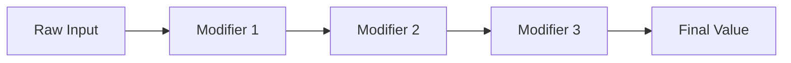

Modifiers transform raw input values before they reach your gameplay code. They're applied in sequence, forming a transformation pipeline.

---

## Available modifiers

<CardGroup cols={2}>
  <Card title="Deadzone" icon="circle-notch">
    Remove small inputs below a threshold
  </Card>
  <Card title="Scale" icon="expand">
    Multiply input by a factor
  </Card>
  <Card title="Normalize" icon="arrows-to-circle">
    Convert to unit length (direction only)
  </Card>
  <Card title="Negate" icon="arrows-left-right">
    Flip axis signs (invert)
  </Card>
  <Card title="Clamp" icon="compress">
    Limit values to a range
  </Card>
</CardGroup>

---

## Deadzone

Removes inputs below a threshold, optionally rescaling the remaining range.

<Tabs>
  <Tab title="Radial deadzone">
    **Magnitude-based** - treats input as a 2D/3D vector

    ```csharp
    new DeadzoneModifier(
        lowerThreshold: 0.2f,  // Zero values below 20% magnitude
        upperThreshold: 1.0f,   // Clamp values above 100%
        type: DeadzoneType.Radial
    );
    ```

    **Behavior:**
    - Calculates magnitude: `magnitude = input.Length`
    - If `magnitude < lowerThreshold`: returns `Vector2.Zero`
    - Otherwise: rescales from `[lowerThreshold, upperThreshold]` to `[0, 1]`

    **Use cases:**
    - Controller analog sticks (eliminate drift)
    - Touch input (ignore small movements)
  </Tab>

  <Tab title="Axial deadzone">
    **Per-axis** - applies deadzone to each component independently

    ```csharp
    new DeadzoneModifier(
        lowerThreshold: 0.15f,
        type: DeadzoneType.Axial  // Apply to X and Y separately
    );
    ```

    **Behavior:**
    - Applies threshold to each axis: `if (abs(x) < threshold) x = 0`
    - Allows for "cross" inputs where one axis is below threshold

    **Use cases:**
    - Mouse movement (reduce jitter on one axis)
    - Independent axis control
  </Tab>
</Tabs>

### Configuration in editor

<Steps>
  <Step title="Add to action">
    In your Input Action resource, click **Add Modifier → Deadzone**
  </Step>

  <Step title="Configure properties">
    | Property | Description | Default |
    |----------|-------------|---------|
    | **Lower Threshold** | Minimum magnitude/value to register | 0.2 |
    | **Upper Threshold** | Maximum value before clamping | 1.0 |
    | **Type** | Radial (magnitude) or Axial (per-axis) | Radial |
  </Step>
</Steps>

<Info>
Deadzone modifiers **have no effect** on `Bool` value types - only `Float`, `Vector2`, and `Vector3`.
</Info>

---

## Scale

Multiplies input values by a factor. Useful for sensitivity adjustment.

```csharp
new ScaleModifier(
    x: 0.5f,    // Halve X axis
    y: 0.5f,    // Halve Y axis
    z: 1.0f     // Z unchanged
);
```

### Examples

<Tabs>
  <Tab title="Uniform scaling">
    **Reduce sensitivity by half:**

    ```csharp
    // In editor: Scale modifier
    X: 0.5
    Y: 0.5
    ```

    ```csharp
    // Before: move = (1.0, 1.0)
    // After:  move = (0.5, 0.5)
    ```
  </Tab>

  <Tab title="Non-uniform scaling">
    **Different sensitivity per axis:**

    ```csharp
    // In editor: Scale modifier
    X: 1.0  // Full horizontal sensitivity
    Y: 0.3  // Reduced vertical sensitivity
    ```

    Useful for mouse look where vertical movement should be slower.
  </Tab>

  <Tab title="Negative scaling (flip)">
    **Invert axis using negative scale:**

    ```csharp
    X: 1.0
    Y: -1.0  // Inverted Y axis
    ```

    Alternative to using Negate modifier.
  </Tab>
</Tabs>

### Use cases

- Sensitivity settings (mouse look, camera)
- Axis remapping (swap or flip axes)
- Reducing input magnitude
- Exposing sensitivity as player preference

---

## Normalize

Converts vector input to unit length (direction only, magnitude discarded).

```csharp
new NormalizeModifier();
```

### Behavior

```csharp
// Before: move = (0.7, 0.7)  // Magnitude ≈ 1.0
// After:  move = (0.707, 0.707)  // Magnitude = 1.0

// Before: move = (0.5, 0.3)  // Magnitude ≈ 0.58
// After:  move = (0.857, 0.514)  // Magnitude = 1.0
```

<Warning>
If input magnitude is **zero**, returns `Vector2.Zero` (avoids division by zero).
</Warning>

### Use cases

<AccordionGroup>
  <Accordion title="WASD normalized movement" icon="keyboard">
    Diagonal WASD input naturally has higher magnitude:

    ```csharp
    // W + D pressed (raw)
    // X = 1.0 (D), Y = 1.0 (W)
    // Magnitude = sqrt(2) ≈ 1.41  // Player moves 41% faster diagonally!

    // With Normalize modifier:
    // X = 0.707, Y = 0.707
    // Magnitude = 1.0  // Consistent speed in all directions
    ```
  </Accordion>

  <Accordion title="Directional input only" icon="compass">
    When magnitude doesn't matter, only direction:

    ```csharp
    protected override void OnUpdate()
    {
        var direction = EnhancedInput.Move.Value; // Already normalized
        // Always unit length - just tells us which direction to move
        MoveInDirection(direction);
    }
    ```
  </Accordion>

  <Accordion title="Combining with other modifiers" icon="link">
    Normalize after deadzone to preserve direction:

    ```csharp
    // Pipeline:
    1. Deadzone (0.2)  // Remove drift
    2. Normalize       // Unit length direction

    // Result: Clean directional input with no drift
    ```
  </Accordion>
</AccordionGroup>

---

## Negate

Flips axis signs (inverts direction).

```csharp
new NegateModifier(
    negateX: false,
    negateY: true,  // Invert Y
    negateZ: false
);
```

### Examples

<Tabs>
  <Tab title="Invert Y axis">
    **Common for camera controls:**

    ```csharp
    // In editor: Negate modifier
    Negate X: false
    Negate Y: true
    ```

    ```csharp
    // Before: look = (1.0, 0.5)  // Mouse moved right and up
    // After:  look = (1.0, -0.5) // Right and down (inverted Y)
    ```
  </Tab>

  <Tab title="Flip horizontal">
    **Mirror horizontal input:**

    ```csharp
    Negate X: true
    Negate Y: false
    ```

    Useful for "mirror mode" or reversed controls.
  </Tab>

  <Tab title="Full inversion">
    **Invert all axes:**

    ```csharp
    Negate X: true
    Negate Y: true
    Negate Z: true
    ```

    Inverts the entire input vector.
  </Tab>
</Tabs>

### Use cases

- Inverted camera Y-axis (player preference)
- Mirror controls for specific vehicles/characters
- Flip input for rear-facing camera
- Local vs world space conversion

---

## Clamp

Limits input values to a specified range.

```csharp
new ClampModifier(
    min: -0.5f,
    max: 0.5f
);
```

### Examples

<Tabs>
  <Tab title="Limit range">
    **Restrict analog input:**

    ```csharp
    // In editor: Clamp modifier
    Min: -0.5
    Max: 0.5
    ```

    ```csharp
    // Before: value = 0.8
    // After:  value = 0.5 (clamped to max)

    // Before: value = -0.9
    // After:  value = -0.5 (clamped to min)
    ```
  </Tab>

  <Tab title="Clamp to positive">
    **Remove negative values:**

    ```csharp
    Min: 0.0
    Max: 1.0
    ```

    Ensures only positive values pass through.
  </Tab>

  <Tab title="Component-wise clamping">
    For Vector2/Vector3, clamping applies per-component:

    ```csharp
    // Before: input = (0.8, -0.9)
    // Clamp: Min = -0.5, Max = 0.5
    // After:  input = (0.5, -0.5)
    ```
  </Tab>
</Tabs>

### Use cases

- Prevent extreme input values
- Limit trigger ranges
- Ensure values stay within expected bounds
- Safety checks for analog inputs

---

## Modifier pipeline

Modifiers are **applied in sequence** - order matters!



### Pipeline examples

<Tabs>
  <Tab title="Stick with deadzone + scale">
    ```
    Pipeline:
    1. Deadzone (0.2, Radial)
    2. Scale (0.5, 0.5)
    ```

    ```csharp
    // Raw input: (0.15, 0.15)  // Magnitude = 0.21
    // After Deadzone: (0.0, 0.0)  // Below threshold
    // After Scale: (0.0, 0.0)
    // Result: No input (drift removed)

    // Raw input: (0.7, 0.7)  // Magnitude = 0.99
    // After Deadzone: (0.7, 0.7)  // Above threshold
    // After Scale: (0.35, 0.35)
    // Result: Reduced sensitivity, no drift
    ```
  </Tab>

  <Tab title="WASD normalized movement">
    ```
    Pipeline:
    1. Deadzone (0.1, Axial)  // Remove tiny inputs per-axis
    2. Normalize              // Unit length
    ```

    ```csharp
    // W + D pressed
    // Raw input: (1.0, 1.0)  // Magnitude = 1.41
    // After Deadzone: (1.0, 1.0)  // Above threshold
    // After Normalize: (0.707, 0.707)  // Magnitude = 1.0
    // Result: Consistent speed in all directions
    ```
  </Tab>

  <Tab title="Mouse look (deadzone + scale + invert)">
    ```
    Pipeline:
    1. Deadzone (0.05, Radial)  // Remove mouse jitter
    2. Scale (0.5, 0.5)         // Sensitivity
    3. Negate (false, true)     // Invert Y
    ```

    ```csharp
    // Mouse moved right + up
    // Raw input: (10.0, 5.0)
    // After Deadzone: (10.0, 5.0)  // Above threshold
    // After Scale: (5.0, 2.5)
    // After Negate: (5.0, -2.5)    // Y inverted
    // Result: Right + down camera movement
    ```
  </Tab>

  <Tab title="Order matters!">
    **Wrong order can produce unexpected results:**

    ```
    ❌ Bad pipeline:
    1. Normalize
    2. Deadzone (0.2)

    Result: Normalize sets magnitude to 1.0,
            then deadzone does nothing!

    ✅ Correct pipeline:
    1. Deadzone (0.2)
    2. Normalize

    Result: Remove drift first, then normalize direction
    ```
  </Tab>
</Tabs>

---

## Configuring modifiers

### In the editor

<Steps>
  <Step title="Open Input Action resource">
    Select your `.inputact` file in the Asset Browser
  </Step>

  <Step title="Add modifiers">
    In the **Modifiers** section, click **Add Modifier** and select type
  </Step>

  <Step title="Configure properties">
    Set modifier-specific properties in the inspector
  </Step>

  <Step title="Reorder if needed">
    Drag modifiers to change pipeline order
  </Step>
</Steps>

### Programmatically

```csharp
var action = new InputActionBinding("move", InputValueType.Vector2, "move")
    .WithModifier(new DeadzoneModifier(0.2f, 1.0f, DeadzoneType.Radial))
    .WithModifier(new ScaleModifier(0.5f, 0.5f))
    .WithModifier(new NormalizeModifier());

var input = CoreServiceRegistry.Get<IInputService>();
input.RegisterAction(action);
```

---

## Common patterns

<AccordionGroup>
  <Accordion title="Controller stick (deadzone + normalize)" icon="gamepad">
    ```
    Modifiers:
    1. Deadzone (Lower: 0.2, Type: Radial)
    2. Normalize
    ```

    Removes drift and ensures consistent movement speed.
  </Accordion>

  <Accordion title="Mouse look (deadzone + scale + invert)" icon="mouse">
    ```
    Modifiers:
    1. Deadzone (Lower: 0.05, Type: Radial)
    2. Scale (X: sensitivity, Y: sensitivity)
    3. Negate (X: false, Y: true)
    ```

    Removes jitter, adjusts sensitivity, inverts Y axis.
  </Accordion>

  <Accordion title="WASD movement (normalize only)" icon="keyboard">
    ```
    Modifiers:
    1. Normalize
    ```

    Prevents diagonal movement from being faster.
  </Accordion>

  <Accordion title="Trigger (clamp + scale)" icon="hand-pointer">
    ```
    Modifiers:
    1. Clamp (Min: 0.0, Max: 1.0)
    2. Scale (X: 1.0)
    ```

    Ensures trigger stays in valid range, optionally scales sensitivity.
  </Accordion>

  <Accordion title="Flight stick (deadzone + scale)" icon="plane">
    ```
    Modifiers:
    1. Deadzone (Lower: 0.15, Type: Radial)
    2. Scale (X: 1.0, Y: 1.0, Z: 1.0)
    ```

    Removes center drift, allows sensitivity adjustment.
  </Accordion>
</AccordionGroup>

---

## Performance notes

<Note>
Modifiers are **computationally cheap** - simple math operations per frame.

Typical cost per action with 3-5 modifiers: **< 0.01ms**
</Note>

Best practices:
- ✅ Use 3-5 modifiers per action (typical)
- ✅ Avoid deep chains (> 10 modifiers)
- ✅ Order matters - put expensive operations last if possible
- ✅ Deadzone early in pipeline (avoids processing drift)

---

## Validation

The system validates modifier configurations:

<Warning>
**Common validation warnings:**
- "Deadzone modifier has no effect on Bool value types"
- "Normalize modifier has no effect on Float value types"
- "Upper threshold must be greater than lower threshold"
</Warning>

Check the console for warnings when loading input action resources.

---

## Related pages

<CardGroup cols={3}>
  <Card title="Actions" icon="bolt" href="/corelib/input/actions">
    Learn about action types
  </Card>
  <Card title="Triggers" icon="hand-pointer" href="/corelib/input/triggers">
    Control when actions fire
  </Card>
  <Card title="Usage Patterns" icon="code" href="/corelib/input/usage-patterns">
    See modifiers in action
  </Card>
</CardGroup>
