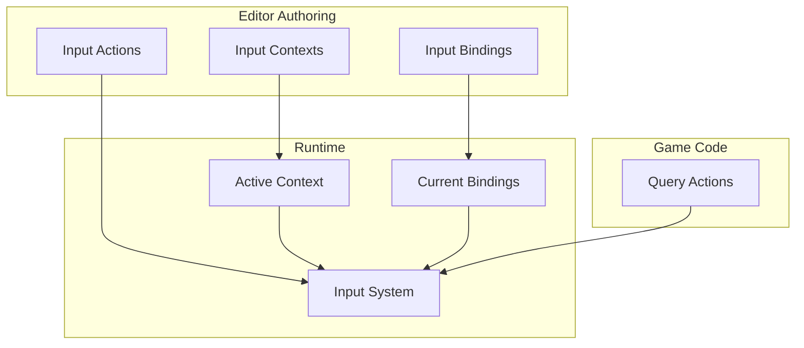

<Info>
The **Enhanced Input** system provides contextual, rebindable input handling with comprehensive editor tooling.
</Info>

---

## What is Enhanced Input?

Enhanced Input is CoreLib's abstraction layer over s&box's raw input APIs. It provides:

<CardGroup cols={2}>
  <Card title="Input actions" icon="bolt">
    Named actions like "Jump" or "Fire" instead of raw key codes
  </Card>
  <Card title="Contexts" icon="layer-group">
    Group actions by game state (menu, gameplay, vehicle)
  </Card>
  <Card title="Rebinding" icon="keyboard">
    Players can customise controls at runtime
  </Card>
  <Card title="Editor tooling" icon="window">
    Visual authoring and testing
  </Card>
</CardGroup>

---

## Why use Enhanced Input?

<Tabs>
  <Tab title="Without Enhanced Input">
    ```csharp
    // Hardcoded, scattered, hard to rebind
    void Update()
    {
        if (Input.Pressed(InputButton.Jump))
            Jump();

        if (Input.Pressed(InputButton.Attack1))
            Fire();

        // What about menus? Vehicles? Rebinding?
    }
    ```

    **Problems:**
    - Keys hardcoded throughout codebase
    - No easy rebinding
    - No context awareness
    - Difficult to maintain
  </Tab>
  <Tab title="With Enhanced Input">
    ```csharp
    // Clean, rebindable, context-aware
    void Update()
    {
        if (InputSystem.IsActionPressed("jump"))
            Jump();

        if (InputSystem.IsActionPressed("fire"))
            Fire();
    }
    ```

    **Benefits:**
    - Actions defined in one place
    - Rebinding built-in
    - Context switching automatic
    - Editor tooling included
  </Tab>
</Tabs>

---

## Core concepts



<AccordionGroup>
  <Accordion title="Input Actions" icon="bolt">
    Named actions that represent player intent:
    - `jump`, `fire`, `interact`, `move`
    - Define what the player can do
    - Independent of how they do it
  </Accordion>

  <Accordion title="Input Bindings" icon="keyboard">
    Connections between hardware inputs and actions:
    - `Space` → `jump`
    - `Left Click` → `fire`
    - Can have multiple bindings per action
    - Players can modify at runtime
  </Accordion>

  <Accordion title="Input Contexts" icon="layer-group">
    Collections of active actions for a game state:
    - "Gameplay" context: movement, combat actions
    - "Menu" context: navigation, selection
    - "Vehicle" context: driving controls
    - Only one context active at a time
  </Accordion>
</AccordionGroup>

---

## Quick example

<Steps>
  <Step title="Define actions in the editor">
    Use the Input Editor to create actions like `jump`, `fire`, `move`.
  </Step>

  <Step title="Assign default bindings">
    Map `Space` to `jump`, `Left Click` to `fire`, etc.
  </Step>

  <Step title="Create contexts">
    Group actions into contexts like "Gameplay" and "Menu".
  </Step>

  <Step title="Use in code">
    ```csharp
    public class PlayerController : Component
    {
        protected override void OnUpdate()
        {
            // Check digital action
            if (InputSystem.IsActionPressed("jump"))
            {
                PerformJump();
            }

            // Check analog action
            var moveInput = InputSystem.GetAxis2D("move");
            ApplyMovement(moveInput);

            // Check action state
            if (InputSystem.IsActionHeld("fire"))
            {
                ContinueFiring();
            }
        }
    }
    ```
  </Step>
</Steps>

---

## Action types

| Type | Description | Example |
|------|-------------|---------|
| **Digital** | On/off state | Jump, Fire, Interact |
| **Axis1D** | Single axis value | Throttle, Zoom |
| **Axis2D** | Two-axis value | Movement, Look |

```csharp
// Digital - returns bool
bool jumping = InputSystem.IsActionPressed("jump");

// Axis1D - returns float
float throttle = InputSystem.GetAxis1D("throttle");

// Axis2D - returns Vector2
Vector2 movement = InputSystem.GetAxis2D("move");
```

---

## Context switching

<CardGroup cols={2}>
  <Card title="Push context" icon="arrow-right">
    ```csharp
    // Enter menu
    InputSystem.PushContext("menu");
    ```
  </Card>
  <Card title="Pop context" icon="arrow-left">
    ```csharp
    // Return to previous
    InputSystem.PopContext();
    ```
  </Card>
</CardGroup>

Contexts stack, so you can layer them:

```csharp
// Player in gameplay
InputSystem.SetActiveContext("gameplay");

// Player opens inventory (gameplay paused)
InputSystem.PushContext("inventory");

// Player closes inventory (back to gameplay)
InputSystem.PopContext();
```

---

## Features at a glance

| Feature | Description |
|---------|-------------|
| **Rebinding** | Players can change bindings at runtime |
| **Persistence** | Bindings saved and restored automatically |
| **Modifiers** | Shift+Key, Ctrl+Key combinations |
| **Chords** | Multi-key combinations |
| **Gamepad** | Controller support built-in |
| **Validation** | Editor catches conflicts and issues |

---

## In this section

<CardGroup cols={2}>
  <Card title="Concepts" icon="lightbulb" href="/corelib/input/concepts">
    Deep dive into input system concepts
  </Card>
  <Card title="Runtime Usage" icon="code" href="/corelib/input/runtime-usage">
    Using input in gameplay code
  </Card>
  <Card title="Rebinding" icon="keyboard" href="/corelib/input/rebinding">
    Implementing player rebinding
  </Card>
  <Card title="Debugging" icon="bug" href="/corelib/input/debugging">
    Troubleshooting input issues
  </Card>
  <Card title="Best Practices" icon="star" href="/corelib/input/best-practices">
    Recommended patterns
  </Card>
  <Card title="Input Editor" icon="window" href="/editor/tools/input-editor">
    Editor tooling guide
  </Card>
</CardGroup>
