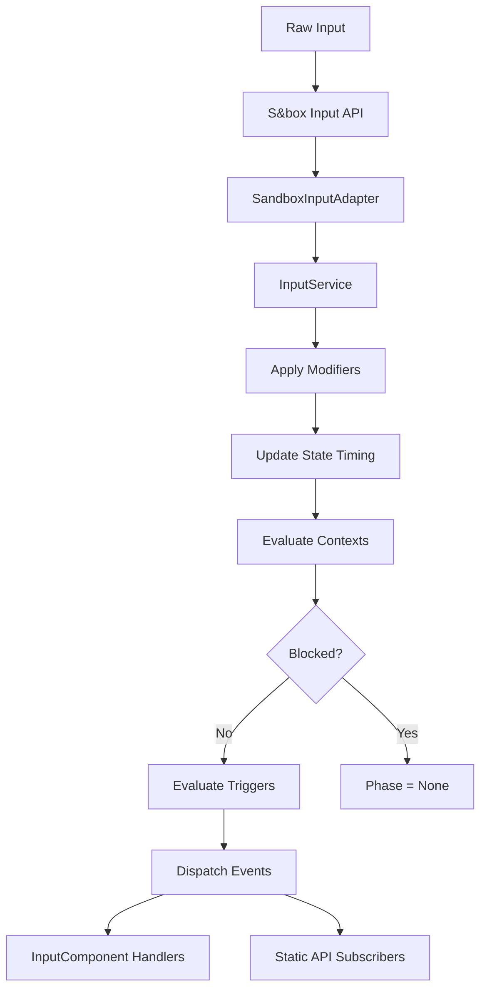

<Info>
**Enhanced Input** is a powerful abstraction layer over s&box's native input system, inspired by Unreal Engine 5's Enhanced Input. Define typed actions, apply modifier pipelines, configure complex trigger conditions, and manage priority-based input contexts - all with full editor support.
</Info>

---

## Core components

<CardGroup cols={2}>
  <Card title="Actions" icon="bolt" href="/corelib/input/actions">
    Named input operations with typed values (Bool, Float, Vector2, Vector3)
  </Card>
  <Card title="Modifiers" icon="sliders" href="/corelib/input/modifiers">
    Transform raw input (Deadzone, Scale, Normalize, Negate, Clamp)
  </Card>
  <Card title="Triggers" icon="hand-pointer" href="/corelib/input/triggers">
    Define when actions fire (Press, Hold, Tap, DoubleTap, Chorded)
  </Card>
  <Card title="Contexts" icon="layer-group" href="/corelib/input/contexts">
    Priority-based groups that handle, block, or consume input
  </Card>
</CardGroup>

---

## Why use Enhanced Input?

<Tabs>
  <Tab title="Traditional approach">
    **Scattered input logic with hardcoded values**

    ```csharp
    // In PlayerController.Update()
    if (Input.Pressed("jump"))
    {
        Jump();
    }

    // Hardcoded deadzone
    var move = Input.AnalogMove;
    if (move.Length < 0.2f) move = Vector2.Zero;

    // Custom hold timer
    _fireHoldTime += Time.Delta;
    if (Input.Down("attack1") && _fireHoldTime > 0.5f)
    {
        Fire();
        _fireHoldTime = 0f;
    }

    // Manual context checks
    if (_isMenuOpen && Input.Pressed("jump"))
        return; // Blocked
    ```

    **Problems:**
    - 🔴 Input logic scattered throughout gameplay code
    - 🔴 Modifiers (deadzones) hardcoded everywhere
    - 🔴 Complex patterns require custom state tracking
    - 🔴 Context priority unclear and error-prone
    - 🔴 No designer tooling
    - 🔴 String-based action names (typo-prone)
  </Tab>
  <Tab title="Enhanced Input">
    **Centralized, data-driven configuration**

    ```csharp
    // Actions defined in editor (.inputact resources)
    // - Jump: Bool, Pressed trigger
    // - Move: Vector2, Deadzone 0.2
    // - Fire: Bool, Hold 0.5s trigger

    // Auto-generated typed handles
    public static class EnhancedInput
    {
        public static BoolAction Jump { get; }
        public static Vector2Action Move { get; }
        public static BoolAction Fire { get; }
    }

    // Clean gameplay code
    public class PlayerController : InputComponent
    {
        protected override void RegisterInputBindings()
        {
            Bind(EnhancedInput.Jump).OnTriggered(Jump);
            Bind(EnhancedInput.Fire).OnTriggered(Fire);
        }

        protected override void OnUpdate()
        {
            var move = EnhancedInput.Move.Value; // Deadzone already applied
            CharacterController.Move(move);
        }

        void Jump() { /* Pure gameplay logic */ }
        void Fire() { /* Pure gameplay logic */ }
    }
    ```

    **Benefits:**
    - ✅ Clear separation: config (editor) vs logic (code)
    - ✅ Type-safe APIs with IntelliSense
    - ✅ Priority-based contexts (automatic blocking)
    - ✅ Complex patterns without state tracking
    - ✅ Designer-friendly (tweak in editor)
    - ✅ Testable (mock service)
  </Tab>
</Tabs>

---

## When to use this system

<CardGroup cols={2}>
  <Card title="Good fit" icon="check" color="#16A34A">
    - Medium to large games (5+ distinct actions)
    - Projects with designers tuning input feel
    - Games with UI overlays needing priority-based blocking
    - Complex input patterns (charge attacks, combos)
    - Multiplayer games requiring input validation
  </Card>
  <Card title="Consider alternatives" icon="circle-xmark" color="#EAB308">
    - Small prototypes with 2-3 simple buttons
    - Single-screen games with no context switching
    - Projects where `Input.Down()` is sufficient
    - Preference for code-only configuration
  </Card>
</CardGroup>

---

## Quick example

<Steps>
  <Step title="Ensure InputModule exists">
    The `InputModule` component should be added to your scene as a child of `CoreRoot`:

    ```
    GameObject: CoreRoot
    ├─ Component: CoreRoot
    ├─ Component: InputModule (Auto-Load Resources: true)
    └─ ... other CoreLib modules
    ```
  </Step>

  <Step title="Create an input action">
    Open the **Input Editor** window (search for "Input Editor" in the editor's tool menu).

    In the **Asset Browser** dock (left side):
    1. Find the **Actions** section
    2. Click the **+** button next to "Actions"
    3. Type a name (e.g., "jump") and press Enter
    4. Configure in the **Inspector** dock (right side):
       - **S&box Action**: "jump"
       - **Value Type**: Bool
       - **Triggers**: [Pressed]
    5. **Save** (Ctrl+S) - automatically generates typed code
  </Step>

  <Step title="Bind in gameplay code">
    ```csharp
    public class PlayerController : InputComponent
    {
        protected override void RegisterInputBindings()
        {
            Bind(EnhancedInput.Jump).OnTriggered(OnJump);
        }

        void OnJump()
        {
            GetComponent<Rigidbody>().ApplyForce(Vector3.Up * 1000f);
        }
    }
    ```
  </Step>
</Steps>

---

## Key features

| Feature | Description |
|---------|-------------|
| **Type-safe actions** | BoolAction, FloatAction, Vector2Action, Vector3Action with IntelliSense |
| **Modifier pipeline** | Deadzone, Scale, Normalize, Negate, Clamp - configured in editor |
| **Complex triggers** | Hold, Tap, DoubleTap, Chorded patterns without custom state tracking |
| **Priority contexts** | UI blocks gameplay automatically based on priority |
| **Hot-reload** | Tweak input feel without recompiling |
| **Component-based binding** | Automatic lifecycle management with InputComponent |

---

## How it works



<AccordionGroup>
  <Accordion title="Execution flow" icon="diagram-project">
    Each frame, for every registered action:
    1. **Read raw value** from s&box Input API
    2. **Apply modifiers** in sequence (deadzone → scale → normalize, etc.)
    3. **Update state timing** (track how long action has been held)
    4. **Evaluate contexts** - check if action is blocked by higher-priority context
    5. **Evaluate triggers** - determine current phase (Started/Triggered/Completed/Canceled)
    6. **Dispatch events** - notify all subscribers if phase changed
  </Accordion>

  <Accordion title="Context evaluation" icon="layer-group">
    Contexts are evaluated from **highest to lowest priority**:
    - Higher priority contexts see input first
    - **Blocked actions** are consumed without dispatching
    - **Handled actions** fire in that context
    - **ConsumesInput** stops propagation to lower contexts
  </Accordion>

  <Accordion title="Type safety" icon="shield-halved">
    Multiple layers ensure type safety:
    - **InputValueType** enum: Bool, Float, Vector2, Vector3
    - **Typed action handles**: BoolAction, FloatAction, Vector2Action, Vector3Action
    - **Auto-generated code**: EnhancedInput.Jump (BoolAction) vs EnhancedInput.Move (Vector2Action)
    - **Compile-time validation**: Cannot pass Vector2Action where BoolAction expected
  </Accordion>
</AccordionGroup>

---

## In this section

<CardGroup cols={3}>
  <Card title="Getting Started" icon="rocket" href="/corelib/input/getting-started">
    Step-by-step setup guide
  </Card>
  <Card title="Actions" icon="bolt" href="/corelib/input/actions">
    Action types and value access
  </Card>
  <Card title="Modifiers" icon="sliders" href="/corelib/input/modifiers">
    Transform raw input values
  </Card>
  <Card title="Triggers" icon="hand-pointer" href="/corelib/input/triggers">
    Control when actions fire
  </Card>
  <Card title="Contexts" icon="layer-group" href="/corelib/input/contexts">
    Priority-based input management
  </Card>
  <Card title="Usage Patterns" icon="code" href="/corelib/input/usage-patterns">
    Common implementation patterns
  </Card>
  <Card title="Debugging" icon="bug" href="/corelib/input/debugging">
    Troubleshooting and debugging
  </Card>
</CardGroup>
