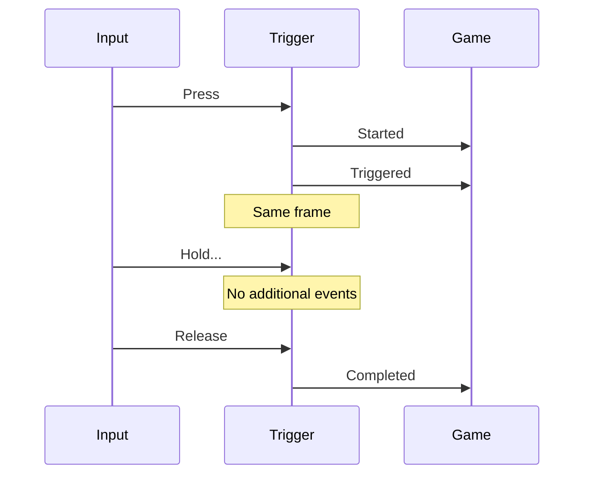
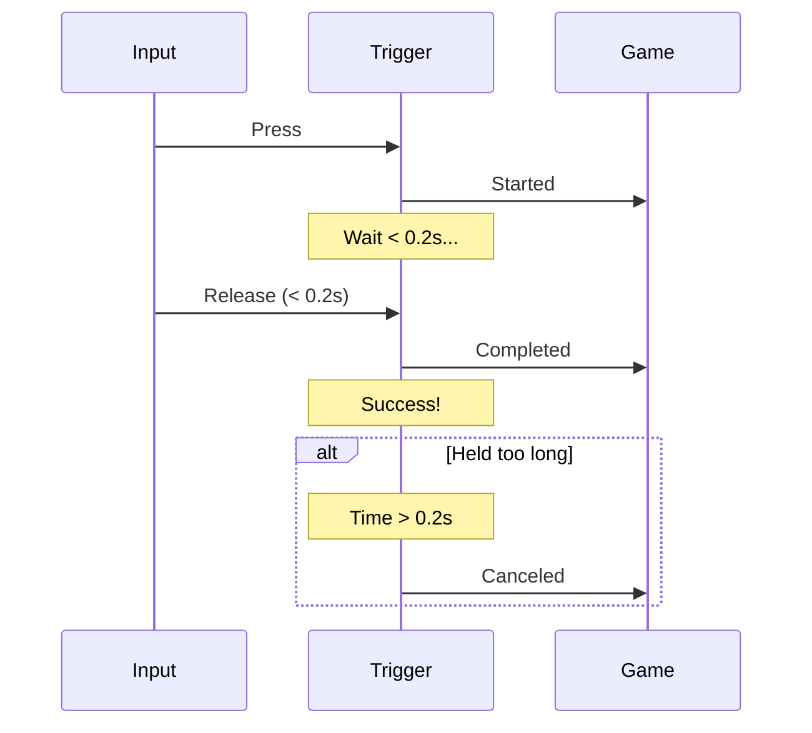
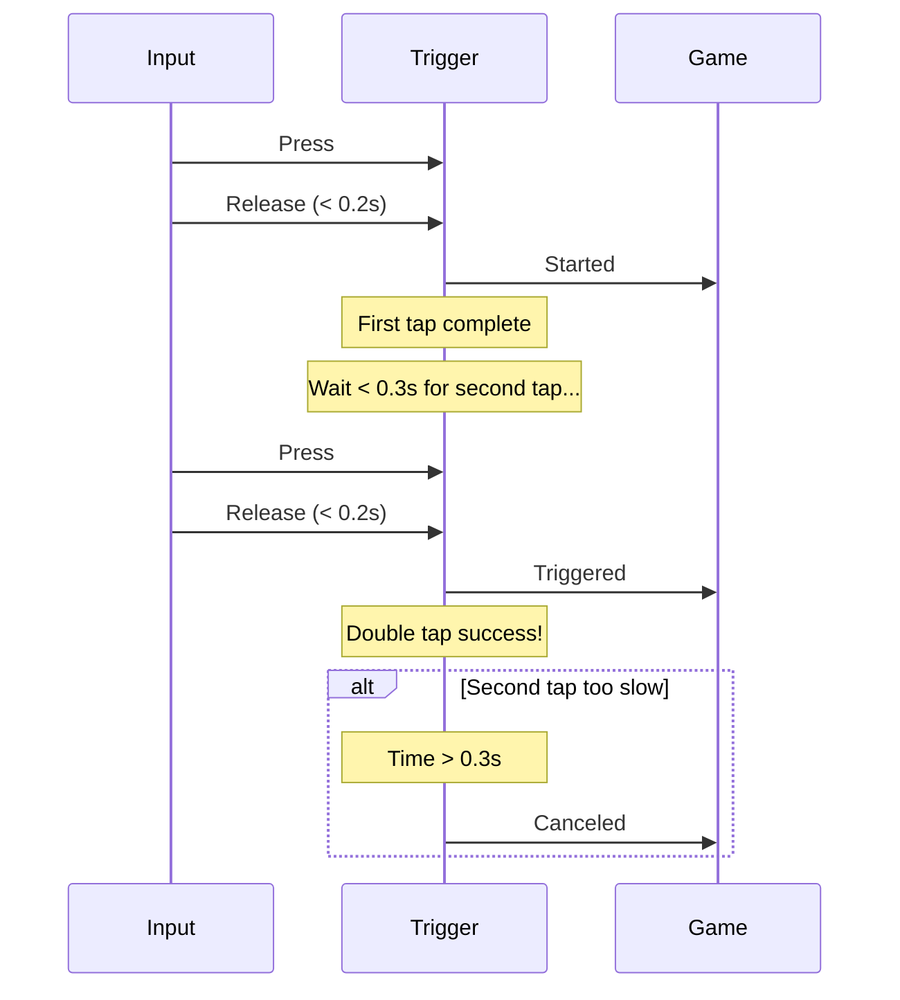
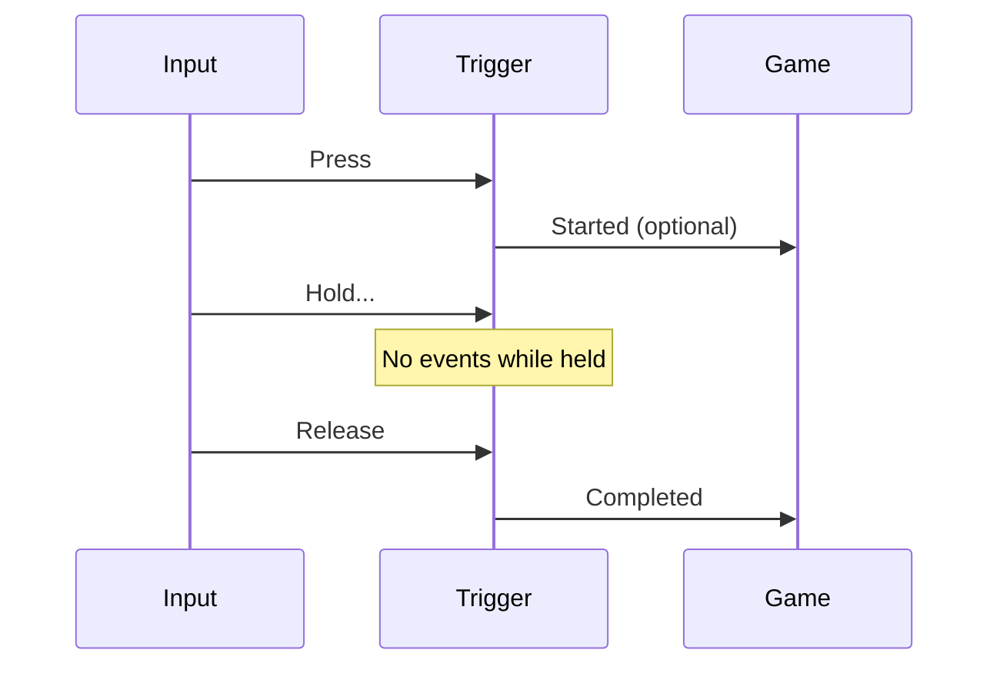
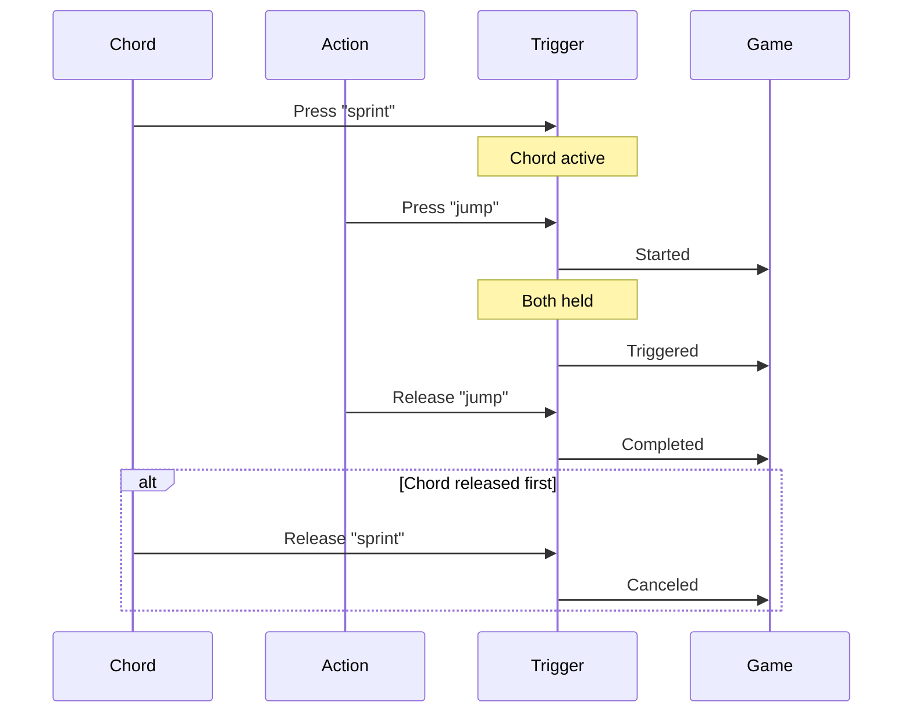

Triggers determine **when** actions fire. They evaluate input state and timing to produce different activation patterns without custom state tracking.

---

## Available triggers

<CardGroup cols={2}>
  <Card title="Pressed" icon="hand-pointer">
    Fires once on press (default)
  </Card>
  <Card title="Hold" icon="hand">
    Fires after holding for a duration
  </Card>
  <Card title="Tap" icon="hand-back-fist">
    Fires on quick press+release
  </Card>
  <Card title="DoubleTap" icon="hand-point-up">
    Fires on two quick taps
  </Card>
  <Card title="Released" icon="hand-scissors">
    Fires on button release
  </Card>
  <Card title="Chorded" icon="keyboard">
    Fires only if another action is held
  </Card>
</CardGroup>

---

## Pressed

The default trigger - fires once when input becomes active.

```csharp
new PressedTrigger();
```

### Phase timeline



### Phases fired

| Phase | When | Description |
|-------|------|-------------|
| **Started** | First frame pressed | Initial activation |
| **Triggered** | Same frame as Started | Main event |
| **Completed** | Frame released | Cleanup |

### Use cases

- Jump
- Menu select/confirm
- Interact
- One-shot actions

### Example

```csharp
// Action configuration (in editor)
// Trigger: Pressed

public class PlayerController : InputComponent
{
    protected override void RegisterInputBindings()
    {
        Bind(EnhancedInput.Jump).OnTriggered(Jump);
    }

    void Jump()
    {
        // Fires exactly once per press
        if (IsGrounded)
            Velocity += Vector3.Up * JumpForce;
    }
}
```

---

## Hold

Fires after holding input for a specified duration. Optionally repeats.

```csharp
new HoldTrigger(
    holdTime: 0.5f,      // Time to hold before firing
    repeat: false         // Fire once or repeatedly
);
```

### Phase timeline

<Tabs>
  <Tab title="Non-repeating">
    ```mermaid
    sequenceDiagram
        participant Input
        participant Trigger
        participant Game

        Input->>Trigger: Press
        Trigger->>Game: Started
        Note over Trigger: Wait 0.5s...
        Trigger->>Game: Completed
        Note over Trigger: Hold time reached
        Input->>Trigger: Release
        Note over Trigger: No additional events
    ```

    **Phases:**
    - **Started**: First frame pressed
    - **Completed**: After `holdTime` elapsed (fires once)
    - **Canceled**: Released before `holdTime`
  </Tab>

  <Tab title="Repeating">
    ```mermaid
    sequenceDiagram
        participant Input
        participant Trigger
        participant Game

        Input->>Trigger: Press
        Trigger->>Game: Started
        Note over Trigger: Wait 0.5s...
        Trigger->>Game: Triggered
        Note over Trigger: Wait repeatInterval...
        Trigger->>Game: Triggered
        Note over Trigger: Continues repeating...
        Input->>Trigger: Release
        Trigger->>Game: Completed
    ```

    **Phases:**
    - **Started**: First frame pressed
    - **Triggered**: Every `repeatInterval` after initial `holdTime`
    - **Completed**: On release
  </Tab>
</Tabs>

### Configuration

```csharp
// Non-repeating hold (charge attack)
new HoldTrigger(
    holdTime: 2.0f,       // 2 seconds to charge
    repeat: false         // Fire once when fully charged
);

// Repeating hold (auto-fire weapon)
new HoldTrigger(
    holdTime: 0.5f,       // Initial delay
    repeat: true,
    repeatInterval: 0.1f  // Fire every 0.1s after initial delay
);
```

### Use cases

<AccordionGroup>
  <Accordion title="Charge attack" icon="bolt">
    ```csharp
    // Hold trigger: 2s, no repeat
    protected override void RegisterInputBindings()
    {
        Bind(EnhancedInput.ChargeAttack)
            .OnStarted(StartChargeEffect)     // Begin visual
            .OnCompleted(ReleaseChargedAttack) // Fire at full charge
            .OnCanceled(CancelCharge);        // Released too early
    }

    void StartChargeEffect()
    {
        // Show charging particle effect
    }

    void ReleaseChargedAttack()
    {
        // Attack at full power
        FireWeapon(MaxDamage);
    }

    void CancelCharge()
    {
        // Weak attack or no attack
        StopChargeEffect();
    }
    ```
  </Accordion>

  <Accordion title="Auto-fire weapon" icon="gun">
    ```csharp
    // Hold trigger: 0.5s initial, repeat every 0.1s
    protected override void RegisterInputBindings()
    {
        Bind(EnhancedInput.Fire)
            .OnTriggered(FireWeapon)    // Fires repeatedly
            .OnCompleted(StopFiring);   // Released
    }

    void FireWeapon()
    {
        // Called every 0.1s while held
        SpawnBullet();
    }
    ```
  </Accordion>

  <Accordion title="Long-press menu" icon="menu">
    ```csharp
    // Hold trigger: 1s, no repeat
    Bind(EnhancedInput.ContextMenu)
        .OnCompleted(OpenContextMenu);

    void OpenContextMenu()
    {
        // Only opens if held for 1s
        ShowMenu();
    }
    ```
  </Accordion>
</AccordionGroup>

---

## Tap

Fires if pressed and released within a time window.

```csharp
new TapTrigger(
    tapTime: 0.2f  // Max duration for a "tap"
);
```

### Phase timeline



### Phases fired

| Phase | When | Description |
|-------|------|-------------|
| **Started** | First frame pressed | Initial activation |
| **Completed** | Released within `tapTime` | Successful tap |
| **Canceled** | Held longer than `tapTime` | Failed tap |

### Use cases

- Light attack (vs hold for heavy)
- Quick interact
- Tap-to-jump (vs hold-to-fly)
- Menu quick-select

### Example

```csharp
// Tap trigger: 0.2s
// Combined with Hold trigger for different attacks
protected override void RegisterInputBindings()
{
    // Action has BOTH Tap and Hold triggers
    Bind(EnhancedInput.Attack)
        .OnCompleted(OnAttackComplete);
}

void OnAttackComplete()
{
    // Check which trigger succeeded
    if (EnhancedInput.Attack.HoldTime < 0.2f)
    {
        LightAttack(); // Quick tap
    }
    else
    {
        HeavyAttack(); // Held longer
    }
}
```

---

## DoubleTap

Fires on two quick taps in sequence.

```csharp
new DoubleTapTrigger(
    tapTime: 0.2f,          // Max duration per tap
    doubleTapWindow: 0.3f   // Max time between taps
);
```

### Phase timeline



### Phases fired

| Phase | When | Description |
|-------|------|-------------|
| **Started** | First tap completed | Waiting for second tap |
| **Triggered** | Second tap completed within window | Success |
| **Canceled** | Second tap too slow or held | Failed |

### Use cases

- Dodge/dash
- Double-jump
- Quick-turn
- Activate sprint
- Double-click selection

### Example

```csharp
// DoubleTap trigger: 0.2s per tap, 0.3s window
protected override void RegisterInputBindings()
{
    Bind(EnhancedInput.Dodge).OnTriggered(PerformDodge);
}

void PerformDodge()
{
    // Only fires on successful double-tap
    var direction = GetMoveDirection();
    DodgeInDirection(direction);
    PlayDodgeAnimation();
}
```

---

## Released

Fires when input is released.

```csharp
new ReleasedTrigger();
```

### Phase timeline



### Phases fired

| Phase | When | Description |
|-------|------|-------------|
| **Started** | First frame pressed | Optional |
| **Completed** | Frame released | Main event |

### Use cases

- Grenade throw (charge while held, throw on release)
- Bow/slingshot (pull back while held, fire on release)
- Jump buffering (press early, execute on landing)
- Release-to-confirm dialogs

### Example

```csharp
// Released trigger
protected override void RegisterInputBindings()
{
    Bind(EnhancedInput.ThrowGrenade)
        .OnStarted(StartGrenadeCharge)  // Begin charging
        .OnCompleted(ThrowGrenade);     // Release to throw
}

void StartGrenadeCharge()
{
    _chargeStartTime = Time.Now;
    ShowGrenadeTrajectory();
}

void ThrowGrenade()
{
    var chargeTime = Time.Now - _chargeStartTime;
    var throwForce = CalculateForce(chargeTime);
    SpawnGrenade(throwForce);
}
```

---

## Chorded

Fires only if another action (the "chord") is held.

```csharp
new ChordedActionTrigger(
    chordAction: "sprint",  // Must be held
    holdTime: 0.1f          // Optional delay before chord activates
);
```

### Phase timeline



### Phases fired

| Phase | When | Description |
|-------|------|-------------|
| **Started** | Chord held + action pressed | Chord activated |
| **Triggered** | While both held | Fires while active |
| **Completed** | Action released (chord still held) | Success |
| **Canceled** | Chord released first | Failed |

### Use cases

- Modified actions (Sprint+Jump = Super Jump)
- Context-sensitive inputs (Aim+Fire = Precise Shot)
- Shift/Ctrl/Alt modifiers
- Multi-button combinations

### Example

```csharp
// Action: SuperJump
// Trigger: Chorded (ChordAction: "sprint", HoldTime: 0.1s)

protected override void RegisterInputBindings()
{
    // Regular jump
    Bind(EnhancedInput.Jump).OnTriggered(NormalJump);

    // Super jump (Sprint+Jump)
    Bind(EnhancedInput.SuperJump).OnTriggered(SuperJump);
}

void NormalJump()
{
    Velocity += Vector3.Up * JumpForce;
}

void SuperJump()
{
    // Only fires if Sprint is held
    Velocity += Vector3.Up * JumpForce * 2.0f;
    PlaySuperJumpEffect();
}
```

---

## Multiple triggers

Actions can have **multiple triggers** - the highest priority phase wins.

### Example: Tap vs Hold attack

```csharp
// Action: "Attack"
// Triggers:
//   1. Tap (0.2s)
//   2. Hold (0.5s)
```

**Behavior:**
- **Quick tap** (< 0.2s): Tap trigger fires `Completed` → Light attack
- **Medium hold** (0.2s - 0.5s): No trigger fires (tap failed, hold not ready)
- **Long hold** (> 0.5s): Hold trigger fires `Completed` → Heavy attack

### Implementation

```csharp
protected override void RegisterInputBindings()
{
    Bind(EnhancedInput.Attack)
        .OnStarted(OnAttackStart)
        .OnCompleted(OnAttackComplete);
}

void OnAttackStart()
{
    // Visual feedback for charging
    ShowChargeEffect();
}

void OnAttackComplete()
{
    var holdTime = EnhancedInput.Attack.HoldTime;

    if (holdTime < 0.2f)
    {
        // Tap succeeded
        LightAttack();
    }
    else if (holdTime >= 0.5f)
    {
        // Hold succeeded
        HeavyAttack();
    }

    HideChargeEffect();
}
```

---

## Configuring triggers

### In the editor

<Steps>
  <Step title="Open Input Action resource">
    Select your `.inputact` file
  </Step>

  <Step title="Add trigger">
    In the **Triggers** section, click **Add Trigger** and select type
  </Step>

  <Step title="Configure properties">
    Set trigger-specific properties (holdTime, tapTime, etc.)
  </Step>

  <Step title="Add multiple triggers (optional)">
    Actions can have multiple triggers for complex patterns
  </Step>
</Steps>

### Programmatically

```csharp
var action = new InputActionBinding("attack", InputValueType.Bool, "attack1")
    .WithTrigger(new TapTrigger(0.2f))        // Quick tap
    .WithTrigger(new HoldTrigger(0.5f));      // Long hold

var input = CoreServiceRegistry.Get<IInputService>();
input.RegisterAction(action);
```

---

## Common patterns

<AccordionGroup>
  <Accordion title="Tap vs Hold (light vs heavy attack)" icon="hand-fist">
    ```
    Triggers:
    - Tap (0.2s)
    - Hold (0.5s)

    Result:
    - Quick press → Light attack
    - Long press → Heavy attack
    ```
  </Accordion>

  <Accordion title="Double-tap to dodge" icon="person-running">
    ```
    Triggers:
    - DoubleTap (0.2s per tap, 0.3s window)

    Result:
    - Single tap → Nothing
    - Double tap → Dodge
    ```
  </Accordion>

  <Accordion title="Hold to charge, release to fire" icon="gun">
    ```
    Triggers:
    - Released

    Usage:
    - OnStarted: Begin charge effect
    - OnCompleted: Calculate charge based on HoldTime, fire
    ```
  </Accordion>

  <Accordion title="Sprint + Jump = Super Jump" icon="rocket">
    ```
    Action: SuperJump
    Trigger: Chorded (ChordAction: "sprint")

    Result:
    - Jump alone → Normal jump
    - Sprint + Jump → Super jump
    ```
  </Accordion>

  <Accordion title="Auto-fire weapon" icon="gun">
    ```
    Triggers:
    - Hold (0.5s initial, repeat every 0.1s)

    Result:
    - Tap → Nothing (below threshold)
    - Hold → Fires every 0.1s after 0.5s
    ```
  </Accordion>
</AccordionGroup>

---

## Validation

The system validates trigger configurations:

<Warning>
**Common validation warnings:**
- "Chorded trigger must specify a chord action"
- "Hold time must be greater than zero"
- "Tap time must be greater than zero"
- "Double tap window must be greater than tap time"
</Warning>

---

## Related pages

<CardGroup cols={3}>
  <Card title="Actions" icon="bolt" href="/corelib/input/actions">
    Learn about action phases
  </Card>
  <Card title="Modifiers" icon="sliders" href="/corelib/input/modifiers">
    Transform input values
  </Card>
  <Card title="Usage Patterns" icon="code" href="/corelib/input/usage-patterns">
    See triggers in real examples
  </Card>
</CardGroup>
