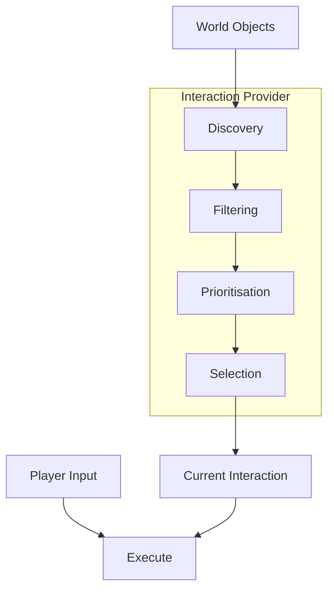
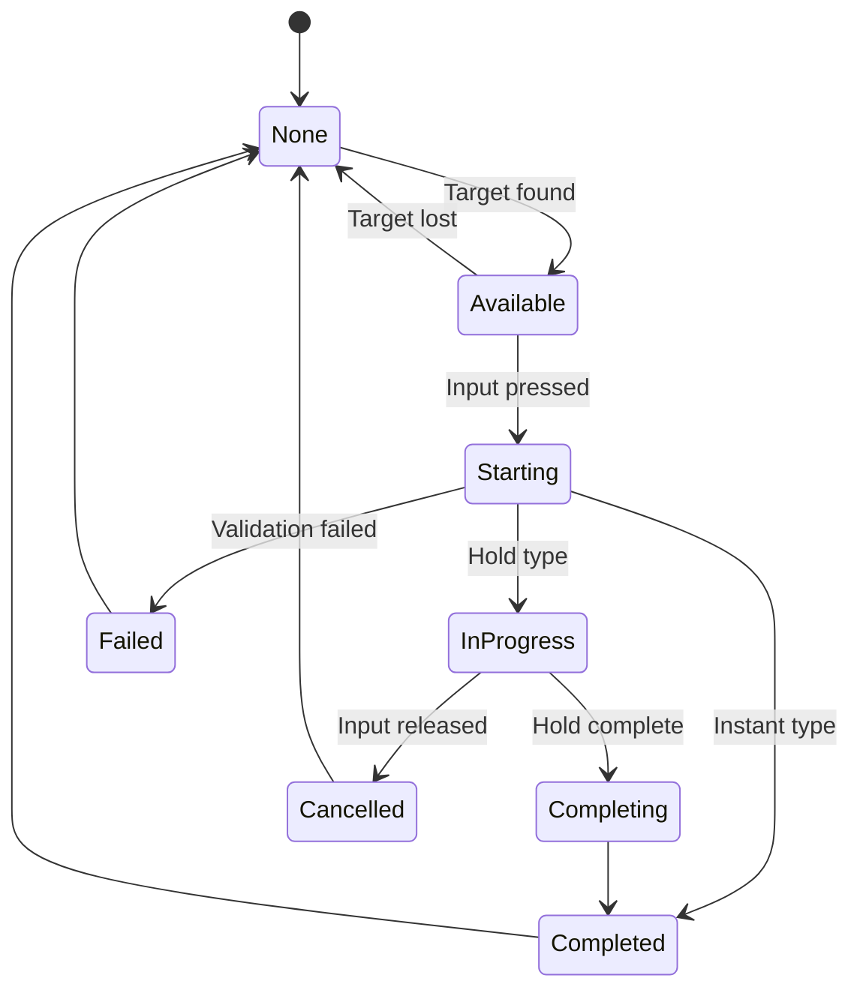

<Info>
This page explains the fundamental concepts of the Interaction System in detail.
</Info>

---

## IInteractable interface

The core interface for interactable objects:

```csharp
public interface IInteractable
{
    /// <summary>
    /// The interaction definition for this object.
    /// </summary>
    InteractionDefinition Interaction { get; }

    /// <summary>
    /// Check if the player can interact with this object.
    /// </summary>
    bool CanInteract(Player player);

    /// <summary>
    /// Called when the player interacts.
    /// </summary>
    void OnInteract(Player player);
}
```

### Implementation example

```csharp
public class Chest : Component, IInteractable
{
    [Property]
    public InteractionDefinition Interaction { get; set; }

    private bool _isOpen;

    public bool CanInteract(Player player)
    {
        // Can only open if closed
        return !_isOpen;
    }

    public void OnInteract(Player player)
    {
        _isOpen = true;
        SpawnLoot();
        PlayAnimation("open");
    }
}
```

---

## Interaction definitions

An **InteractionDefinition** describes a type of interaction:

```csharp
public class InteractionDefinition : Definition
{
    public string Id { get; set; }
    public string DisplayName { get; set; }
    public string Icon { get; set; }
    public string InputAction { get; set; }
    public float Range { get; set; }
    public int Priority { get; set; }
    public InteractionType Type { get; set; }
    public float HoldDuration { get; set; }
}
```

### Properties

| Property | Description |
|----------|-------------|
| `Id` | Unique identifier |
| `DisplayName` | Shown in UI prompts |
| `Icon` | Icon for UI display |
| `InputAction` | Required input action name |
| `Range` | Maximum interaction distance |
| `Priority` | Higher = shown first when multiple available |
| `Type` | Instant, Hold, Toggle |
| `HoldDuration` | Time required for hold interactions |

---

## Interaction types

<Tabs>
  <Tab title="Instant">
    Executes immediately on input:

    ```csharp
    new InteractionDefinition
    {
        Id = "pickup",
        Type = InteractionType.Instant
    };
    ```

    **Use for:** Picking up items, flipping switches, opening doors
  </Tab>
  <Tab title="Hold">
    Requires holding input for duration:

    ```csharp
    new InteractionDefinition
    {
        Id = "revive",
        Type = InteractionType.Hold,
        HoldDuration = 3.0f
    };
    ```

    **Use for:** Reviving, hacking, defusing
  </Tab>
  <Tab title="Toggle">
    Alternates between states:

    ```csharp
    new InteractionDefinition
    {
        Id = "flashlight",
        Type = InteractionType.Toggle
    };
    ```

    **Use for:** Lights, doors, equipment
  </Tab>
</Tabs>

---

## Multiple interactions

For objects with multiple possible interactions:

```csharp
public interface IMultiInteractable
{
    /// <summary>
    /// Get all available interactions for this player.
    /// </summary>
    IEnumerable<InteractionDefinition> GetInteractions(Player player);

    /// <summary>
    /// Check if a specific interaction is valid.
    /// </summary>
    bool CanInteract(Player player, InteractionDefinition interaction);

    /// <summary>
    /// Execute a specific interaction.
    /// </summary>
    void OnInteract(Player player, InteractionDefinition interaction);
}
```

### Example

```csharp
public class Workbench : Component, IMultiInteractable
{
    public IEnumerable<InteractionDefinition> GetInteractions(Player player)
    {
        yield return _useInteraction;
        yield return _storeInteraction;

        if (HasItems)
            yield return _takeAllInteraction;
    }

    public bool CanInteract(Player player, InteractionDefinition interaction)
    {
        if (interaction.Id == "store")
            return player.Inventory.HasItems;

        return true;
    }

    public void OnInteract(Player player, InteractionDefinition interaction)
    {
        switch (interaction.Id)
        {
            case "use":
                OpenCraftingUI();
                break;
            case "store":
                TransferItems(player.Inventory, this);
                break;
            case "take_all":
                TransferItems(this, player.Inventory);
                break;
        }
    }
}
```

---

## Interaction provider

The **InteractionProvider** manages interaction discovery and execution:



### Provider configuration

```csharp
public class InteractionProviderConfig
{
    public float ScanRadius { get; set; } = 5f;
    public float ScanInterval { get; set; } = 0.1f;
    public int MaxResults { get; set; } = 10;
    public LayerMask ScanLayers { get; set; }
}
```

---

## Priority and selection

When multiple interactions are available:

<Steps>
  <Step title="Gather candidates">
    Find all interactables in range
  </Step>
  <Step title="Filter by validity">
    Remove interactions where `CanInteract` returns false
  </Step>
  <Step title="Sort by priority">
    Higher priority interactions first
  </Step>
  <Step title="Apply tiebreakers">
    - Distance (closer wins)
    - Angle (more centred wins)
    - Recency (current target preferred)
  </Step>
  <Step title="Select best">
    Top candidate becomes active interaction
  </Step>
</Steps>

### Priority guidelines

| Priority | Use for |
|----------|---------|
| 100+ | Critical interactions (revive) |
| 50-99 | Important interactions (use) |
| 10-49 | Normal interactions (open) |
| 1-9 | Low priority (examine) |

---

## Validation

Interactions support validation at multiple levels:

<Tabs>
  <Tab title="Runtime validation">
    Check conditions at interaction time:

    ```csharp
    public bool CanInteract(Player player)
    {
        if (!player.IsAlive)
            return false;

        if (Vector3.Distance(player.Position, Position) > Interaction.Range)
            return false;

        if (_isLocked && !player.HasKey(KeyId))
            return false;

        return true;
    }
    ```
  </Tab>
  <Tab title="Feedback">
    Provide feedback for failed validation:

    ```csharp
    public ValidationResult ValidateInteraction(Player player)
    {
        if (_isLocked && !player.HasKey(KeyId))
        {
            return ValidationResult.Fail("Requires key");
        }

        return ValidationResult.Success;
    }
    ```
  </Tab>
</Tabs>

---

## Interaction context

Additional data passed during interaction:

```csharp
public class InteractionContext
{
    public Player Player { get; set; }
    public IInteractable Target { get; set; }
    public InteractionDefinition Interaction { get; set; }
    public Vector3 HitPoint { get; set; }
    public Vector3 HitNormal { get; set; }
}

// Usage in interactable
public void OnInteract(InteractionContext context)
{
    // Access contextual information
    var hitPoint = context.HitPoint;
    SpawnEffectAt(hitPoint);
}
```

---

## Interaction state

Track the state of ongoing interactions:

```csharp
public enum InteractionState
{
    None,       // No interaction
    Available,  // Valid interaction in range
    Starting,   // Beginning interaction
    InProgress, // Hold interaction ongoing
    Completing, // Finishing interaction
    Completed,  // Interaction done
    Cancelled,  // Interaction cancelled
    Failed      // Validation failed
}
```



---

## Related pages

<CardGroup cols={2}>
  <Card title="Authoring" icon="pen" href="/corelib/interactions/authoring">
    Creating interactable objects
  </Card>
  <Card title="Runtime Flow" icon="diagram-project" href="/corelib/interactions/runtime-flow">
    How interactions are processed
  </Card>
</CardGroup>
