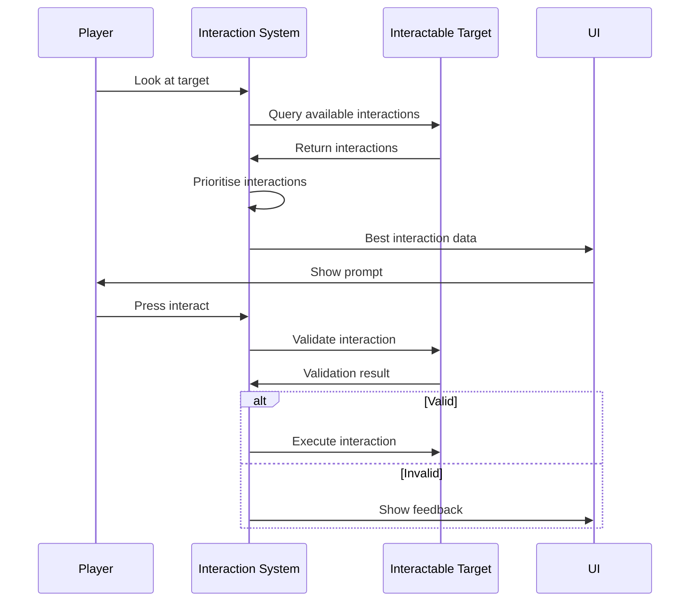
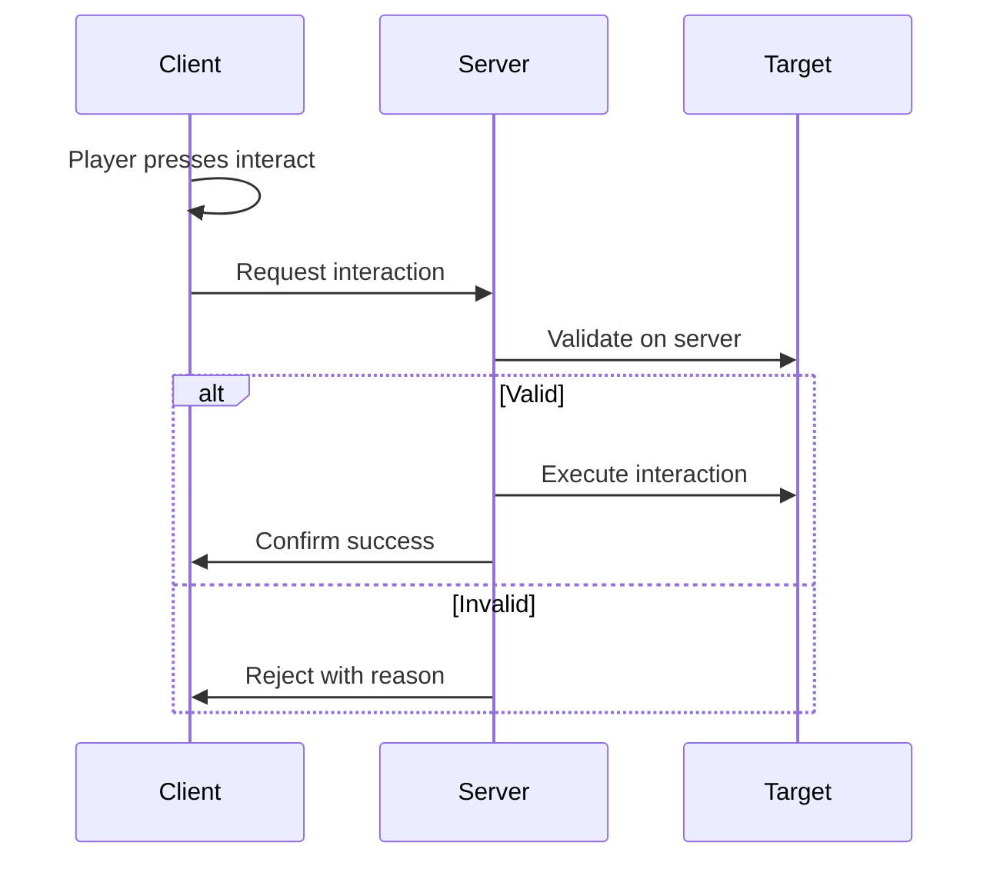

<Info>
The **Interaction System** handles discoverable, context-aware interactions between players and the game world.
</Info>

---

## What is the Interaction System?

The Interaction System provides a unified way to handle player interactions with objects, NPCs, vehicles, and other entities.

<CardGroup cols={2}>
  <Card title="Discovery" icon="magnifying-glass">
    Automatically finds interactable objects in range
  </Card>
  <Card title="Prioritisation" icon="list-ol">
    Determines which interaction to show when multiple are available
  </Card>
  <Card title="UI integration" icon="window">
    Provides data for interaction prompts
  </Card>
  <Card title="Validation" icon="shield">
    Checks if interactions are valid before allowing them
  </Card>
</CardGroup>

---

## Core workflow



---

## Key concepts

<AccordionGroup>
  <Accordion title="Interactables" icon="cube">
    Objects that can be interacted with. Implement `IInteractable`:

    ```csharp
    public class Door : Component, IInteractable
    {
        public InteractionDefinition Interaction => _openDoorInteraction;

        public bool CanInteract(Player player) => !_isLocked;

        public void OnInteract(Player player)
        {
            Toggle();
        }
    }
    ```
  </Accordion>

  <Accordion title="Interaction Definitions" icon="file-code">
    Data describing an interaction type:

    - Display name and icon
    - Input action required
    - Priority for sorting
    - Validation rules
  </Accordion>

  <Accordion title="Interaction Provider" icon="satellite-dish">
    Finds and manages available interactions:

    - Scans for nearby interactables
    - Filters by range and validity
    - Selects the best interaction
    - Handles input and execution
  </Accordion>

  <Accordion title="Interaction Prompts" icon="comment">
    UI elements showing available interactions:

    - Display interaction name
    - Show required input
    - Indicate validity state
  </Accordion>
</AccordionGroup>

---

## Quick example

<Steps>
  <Step title="Create an interaction definition">
    Define the interaction type in the editor or code:

    ```csharp
    var pickupInteraction = new InteractionDefinition
    {
        Id = "pickup_item",
        DisplayName = "Pick up",
        Icon = "hand-grab",
        InputAction = "interact",
        Range = 2f
    };
    ```
  </Step>

  <Step title="Make an object interactable">
    ```csharp
    public class PickupItem : Component, IInteractable
    {
        [Property]
        public InteractionDefinition Interaction { get; set; }

        public bool CanInteract(Player player)
        {
            return player.Inventory.HasSpace;
        }

        public void OnInteract(Player player)
        {
            player.Inventory.Add(this);
            GameObject.Destroy();
        }
    }
    ```
  </Step>

  <Step title="System handles the rest">
    - Player approaches item
    - System discovers the interaction
    - UI shows "Press E to Pick up"
    - Player presses E
    - System validates and executes
  </Step>
</Steps>

---

## Interaction types

| Type | Description | Example |
|------|-------------|---------|
| **Instant** | Happens immediately | Pick up item |
| **Hold** | Requires holding input | Revive player |
| **Toggle** | Turns state on/off | Open/close door |
| **Contextual** | Changes based on state | Lock/unlock |

```csharp
public class Door : Component, IInteractable
{
    private bool _isOpen;

    public InteractionDefinition Interaction =>
        _isOpen ? _closeInteraction : _openInteraction;

    public void OnInteract(Player player)
    {
        _isOpen = !_isOpen;
        Animate(_isOpen ? "open" : "close");
    }
}
```

---

## Multiple interactions

Objects can provide multiple interactions:

```csharp
public class Vehicle : Component, IMultiInteractable
{
    public IEnumerable<InteractionDefinition> GetInteractions(Player player)
    {
        yield return _enterInteraction;

        if (player.HasKey(KeyId))
        {
            yield return _lockInteraction;
        }

        if (_needsRepair)
        {
            yield return _repairInteraction;
        }
    }
}
```

The system prioritises and presents the best option.

---

## Server authority

<Warning>
Interactions that affect game state must be validated on the server.
</Warning>



---

## Features

| Feature | Description |
|---------|-------------|
| **Range-based discovery** | Finds interactions within configurable range |
| **Priority system** | Shows most relevant interaction |
| **Hold interactions** | Support for held interactions with progress |
| **Cooldowns** | Prevent interaction spam |
| **Validation** | Server-authoritative validation |
| **UI integration** | Data binding for prompts |

---

## In this section

<CardGroup cols={2}>
  <Card title="Concepts" icon="lightbulb" href="/corelib/interactions/concepts">
    Deep dive into interaction concepts
  </Card>
  <Card title="Authoring" icon="pen" href="/corelib/interactions/authoring">
    Creating interactable objects
  </Card>
  <Card title="Runtime Flow" icon="diagram-project" href="/corelib/interactions/runtime-flow">
    How interactions are processed
  </Card>
  <Card title="UI Prompts" icon="window" href="/corelib/interactions/ui-prompts">
    Building interaction UI
  </Card>
  <Card title="Debugging" icon="bug" href="/corelib/interactions/debugging">
    Troubleshooting interactions
  </Card>
  <Card title="Interaction Editor" icon="wrench" href="/editor/tools/interaction-editor">
    Editor tooling guide
  </Card>
</CardGroup>
