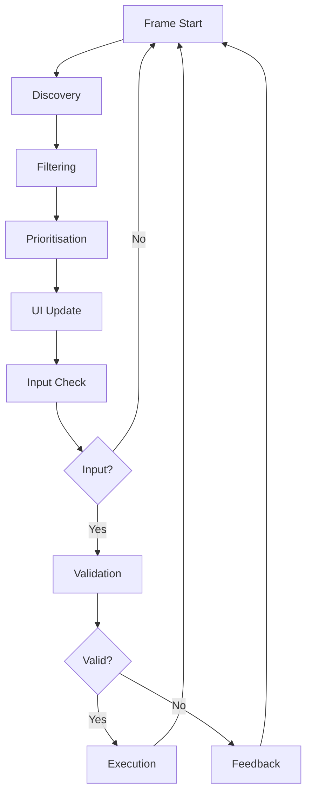
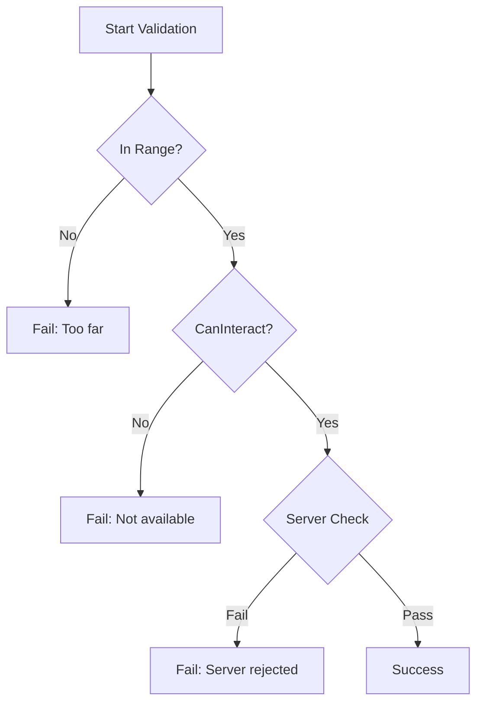
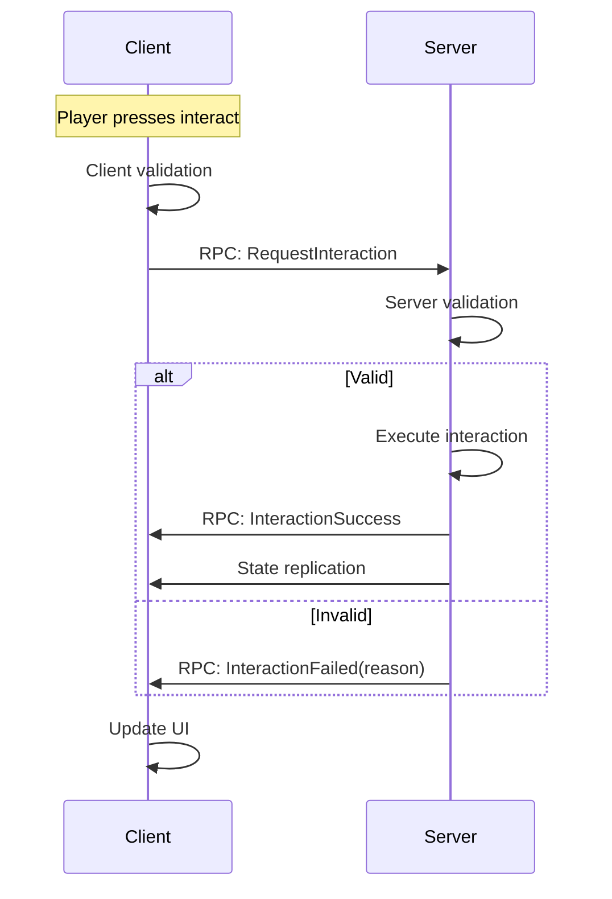

<Info>
This page details the runtime flow of the Interaction System, from discovery to execution.
</Info>

---

## Overview

The interaction system processes in several stages each frame:



---

## Discovery phase

The system scans for interactables using configurable methods:

<Tabs>
  <Tab title="Sphere scan">
    ```csharp
    // Find all interactables in radius
    var hits = Scene.FindInSphere(
        player.EyePosition,
        config.ScanRadius
    ).Where(x => x.Components.Get<IInteractable>() != null);
    ```

    **Best for:** Open areas, many small objects
  </Tab>
  <Tab title="Cone scan">
    ```csharp
    // Find interactables in view cone
    var hits = Scene.FindInCone(
        player.EyePosition,
        player.EyeRotation.Forward,
        config.ScanRadius,
        config.ScanAngle
    );
    ```

    **Best for:** Focused interaction, FPS games
  </Tab>
  <Tab title="Raycast">
    ```csharp
    // Find interactable player is looking at
    var hit = Scene.Trace.Ray(
        player.EyePosition,
        player.EyeRotation.Forward * config.ScanRadius
    ).Run();
    ```

    **Best for:** Precise targeting
  </Tab>
</Tabs>

### Discovery configuration

```csharp
public class DiscoveryConfig
{
    public DiscoveryMode Mode { get; set; } = DiscoveryMode.Cone;
    public float ScanRadius { get; set; } = 3f;
    public float ScanAngle { get; set; } = 60f;
    public float ScanInterval { get; set; } = 0.1f;
    public int MaxCandidates { get; set; } = 10;
    public LayerMask ScanLayers { get; set; }
}
```

---

## Filtering phase

Candidates are filtered based on multiple criteria:

<Steps>
  <Step title="Range check">
    ```csharp
    var distance = Vector3.Distance(player.Position, target.Position);
    var maxRange = target.GetInteractionRange() ?? config.DefaultRange;

    if (distance > maxRange)
        continue; // Skip
    ```
  </Step>

  <Step title="Line of sight">
    ```csharp
    var hasLineOfSight = !Scene.Trace
        .Ray(player.EyePosition, target.InteractionPoint)
        .Ignore(player)
        .Run()
        .Hit;

    if (!hasLineOfSight)
        continue; // Skip
    ```
  </Step>

  <Step title="CanInteract check">
    ```csharp
    if (!target.CanInteract(player))
        continue; // Skip
    ```
  </Step>
</Steps>

---

## Prioritisation phase

Valid candidates are sorted to find the best interaction:

```csharp
var sorted = candidates
    .OrderByDescending(c => c.Interaction.Priority)
    .ThenBy(c => c.Distance)
    .ThenByDescending(c => c.DotProduct)  // Center of view
    .ThenBy(c => c.LastInteractedTime);   // Prefer current target

var best = sorted.FirstOrDefault();
```

### Priority factors

| Factor | Weight | Description |
|--------|--------|-------------|
| Definition priority | Primary | Explicit priority in definition |
| Distance | Secondary | Closer objects preferred |
| View angle | Tertiary | Objects in centre of view |
| Stickiness | Quaternary | Current target slightly preferred |

---

## Input handling

When the player provides input:

```csharp
public void Update()
{
    // Check for interaction input
    if (InputSystem.IsActionPressed("interact"))
    {
        TryStartInteraction();
    }

    // Handle ongoing hold interactions
    if (_currentHoldInteraction != null)
    {
        UpdateHoldInteraction();
    }
}

private void TryStartInteraction()
{
    if (_currentInteraction == null)
        return;

    var result = ValidateInteraction(_currentInteraction, _player);

    if (result.IsSuccess)
    {
        StartInteraction(_currentInteraction, _player);
    }
    else
    {
        RaiseValidationFailed(result);
    }
}
```

---

## Validation flow



### Validation levels

<Tabs>
  <Tab title="Client (fast)">
    Quick checks for UI responsiveness:
    - Range
    - Line of sight
    - Basic `CanInteract`
  </Tab>
  <Tab title="Server (authoritative)">
    Full validation before execution:
    - All client checks
    - Anti-cheat validation
    - Game state verification
    - Resource checks
  </Tab>
</Tabs>

---

## Execution phase

### Instant interactions

```csharp
private void ExecuteInstant(InteractionContext context)
{
    // Notify start
    RaiseInteractionStarted(context);

    // Execute
    context.Target.OnInteract(context);

    // Notify complete
    RaiseInteractionCompleted(context);
}
```

### Hold interactions

```csharp
private void ExecuteHold(InteractionContext context)
{
    _holdContext = context;
    _holdStartTime = Time.Now;

    // Start hold
    context.Target.OnHoldStart(context);
    RaiseHoldStarted(context);
}

private void UpdateHoldInteraction()
{
    var elapsed = Time.Now - _holdStartTime;
    var duration = _holdContext.Interaction.HoldDuration;
    var progress = elapsed / duration;

    // Update progress
    _holdContext.Target.OnHoldProgress(_holdContext, progress);
    RaiseHoldProgress(_holdContext, progress);

    // Check completion
    if (progress >= 1f)
    {
        CompleteHoldInteraction();
    }

    // Check cancellation
    if (!InputSystem.IsActionHeld("interact"))
    {
        CancelHoldInteraction();
    }
}
```

---

## Events

The system raises events at each stage:

```csharp
// Subscribe to interaction events
InteractionSystem.OnInteractionAvailable += OnAvailable;
InteractionSystem.OnInteractionStarted += OnStarted;
InteractionSystem.OnInteractionCompleted += OnCompleted;
InteractionSystem.OnInteractionCancelled += OnCancelled;
InteractionSystem.OnValidationFailed += OnFailed;

// Hold-specific events
InteractionSystem.OnHoldStarted += OnHoldStarted;
InteractionSystem.OnHoldProgress += OnHoldProgress;
```

### Event data

```csharp
public class InteractionEventArgs
{
    public Player Player { get; set; }
    public IInteractable Target { get; set; }
    public InteractionDefinition Interaction { get; set; }
}

public class HoldProgressEventArgs : InteractionEventArgs
{
    public float Progress { get; set; }  // 0-1
    public float TimeRemaining { get; set; }
}

public class ValidationFailedEventArgs : InteractionEventArgs
{
    public ValidationResult Result { get; set; }
}
```

---

## Network flow



---

## Performance considerations

<CardGroup cols={2}>
  <Card title="Throttled scanning" icon="clock">
    Discovery doesn't run every frame
    ```csharp
    ScanInterval = 0.1f; // 10 times per second
    ```
  </Card>
  <Card title="Spatial partitioning" icon="grid">
    Uses scene's spatial structures for efficient queries
  </Card>
  <Card title="Candidate limits" icon="filter">
    Maximum candidates prevents expensive sorting
    ```csharp
    MaxCandidates = 10;
    ```
  </Card>
  <Card title="Cached results" icon="database">
    Results cached between scans with validity checks
  </Card>
</CardGroup>

---

## Related pages

<CardGroup cols={2}>
  <Card title="Concepts" icon="lightbulb" href="/corelib/interactions/concepts">
    Core interaction concepts
  </Card>
  <Card title="UI Prompts" icon="window" href="/corelib/interactions/ui-prompts">
    Building interaction UI
  </Card>
</CardGroup>
