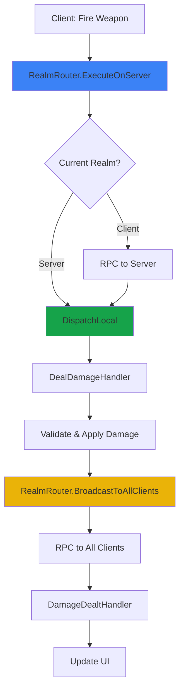

<Info>
**Execution Realms** provides a clean abstraction for network communication in s&box games. Instead of scattering `[Rpc]` methods throughout your codebase, define typed commands and handlers that are automatically routed to the correct execution context.
</Info>

---

## Execution contexts

<CardGroup cols={3}>
  <Card title="LocalClient" icon="desktop" color="#3B82F6">
    Execute immediately without networking

    UI updates, local effects, instant feedback
  </Card>
  <Card title="Server" icon="server" color="#16A34A">
    Execute on the server (authoritative)

    Validation, gameplay logic, state changes
  </Card>
  <Card title="AllClients" icon="users" color="#EAB308">
    Broadcast from server to all clients

    Synchronized events, global notifications
  </Card>
</CardGroup>

---

## Why use Execution Realms?

<Tabs>
  <Tab title="Traditional RPCs">
    **Scattered RPC methods throughout codebase**

    ```csharp
    // In PlayerController.cs
    [Rpc.Host]
    void ServerDealDamage(Guid targetId, float amount) { }

    // In InventoryManager.cs
    [Rpc.Host]
    void ServerUseItem(Guid itemId) { }

    // In ChatSystem.cs
    [Rpc.Broadcast]
    void BroadcastMessage(string player, string message) { }

    // ... 47 more scattered RPC methods across random components

    // Called from somewhere
    ServerDealDamage(target.Id, 10f); // Easy to swap parameters!
    ```

    **Problems:**
    - 🔴 Hard to find all networking code (scattered everywhere)
    - 🔴 No type safety (easy to mess up parameter order/types)
    - 🔴 Difficult to test (tightly coupled to components)
    - 🔴 No consistent validation patterns
    - 🔴 Easy to forget server authority checks
    - 🔴 Parameter changes break all call sites
  </Tab>
  <Tab title="Execution Realms">
    **Centralized, type-safe command definitions**

    ```csharp
    // Commands/DamageCommands.cs - All damage networking in one place
    [RealmCommand(Description = "Deal damage to target")]
    public struct DealDamageRequest : IRealmCommand
    {
        public Guid TargetId { get; set; }
        public float Amount { get; set; }
        public DamageType Type { get; set; }
    }

    // Handlers/DamageHandler.cs - Server validation logic
    public class DealDamageRequestHandler : RealmCommandHandler<DealDamageRequest>
    {
        protected override void OnHandle(in DealDamageRequest cmd, RealmContext ctx)
        {
            ctx.RequireServer();
            var sender = ctx.RequireSender();

            // Centralized validation and execution
            ApplyDamage(cmd.TargetId, cmd.Amount, cmd.Type, sender);
        }
    }

    // Anywhere in gameplay code - type-safe!
    RealmRouter.ExecuteOnServer(new DealDamageRequest
    {
        TargetId = target.Id,
        Amount = 25f,
        Type = DamageType.Explosive
    });
    ```

    **Benefits:**
    - ✅ All networking in centralized command definitions
    - ✅ Full type safety (compile-time errors for parameter mismatches)
    - ✅ Testable (mock handlers or service, test in isolation)
    - ✅ Consistent validation patterns (RequireServer, RequireSender)
    - ✅ Easy to find all network commands (one folder)
    - ✅ Clear separation: data (commands) vs logic (handlers)
  </Tab>
</Tabs>

---

## When to use this system

<CardGroup cols={2}>
  <Card title="Good fit" icon="check" color="#16A34A">
    - Medium to large multiplayer projects (5+ networked features)
    - Server-authoritative gameplay (damage, inventory, state changes)
    - Projects with multiple developers (reduces chaos)
    - Long-lived codebases (maintainability matters)
    - Want consistent patterns across all networking
  </Card>
  <Card title="Consider alternatives" icon="circle-xmark" color="#EAB308">
    - Small projects with 2-3 simple RPC calls
    - Prototypes where speed matters more than architecture
    - Single-player games (no networking needed)
    - Prefer direct `[Rpc]` for simplicity
  </Card>
</CardGroup>

---

## Quick example

<Steps>
  <Step title="Create your RealmModule">
    Create a subclass to register your command types:

    ```csharp
    public class MyGameRealmModule : RealmModule
    {
        protected override void RegisterCommandTypes()
        {
            // Register all command types
            CommandTypeRegistry.Register<DealDamageRequest>();
            CommandTypeRegistry.Register<DamageDealtEvent>();
            CommandTypeRegistry.Register<ShowHitmarkerLocal>();
        }
    }
    ```

    Add `MyGameRealmModule` component to your scene as a child of `CoreRoot`.
  </Step>

  <Step title="Define a command">
    Commands are structs implementing `IRealmCommand`:

    ```csharp
    [RealmCommand(Description = "Player requests to deal damage")]
    public struct DealDamageRequest : IRealmCommand
    {
        public Guid PlayerId { get; set; }
        public float Damage { get; set; }
        public Vector3 HitLocation { get; set; }
    }
    ```
  </Step>

  <Step title="Create a handler">
    Handlers inherit from `RealmCommandHandler<T>`:

    ```csharp
    public class DealDamageRequestHandler : RealmCommandHandler<DealDamageRequest>
    {
        protected override void OnHandle(in DealDamageRequest cmd, RealmContext ctx)
        {
            // Guard: must run on server
            ctx.RequireServer();
            var sender = ctx.RequireSender();

            // Apply damage
            var player = FindPlayer(cmd.PlayerId);
            var finalDamage = player?.TakeDamage(cmd.Damage, cmd.HitLocation) ?? 0f;

            // Broadcast result to all clients
            RealmRouter.BroadcastToAllClients(new DamageDealtEvent
            {
                PlayerId = cmd.PlayerId,
                FinalDamage = finalDamage
            });
        }
    }
    ```
  </Step>

  <Step title="Execute the command">
    ```csharp
    // From anywhere (client or server)
    RealmRouter.ExecuteOnServer(new DealDamageRequest
    {
        PlayerId = targetPlayer.Id,
        Damage = 25f,
        HitLocation = hitPoint
    });
    ```
  </Step>
</Steps>

---

## How it works



<AccordionGroup>
  <Accordion title="Command flow" icon="diagram-project">
    1. **Define command** - Struct with data to send
    2. **Execute command** - `RealmRouter.Execute(Realm, command)`
    3. **Route to realm** - System determines if RPC is needed
    4. **Dispatch locally** - Handlers receive command
    5. **Validate & execute** - Handlers process with context
  </Accordion>

  <Accordion title="Why manual registration?" icon="circle-question">
    s&box's reflection whitelist blocks automatic type discovery. Manual registration:
    - Prevents "command type not registered" errors
    - Makes all networking explicit and visible
    - Avoids order-of-initialization issues
    - Works reliably across builds
  </Accordion>

  <Accordion title="Type safety" icon="shield-halved">
    Commands are strongly-typed structs:
    - Compiler catches parameter errors
    - IntelliSense shows available fields
    - Refactoring tools work correctly
    - No runtime type confusion
  </Accordion>
</AccordionGroup>

---

## Key features

| Feature | Description |
|---------|-------------|
| **Type-safe commands** | Structs with compile-time validation |
| **Centralized networking** | All commands in one place, easy to find |
| **Automatic routing** | System handles RPC forwarding |
| **Validation helpers** | RequireServer, RequireSender built-in |
| **Testable** | Mock handlers or service for unit tests |
| **Auto-registration** | Handlers register themselves automatically |

---

## Common patterns

<Tabs>
  <Tab title="Client → Server">
    **Player action requiring server validation**

    ```csharp
    // Client: Request action
    RealmRouter.ExecuteOnServer(new UseItemRequest
    {
        ItemId = item.Id,
        PlayerId = player.Id
    });

    // Server: Validate and apply
    public class UseItemRequestHandler : RealmCommandHandler<UseItemRequest>
    {
        protected override void OnHandle(in UseItemRequest cmd, RealmContext ctx)
        {
            ctx.RequireServer();
            var sender = ctx.RequireSender();

            if (IsValidUse(cmd, sender))
            {
                ApplyItemEffect(cmd.ItemId, cmd.PlayerId);
            }
        }
    }
    ```
  </Tab>

  <Tab title="Server → AllClients">
    **Server broadcasts event to all clients**

    ```csharp
    // Server: Broadcast event
    RealmRouter.BroadcastToAllClients(new PlayerJoinedEvent
    {
        PlayerName = player.Name,
        PlayerId = player.Id
    });

    // All clients: Update UI
    public class PlayerJoinedHandler : RealmCommandHandler<PlayerJoinedEvent>
    {
        protected override void OnHandle(in PlayerJoinedEvent cmd, RealmContext ctx)
        {
            ShowNotification($"{cmd.PlayerName} joined the game");
        }
    }
    ```
  </Tab>

  <Tab title="LocalClient only">
    **Instant feedback without networking**

    ```csharp
    // Execute locally (no RPC)
    RealmRouter.ExecuteLocally(new ShowHitmarkerLocal
    {
        Position = hitPoint,
        Damage = estimatedDamage
    });

    // Handler executes immediately
    public class ShowHitmarkerHandler : RealmCommandHandler<ShowHitmarkerLocal>
    {
        protected override void OnHandle(in ShowHitmarkerLocal cmd, RealmContext ctx)
        {
            SpawnHitmarker(cmd.Position, cmd.Damage);
        }
    }
    ```
  </Tab>
</Tabs>

---

## In this section

<CardGroup cols={3}>
  <Card title="Getting Started" icon="rocket" href="/corelib/realms/getting-started">
    Step-by-step setup guide
  </Card>
  <Card title="Commands" icon="code" href="/corelib/realms/commands">
    Defining typed commands
  </Card>
  <Card title="Handlers" icon="microchip" href="/corelib/realms/handlers">
    Processing commands with handlers
  </Card>
  <Card title="Realms" icon="network-wired" href="/corelib/realms/realms">
    Execution contexts and routing
  </Card>
  <Card title="Patterns" icon="diagram-project" href="/corelib/realms/patterns">
    Common implementation patterns
  </Card>
  <Card title="Debugging" icon="bug" href="/corelib/realms/debugging">
    Troubleshooting guide
  </Card>
</CardGroup>
