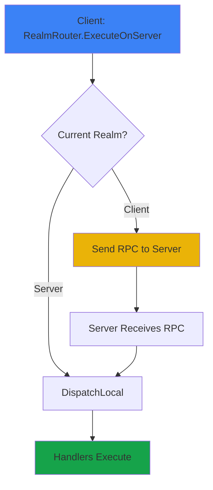
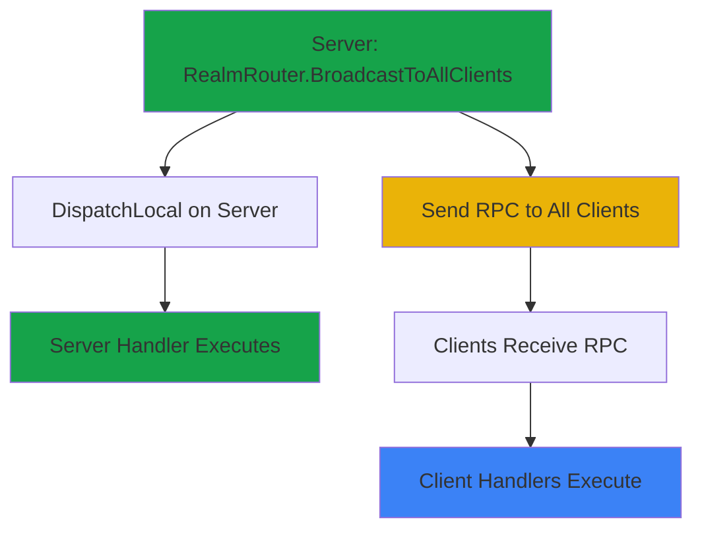

Realms define **where** a command executes. The Execution Realms system automatically handles RPC forwarding based on the target realm.

---

## Realm enum

Three execution contexts are available:

```csharp
public enum Realm
{
    LocalClient,    // Execute locally, no networking
    Server,         // Execute on server (forwards if needed)
    AllClients      // Broadcast to all clients (server only)
}
```

<CardGroup cols={3}>
  <Card title="LocalClient" icon="desktop" color="#3B82F6">
    **Execute immediately without networking**

    - No RPC overhead
    - Instant feedback
    - Client-only state

    **Use for:**
    - UI updates
    - Visual effects
    - Local predictions
  </Card>
  <Card title="Server" icon="server" color="#16A34A">
    **Execute on server (authoritative)**

    - Forwards from client if needed
    - Single source of truth
    - Validates client requests

    **Use for:**
    - Gameplay logic
    - Damage/healing
    - Inventory changes
  </Card>
  <Card title="AllClients" icon="users" color="#EAB308">
    **Broadcast from server to all clients**

    - Server must initiate
    - All clients receive
    - Synchronized events

    **Use for:**
    - Global notifications
    - State sync
    - Events all players see
  </Card>
</CardGroup>

---

## RealmRouter API

The static `RealmRouter` is the primary entry point:

### Core methods

```csharp
// Execute command in specified realm
void Execute<TCommand>(Realm realm, in TCommand command)

// Try to execute, return false on failure
bool TryExecute<TCommand>(Realm realm, in TCommand command)
```

### Convenience helpers

<Tabs>
  <Tab title="ExecuteOnServer">
    ```csharp
    // Execute on server (forwards from client if needed)
    RealmRouter.ExecuteOnServer(new DealDamageRequest
    {
        TargetId = target.Id,
        Amount = 25f
    });

    // Equivalent to:
    RealmRouter.Execute(Realm.Server, command);
    ```
  </Tab>

  <Tab title="BroadcastToAllClients">
    ```csharp
    // Broadcast from server to all clients
    RealmRouter.BroadcastToAllClients(new DamageDealtEvent
    {
        TargetId = target.Id,
        FinalDamage = 25f
    });

    // Equivalent to:
    RealmRouter.Execute(Realm.AllClients, event);
    ```

    <Warning>
    Only works from server! Clients cannot broadcast.
    </Warning>
  </Tab>

  <Tab title="ExecuteLocally">
    ```csharp
    // Execute locally without networking
    RealmRouter.ExecuteLocally(new ShowHitmarkerLocal
    {
        Position = hitPoint,
        Damage = damage
    });

    // Equivalent to:
    RealmRouter.Execute(Realm.LocalClient, command);
    ```
  </Tab>

  <Tab title="ExecuteOnServerThenBroadcast">
    ```csharp
    // Common pattern: Server validates, then broadcasts
    RealmRouter.ExecuteOnServerThenBroadcast(
        new PlayerActionEvent { ... },
        validate: (cmd, ctx) =>
        {
            // Server-side validation
            return IsValidAction(cmd, ctx.Sender);
        }
    );
    ```

    This is equivalent to:
    1. Execute on server
    2. If validation passes, broadcast to all clients
  </Tab>
</Tabs>

---

## Execution flow

### LocalClient


**Behavior:**
- Executes immediately on the calling client
- No RPC overhead
- No network latency
- Handlers execute synchronously

**Example:**
```csharp
RealmRouter.ExecuteLocally(new UpdateHealthUILocal
{
    CurrentHealth = 75f,
    MaxHealth = 100f
});
```

---

### Server (from client)



**Behavior:**
- If on server: executes locally
- If on client: sends RPC to server
- Server handlers receive with `context.Sender` set

**Example:**
```csharp
// Client code
RealmRouter.ExecuteOnServer(new DealDamageRequest
{
    TargetId = target.Id,
    Amount = weaponDamage
});

// Server handler
protected override void OnHandle(in DealDamageRequest cmd, RealmContext ctx)
{
    ctx.RequireServer();
    var attacker = ctx.RequireSender(); // Who sent the request

    ApplyDamage(cmd.TargetId, cmd.Amount, attacker);
}
```

---

### AllClients (from server)



**Behavior:**
- Server executes locally
- Server broadcasts RPC to all connected clients
- All clients execute (including late-joiners get future broadcasts)

**Example:**
```csharp
// Server code
RealmRouter.BroadcastToAllClients(new PlayerJoinedEvent
{
    PlayerId = player.Id,
    PlayerName = player.Name
});

// Client handler
protected override void OnHandle(in PlayerJoinedEvent cmd, RealmContext ctx)
{
    ShowNotification($"{cmd.PlayerName} joined the game");
}
```

---

## Realm behavior matrix

| Realm | From Client | From Server | Network Cost | Use Case |
|-------|-------------|-------------|--------------|----------|
| **LocalClient** | ✅ Executes locally | ✅ Executes locally | None | UI updates, effects |
| **Server** | ✅ Forwards to server | ✅ Executes locally | 1 RPC | Authoritative logic |
| **AllClients** | ❌ Fails | ✅ Broadcasts | N RPCs | Global events |

---

## Single-player behavior

In single-player (host mode), the host is both server and client:

```csharp
// In single-player:
Networking.IsHost == true
context.IsServer == true
context.IsClient == true

// LocalClient: Executes locally (same as multiplayer)
RealmRouter.ExecuteLocally(cmd);

// Server: Executes locally (no RPC needed)
RealmRouter.ExecuteOnServer(cmd);

// AllClients: Executes locally (no broadcast needed)
RealmRouter.BroadcastToAllClients(cmd);
```

<Info>
No RPC overhead in single-player - all commands execute locally!
</Info>

---

## Error handling

### TryExecute

For graceful failure handling:

```csharp
if (!RealmRouter.TryExecute(Realm.AllClients, command))
{
    Log.Warning("Failed to broadcast - are we the server?");
    // Handle failure gracefully
}
```

### Execute

Throws exceptions on failure:

```csharp
try
{
    RealmRouter.Execute(Realm.AllClients, command);
}
catch (InvalidOperationException ex)
{
    Log.Error($"Broadcast failed: {ex.Message}");
}
```

---

## Common mistakes

<AccordionGroup>
  <Accordion title="Client trying to broadcast" icon="triangle-exclamation">
    **Error:** `Cannot broadcast from client`

    ```csharp
    // ❌ Client cannot do this
    RealmRouter.BroadcastToAllClients(new Event { ... });
    ```

    **Fix:** Send to server, let server broadcast:
    ```csharp
    // ✅ Client sends request to server
    RealmRouter.ExecuteOnServer(new EventRequest { ... });

    // ✅ Server validates and broadcasts
    protected override void OnHandle(in EventRequest cmd, RealmContext ctx)
    {
        ctx.RequireServer();
        RealmRouter.BroadcastToAllClients(new Event { ... });
    }
    ```
  </Accordion>

  <Accordion title="Forgetting to check realm" icon="circle-xmark">
    **Problem:** Handler logic runs on wrong realm

    ```csharp
    // ❌ Bad - runs on both client and server
    protected override void OnHandle(in MyCommand cmd, RealmContext ctx)
    {
        ApplyDamage(cmd.TargetId, cmd.Amount); // Runs everywhere!
    }
    ```

    **Fix:** Guard with realm checks:
    ```csharp
    // ✅ Good - only runs on server
    protected override void OnHandle(in MyCommand cmd, RealmContext ctx)
    {
        ctx.RequireServer();
        ApplyDamage(cmd.TargetId, cmd.Amount);
    }
    ```
  </Accordion>

  <Accordion title="Using wrong realm" icon="arrows-spin">
    **Problem:** LocalClient command sent to server

    ```csharp
    // ❌ Bad - UI update command sent to server (wasteful)
    RealmRouter.ExecuteOnServer(new UpdateHealthUILocal { ... });
    ```

    **Fix:** Use correct realm:
    ```csharp
    // ✅ Good - UI updates are local only
    RealmRouter.ExecuteLocally(new UpdateHealthUILocal { ... });
    ```
  </Accordion>
</AccordionGroup>

---

## Performance considerations

| Realm | Latency | Bandwidth | Use Sparingly For |
|-------|---------|-----------|-------------------|
| **LocalClient** | 0ms | 0 bytes | ✅ Use freely |
| **Server** | 1 RTT | Small | Per-frame updates |
| **AllClients** | 1 RTT × N | Small × N | High-frequency events |

<Tip>
**Best practice:** Use LocalClient for immediate feedback, Server for validation, AllClients for synchronized events.
</Tip>

---

## Related pages

<CardGroup cols={3}>
  <Card title="Commands" icon="code" href="/corelib/realms/commands">
    Define command types
  </Card>
  <Card title="Handlers" icon="microchip" href="/corelib/realms/handlers">
    Process commands
  </Card>
  <Card title="Patterns" icon="diagram-project" href="/corelib/realms/patterns">
    Real-world examples
  </Card>
</CardGroup>
