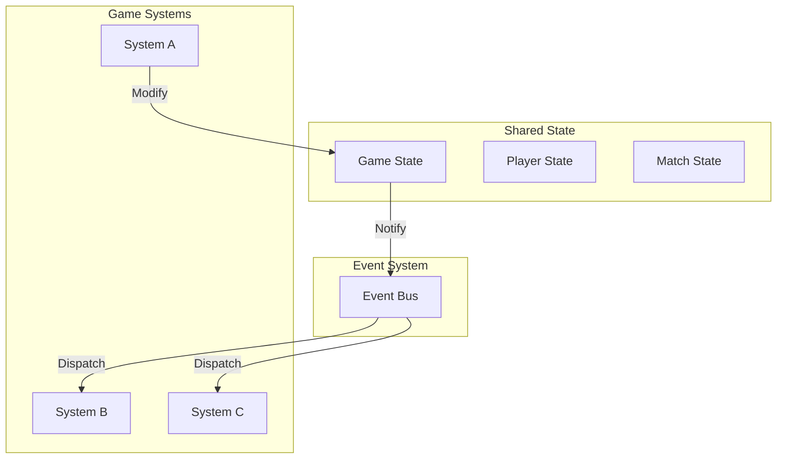

<Info>
The **State & Events** system provides patterns for managing shared state and decoupled communication between systems.
</Info>

---

## What this system provides

<CardGroup cols={2}>
  <Card title="Shared State" icon="database">
    Centralized, observable state that multiple systems can access
  </Card>
  <Card title="Events" icon="bolt">
    Type-safe event dispatching for decoupled communication
  </Card>
  <Card title="Observability" icon="eye">
    React to state changes without tight coupling
  </Card>
  <Card title="Patterns" icon="shapes">
    Recommended patterns for common scenarios
  </Card>
</CardGroup>

---

## Why use this system?

<Tabs>
  <Tab title="Without">
    ```csharp
    // Tight coupling, hard to maintain
    public class DamageSystem
    {
        private ScoreSystem _scores;
        private UISystem _ui;
        private AudioSystem _audio;
        private AchievementSystem _achievements;

        public void DealDamage(Player target, float amount)
        {
            target.Health -= amount;

            if (target.Health <= 0)
            {
                // Everyone needs to know
                _scores.AddKill(attacker);
                _ui.ShowKillFeed(attacker, target);
                _audio.PlayKillSound();
                _achievements.CheckKillAchievements(attacker);
            }
        }
    }
    ```
  </Tab>
  <Tab title="With">
    ```csharp
    // Decoupled, extensible
    public class DamageSystem
    {
        public void DealDamage(Player target, float amount)
        {
            target.Health -= amount;

            Events.Dispatch(new DamageDealtEvent
            {
                Target = target,
                Amount = amount
            });

            if (target.Health <= 0)
            {
                Events.Dispatch(new PlayerKilledEvent
                {
                    Victim = target,
                    Killer = attacker
                });
            }
        }
    }

    // Other systems subscribe independently
    Events.On<PlayerKilledEvent>(e => AddKill(e.Killer));
    Events.On<PlayerKilledEvent>(e => ShowKillFeed(e));
    Events.On<PlayerKilledEvent>(e => PlayKillSound());
    ```
  </Tab>
</Tabs>

---

## Core concepts



<AccordionGroup>
  <Accordion title="Shared State" icon="database">
    Centralized containers for game data:
    - Accessible from multiple systems
    - Observable (fires events on change)
    - Server-authoritative where needed
  </Accordion>

  <Accordion title="Events" icon="bolt">
    Typed messages for system communication:
    - Fire-and-forget dispatching
    - Multiple subscribers per event
    - No direct coupling between systems
  </Accordion>

  <Accordion title="Observers" icon="eye">
    React to state changes:
    - Property change notifications
    - Collection change notifications
    - Computed/derived values
  </Accordion>
</AccordionGroup>

---

## Quick example

### Define an event

```csharp
public struct ScoreChangedEvent
{
    public Player Player;
    public int OldScore;
    public int NewScore;
}
```

### Dispatch events

```csharp
public class ScoreSystem
{
    private Dictionary<Player, int> _scores = new();

    public void AddScore(Player player, int amount)
    {
        var oldScore = _scores.GetValueOrDefault(player);
        var newScore = oldScore + amount;
        _scores[player] = newScore;

        Events.Dispatch(new ScoreChangedEvent
        {
            Player = player,
            OldScore = oldScore,
            NewScore = newScore
        });
    }
}
```

### Subscribe to events

```csharp
public class ScoreUI : Panel
{
    protected override void OnStart()
    {
        Events.On<ScoreChangedEvent>(OnScoreChanged);
    }

    private void OnScoreChanged(ScoreChangedEvent e)
    {
        if (e.Player == Local.Pawn)
        {
            UpdateScoreDisplay(e.NewScore);
        }
    }

    protected override void OnDestroy()
    {
        Events.Off<ScoreChangedEvent>(OnScoreChanged);
    }
}
```

---

## State vs Events

| Use State for | Use Events for |
|--------------|----------------|
| Data that persists | One-time notifications |
| Queried frequently | Fire-and-forget messages |
| Needs history/rollback | Triggering reactions |
| Server-authoritative data | Cross-system communication |

---

## Features

| Feature | Description |
|---------|-------------|
| **Typed events** | Compile-time safety for event data |
| **Priority handlers** | Control handler execution order |
| **Scoped subscriptions** | Auto-cleanup with scope |
| **Event filtering** | Subscribe with conditions |
| **State observation** | React to property changes |
| **Networking** | Server/client event routing |

---

## In this section

<CardGroup cols={2}>
  <Card title="Shared State" icon="database" href="/corelib/state/shared-state">
    Managing centralized state
  </Card>
  <Card title="Events" icon="bolt" href="/corelib/state/events">
    Event system deep dive
  </Card>
  <Card title="Patterns" icon="shapes" href="/corelib/state/patterns">
    Recommended usage patterns
  </Card>
</CardGroup>
