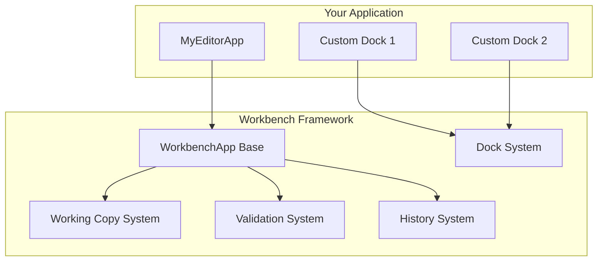
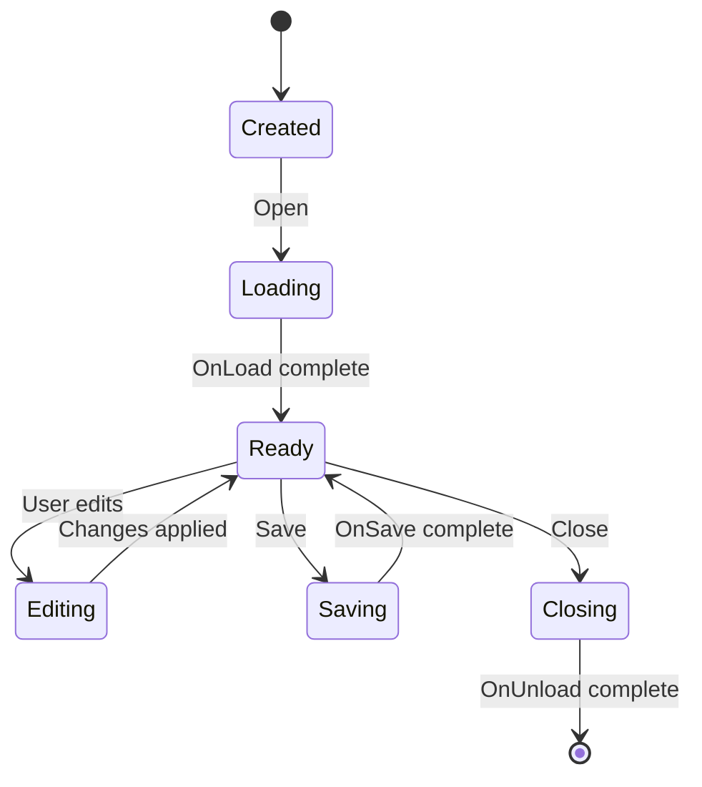
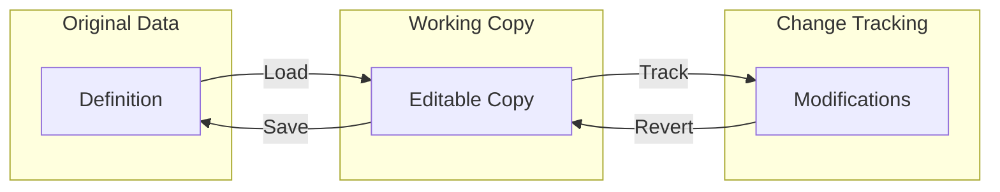
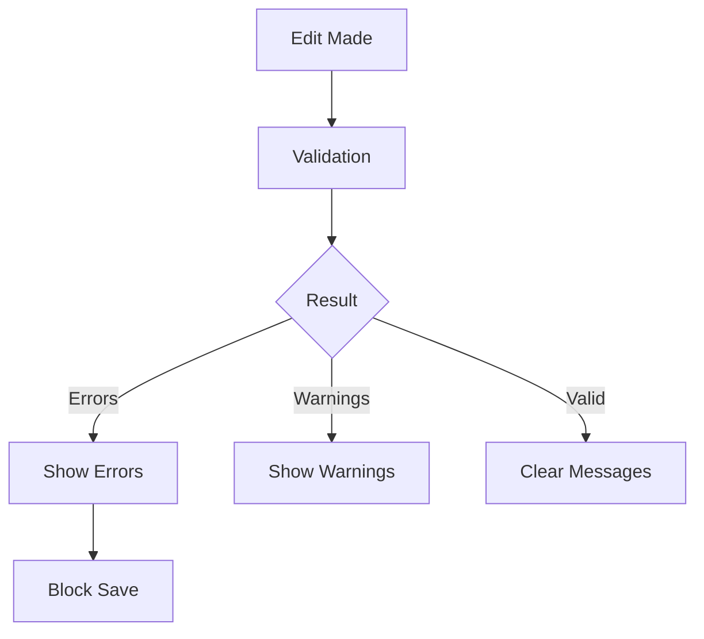
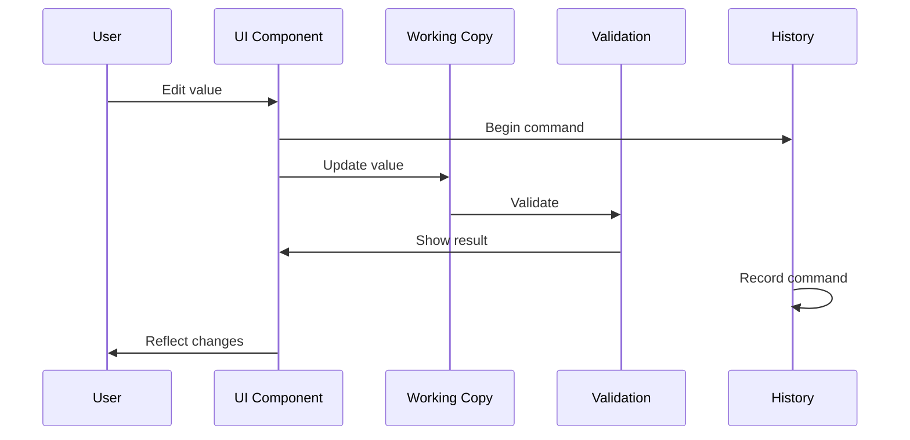

<Info>
This page explains the architecture of Workbench and how its components work together.
</Info>

---

## Component overview



---

## WorkbenchApp

The base class for all Workbench applications:

```csharp
public abstract class WorkbenchApp
{
    // Identity
    public abstract string Title { get; }
    public virtual string Icon => "window";

    // Lifecycle
    protected virtual void OnLoad() { }
    protected virtual void OnUnload() { }

    // UI
    protected abstract void BuildUI();

    // Data
    protected virtual void OnSave() { }
    protected virtual bool OnCanSave() => true;

    // State
    public bool IsDirty { get; protected set; }
    public bool HasErrors { get; protected set; }
}
```

### Lifecycle



---

## Dock system

Workbench uses a flexible dock system for UI layout:

<Tabs>
  <Tab title="Dock positions">
    ```csharp
    public enum DockPosition
    {
        Left,
        Right,
        Top,
        Bottom,
        Center,
        Floating
    }

    // Usage
    AddDock<HierarchyDock>("Items", DockPosition.Left);
    AddDock<InspectorDock>("Properties", DockPosition.Right);
    AddDock<PreviewDock>("Preview", DockPosition.Bottom);
    ```
  </Tab>
  <Tab title="Dock sizes">
    ```csharp
    AddDock<HierarchyDock>("Items", DockPosition.Left)
        .WithWidth(250)
        .WithMinWidth(200)
        .WithMaxWidth(400);
    ```
  </Tab>
  <Tab title="Dock groups">
    ```csharp
    // Tabbed docks
    var group = AddDockGroup(DockPosition.Right);
    group.AddDock<InspectorDock>("Properties");
    group.AddDock<SettingsDock>("Settings");
    ```
  </Tab>
</Tabs>

### Built-in docks

| Dock | Purpose |
|------|---------|
| `HierarchyDock` | Tree view of items |
| `InspectorDock` | Property editor |
| `PreviewDock` | Visual preview |
| `ConsoleDock` | Log output |
| `ValidationDock` | Error list |

---

## Working copy system

The working copy isolates edits from original data:



```csharp
public class WorkingCopy<T> where T : Definition
{
    // Get current state
    public T Current { get; }

    // Check for changes
    public bool IsDirty { get; }

    // Commit changes
    public void Save();

    // Discard changes
    public void Revert();

    // Track specific properties
    public void OnPropertyChanged(string property);
}
```

---

## Validation system

Validation runs automatically on changes:



```csharp
public class ValidationSystem
{
    // Run validation
    public ValidationResult Validate(object target);

    // Subscribe to validation changes
    public event Action<ValidationResult> OnValidationChanged;

    // Check state
    public bool HasErrors { get; }
    public bool HasWarnings { get; }
    public IEnumerable<ValidationMessage> Messages { get; }
}
```

---

## History system

Undo/redo with command pattern:

```csharp
public class HistorySystem
{
    // Execute and record
    public void Execute(ICommand command);

    // Navigation
    public void Undo();
    public void Redo();

    // State
    public bool CanUndo { get; }
    public bool CanRedo { get; }

    // Grouping
    public void BeginGroup(string name);
    public void EndGroup();
}

// Commands
public interface ICommand
{
    string Description { get; }
    void Execute();
    void Undo();
}
```

---

## Data binding

Workbench uses reactive data binding:

```csharp
// Bind property to UI
_nameField.Bind(
    () => _workingCopy.Current.Name,
    value => _workingCopy.Current.Name = value
);

// Bind list to hierarchy
_hierarchy.Bind(_workingCopy.Items);

// Bind selection
_inspector.Bind(_workingCopy.Selected);
```

---

## Event flow



---

## Extension points

| Extension | Purpose |
|-----------|---------|
| Custom docks | New panel types |
| Custom validators | Additional validation |
| Custom commands | New undo/redo actions |
| Custom bindings | Specialized UI binding |

---

## Related pages

<CardGroup cols={2}>
  <Card title="Working Copy" icon="copy" href="/editor/workbench/working-copy">
    Data editing patterns
  </Card>
  <Card title="Creating Apps" icon="plus" href="/editor/extending/creating-a-workbench-app">
    Building your own editor
  </Card>
</CardGroup>
