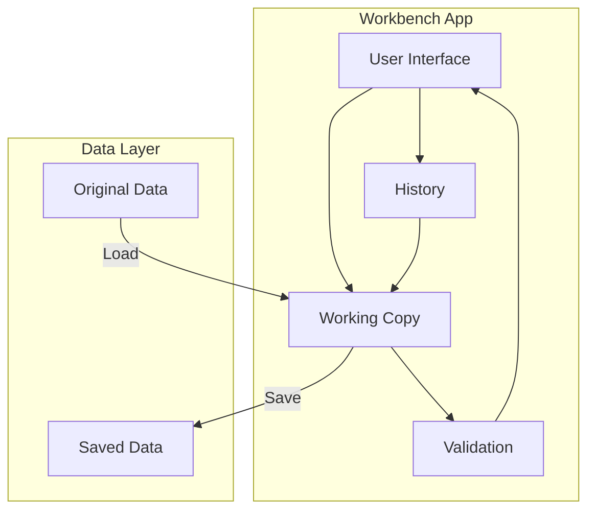

<Info>
**Workbench** is CoreLib's framework for building consistent, full-featured editor applications.
</Info>

---

## What is Workbench?

Workbench provides a foundation for building editor tools:

<CardGroup cols={2}>
  <Card title="Consistent UI" icon="table-columns">
    Standard layouts, docks, and panels
  </Card>
  <Card title="Working copy" icon="copy">
    Edit data without affecting originals
  </Card>
  <Card title="Validation" icon="shield">
    Real-time feedback on data issues
  </Card>
  <Card title="Undo/Redo" icon="rotate-left">
    Full history management
  </Card>
</CardGroup>

---

## Built on Workbench

CoreLib's editors are built on Workbench:

- **Input Editor** — Configure input actions and bindings
- **Interaction Editor** — Author interaction definitions
- **Definition browsers** — View and edit any definition type

Game projects can build their own editors using the same framework.

---

## Workbench architecture



---

## Key concepts

<AccordionGroup>
  <Accordion title="Workbench App" icon="window">
    The main class for an editor application:

    ```csharp
    public class MyEditor : WorkbenchApp
    {
        public override string Title => "My Editor";

        protected override void BuildUI()
        {
            // Build your editor UI
        }
    }
    ```
  </Accordion>

  <Accordion title="Working Copy" icon="copy">
    Edits happen on a copy, not the original:

    - Safe experimentation
    - Cancel discards changes
    - Save commits changes
  </Accordion>

  <Accordion title="Docks" icon="table-columns">
    Customizable panel layout:

    - Hierarchy/tree views
    - Properties/inspector
    - Preview
    - Custom panels
  </Accordion>

  <Accordion title="Validation" icon="shield">
    Real-time data validation:

    - Errors shown immediately
    - Cannot save with errors
    - Custom validation rules
  </Accordion>
</AccordionGroup>

---

## Quick example

```csharp
public class WeaponEditor : WorkbenchApp
{
    public override string Title => "Weapon Editor";
    public override string Icon => "gun";

    private WorkingCopy<WeaponDefinition> _workingCopy;

    protected override void OnLoad()
    {
        _workingCopy = new WorkingCopy<WeaponDefinition>(
            Definitions.GetAll<WeaponDefinition>()
        );
    }

    protected override void BuildUI()
    {
        // Hierarchy dock
        AddDock<HierarchyDock>("Weapons", DockPosition.Left)
            .Bind(_workingCopy.Items);

        // Inspector dock
        AddDock<InspectorDock>("Properties", DockPosition.Right)
            .Bind(_workingCopy.Selected);

        // Preview dock
        AddDock<PreviewDock>("Preview", DockPosition.Bottom);
    }

    protected override void OnSave()
    {
        _workingCopy.SaveAll();
    }
}
```

---

## Features

| Feature | Description |
|---------|-------------|
| **Dock system** | Flexible panel arrangement |
| **Working copy** | Safe editing with revert |
| **Undo/Redo** | Full history with grouping |
| **Validation** | Real-time error detection |
| **Keyboard shortcuts** | Standard and custom bindings |
| **Theming** | Consistent with s&box editor |

---

## In this section

<CardGroup cols={2}>
  <Card title="Architecture" icon="diagram-project" href="/editor/workbench/architecture">
    How Workbench is structured
  </Card>
  <Card title="Working Copy" icon="copy" href="/editor/workbench/working-copy">
    Safe data editing patterns
  </Card>
  <Card title="Validation" icon="shield" href="/editor/workbench/validation">
    Real-time validation
  </Card>
  <Card title="Undo/Redo" icon="rotate-left" href="/editor/workbench/undo-redo">
    History management
  </Card>
</CardGroup>

---

## Built-in tools

<CardGroup cols={2}>
  <Card title="Input Editor" icon="gamepad" href="/editor/tools/input-editor">
    Configure input system
  </Card>
  <Card title="Interaction Editor" icon="hand-pointer" href="/editor/tools/interaction-editor">
    Author interactions
  </Card>
</CardGroup>

---

## Extending Workbench

<CardGroup cols={2}>
  <Card title="Creating Apps" icon="plus" href="/editor/extending/creating-a-workbench-app">
    Build your own editor
  </Card>
  <Card title="Custom Docks" icon="table-columns" href="/editor/extending/custom-docks">
    Create custom panels
  </Card>
  <Card title="Validation Rules" icon="shield" href="/editor/extending/validation-rules">
    Add custom validation
  </Card>
  <Card title="Debug Tools" icon="bug" href="/editor/extending/debug-tools">
    Runtime debugging
  </Card>
</CardGroup>
