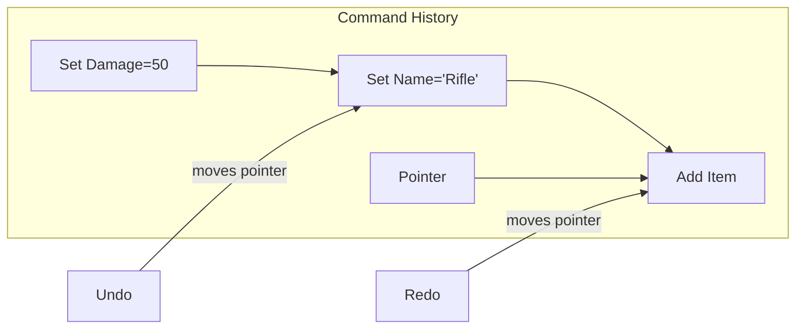

<Info>
Workbench provides automatic undo/redo support for all data changes.
</Info>

---

## How it works

Every change creates a command that can be undone:



---

## Basic usage

### Automatic tracking

```csharp
// Changes are tracked automatically
_workingCopy.Current.Damage = 100;  // Recorded
_workingCopy.Current.Name = "Test"; // Recorded

// Undo/redo
_workingCopy.History.Undo(); // Name reverted
_workingCopy.History.Undo(); // Damage reverted
_workingCopy.History.Redo(); // Damage restored
```

### Manual commands

```csharp
// Create custom command
var command = new SetPropertyCommand(
    target: _weapon,
    property: nameof(WeaponDefinition.Damage),
    oldValue: _weapon.Damage,
    newValue: 100
);

// Execute and record
_workingCopy.History.Execute(command);
```

---

## Command grouping

Group related changes into a single undo step:

```csharp
// Start group
_workingCopy.History.BeginGroup("Resize weapon stats");

// Multiple changes
_weapon.Damage *= 2;
_weapon.FireRate *= 0.5f;
_weapon.MagazineSize *= 2;

// End group
_workingCopy.History.EndGroup();

// Single undo reverses all three changes
_workingCopy.History.Undo();
```

### Using scope

```csharp
using (_workingCopy.History.Group("Bulk edit"))
{
    foreach (var weapon in selectedWeapons)
    {
        weapon.Damage *= multiplier;
    }
} // Group ends automatically
```

---

## Custom commands

### Command interface

```csharp
public interface ICommand
{
    string Description { get; }
    void Execute();
    void Undo();
    bool CanMerge(ICommand other);
    ICommand Merge(ICommand other);
}
```

### Example command

```csharp
public class MoveItemCommand : ICommand
{
    private readonly List<object> _items;
    private readonly int _oldIndex;
    private readonly int _newIndex;

    public string Description => $"Move {_items.Count} items";

    public MoveItemCommand(List<object> items, int from, int to)
    {
        _items = items.ToList();
        _oldIndex = from;
        _newIndex = to;
    }

    public void Execute()
    {
        var item = _items[_oldIndex];
        _items.RemoveAt(_oldIndex);
        _items.Insert(_newIndex, item);
    }

    public void Undo()
    {
        var item = _items[_newIndex];
        _items.RemoveAt(_newIndex);
        _items.Insert(_oldIndex, item);
    }
}
```

---

## Command merging

Merge rapid successive changes:

```csharp
public class SetValueCommand<T> : ICommand
{
    public bool CanMerge(ICommand other)
    {
        // Merge if same property on same target
        return other is SetValueCommand<T> otherSet
            && otherSet.Target == Target
            && otherSet.Property == Property
            && Time.Now - _timestamp < 0.5f;
    }

    public ICommand Merge(ICommand other)
    {
        var otherSet = (SetValueCommand<T>)other;

        // Keep original old value, use new new value
        return new SetValueCommand<T>(
            Target,
            Property,
            OldValue,          // Original
            otherSet.NewValue  // Latest
        );
    }
}
```

This prevents rapid typing from creating many undo steps.

---

## UI integration

### Undo/redo buttons

```csharp
public class ToolbarDock : Dock
{
    private Button _undoButton;
    private Button _redoButton;

    protected override void OnBuild()
    {
        _undoButton = AddButton("Undo", Icons.Undo, OnUndo);
        _redoButton = AddButton("Redo", Icons.Redo, OnRedo);

        // Update button state
        History.OnChanged += UpdateButtons;
    }

    private void UpdateButtons()
    {
        _undoButton.Enabled = History.CanUndo;
        _redoButton.Enabled = History.CanRedo;

        _undoButton.Tooltip = History.CanUndo
            ? $"Undo: {History.UndoDescription}"
            : "Nothing to undo";
    }

    private void OnUndo() => History.Undo();
    private void OnRedo() => History.Redo();
}
```

### Keyboard shortcuts

```csharp
protected override void OnKeyDown(KeyEvent e)
{
    if (e.Ctrl && e.Key == Key.Z)
    {
        if (e.Shift)
            History.Redo();
        else
            History.Undo();

        e.Handled = true;
    }
}
```

---

## History limits

```csharp
// Configure history limits
History.MaxCommands = 100;       // Keep last 100 commands
History.MaxMemory = 50 * 1024;   // Max 50MB of history data

// Clear history
History.Clear();
```

---

## History events

```csharp
History.OnCommandExecuted += (cmd) =>
{
    Log.Info($"Executed: {cmd.Description}");
};

History.OnUndo += (cmd) =>
{
    Log.Info($"Undone: {cmd.Description}");
};

History.OnRedo += (cmd) =>
{
    Log.Info($"Redone: {cmd.Description}");
};

History.OnCleared += () =>
{
    Log.Info("History cleared");
};
```

---

## Best practices

<CardGroup cols={2}>
  <Card title="Group related changes" icon="layer-group">
    Use command groups for multi-property edits
  </Card>
  <Card title="Descriptive names" icon="tag">
    Give commands clear descriptions
  </Card>
  <Card title="Merge rapid edits" icon="compress">
    Implement merging for text/slider changes
  </Card>
  <Card title="Limit history" icon="filter">
    Set reasonable limits to prevent memory issues
  </Card>
</CardGroup>

---

## Related pages

<CardGroup cols={2}>
  <Card title="Working Copy" icon="copy" href="/editor/workbench/working-copy">
    Data editing with undo support
  </Card>
  <Card title="Creating Apps" icon="plus" href="/editor/extending/creating-a-workbench-app">
    Building editors with undo/redo
  </Card>
</CardGroup>
