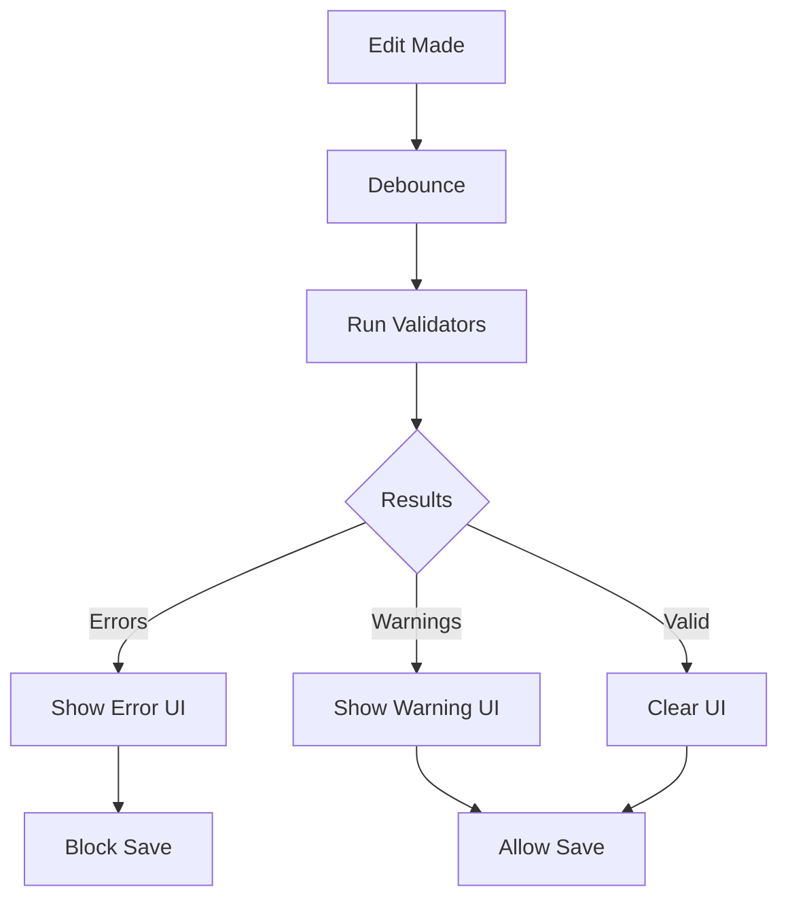

<Info>
Workbench provides real-time validation feedback as users edit data.
</Info>

---

## Validation flow



---

## Validation sources

### Attribute validation

```csharp
public class WeaponDefinition : Definition
{
    [Required]
    public string DisplayName { get; set; }

    [Range(1, 500)]
    public float Damage { get; set; }

    [AssetPath("models/*.vmdl")]
    public string ModelPath { get; set; }
}
```

### IValidatable interface

```csharp
public class RecipeDefinition : Definition, IValidatable
{
    public void Validate(ValidationContext context)
    {
        if (Ingredients.Count == 0)
        {
            context.AddError("Recipe must have ingredients");
        }
    }
}
```

### External validators

```csharp
public class WeaponBalanceValidator : IValidator<WeaponDefinition>
{
    public void Validate(WeaponDefinition weapon, ValidationContext context)
    {
        var dps = weapon.Damage * weapon.FireRate;
        if (dps > 200)
        {
            context.AddWarning("High DPS - review for balance");
        }
    }
}
```

---

## Registering validators

```csharp
public class WeaponEditor : WorkbenchApp
{
    protected override void OnLoad()
    {
        // Register custom validators
        Validation.Register<WeaponDefinition>(new WeaponBalanceValidator());
        Validation.Register<WeaponDefinition>(new AssetExistsValidator());
    }
}
```

---

## Validation messages

### Message levels

```csharp
public enum ValidationLevel
{
    Error,    // Must fix, blocks save
    Warning,  // Should fix, allows save
    Info      // Informational only
}
```

### Message properties

```csharp
public class ValidationMessage
{
    public ValidationLevel Level { get; set; }
    public string Message { get; set; }
    public string PropertyPath { get; set; }  // Which property
    public object Target { get; set; }         // Which object
    public string Suggestion { get; set; }     // How to fix
}
```

---

## Displaying validation

### Field-level errors

```csharp
// In inspector dock
public void BuildPropertyUI(PropertyInfo property, object target)
{
    var field = CreateField(property);

    // Subscribe to validation
    Validation.OnMessage += (msg) =>
    {
        if (msg.PropertyPath == property.Name && msg.Target == target)
        {
            field.SetError(msg.Message);
        }
    };
}
```

### Validation panel

```csharp
public class ValidationDock : Dock
{
    private ListView _messageList;

    protected override void OnBuild()
    {
        _messageList = new ListView();
        Add(_messageList);
    }

    protected override void OnValidationChanged(ValidationResult result)
    {
        _messageList.Clear();

        foreach (var message in result.Messages)
        {
            var item = new ValidationItem(message);
            item.OnClick += () => NavigateToError(message);
            _messageList.Add(item);
        }
    }

    private void NavigateToError(ValidationMessage message)
    {
        // Select the problematic item
        SelectItem(message.Target);

        // Focus the property
        FocusProperty(message.PropertyPath);
    }
}
```

---

## Validation timing

### Immediate validation

```csharp
// Validate on every change
Validation.Mode = ValidationMode.Immediate;
```

### Debounced validation

```csharp
// Validate after user stops typing
Validation.Mode = ValidationMode.Debounced;
Validation.DebounceMs = 300;
```

### Manual validation

```csharp
// Only validate on request
Validation.Mode = ValidationMode.Manual;

// Trigger validation
Validation.ValidateNow();
```

---

## Save blocking

```csharp
public class WeaponEditor : WorkbenchApp
{
    protected override bool OnCanSave()
    {
        // Can't save with errors
        if (Validation.HasErrors)
        {
            return false;
        }

        return _workingCopy.IsDirty;
    }

    protected override void OnSave()
    {
        // Show warning confirmation
        if (Validation.HasWarnings)
        {
            var result = ShowDialog(
                "There are warnings. Save anyway?",
                DialogButtons.YesNo
            );

            if (result != DialogResult.Yes)
                return;
        }

        _workingCopy.Save();
    }
}
```

---

## Batch validation

```csharp
// Validate all items
var results = Validation.ValidateAll(_workingCopy.Items);

// Summary
Log.Info($"Errors: {results.ErrorCount}");
Log.Info($"Warnings: {results.WarningCount}");

// Group by item
foreach (var group in results.GroupByTarget())
{
    Log.Info($"{group.Target}: {group.Messages.Count} issues");
}
```

---

## Custom validation UI

```csharp
// Inline validation with fix suggestions
public class ValidationField : Panel
{
    public void SetError(ValidationMessage message)
    {
        _errorLabel.Text = message.Message;
        _errorLabel.Visible = true;

        if (!string.IsNullOrEmpty(message.Suggestion))
        {
            _fixButton.Text = message.Suggestion;
            _fixButton.Visible = true;
            _fixButton.OnClick += () => ApplyFix(message);
        }

        AddClass("has-error");
    }
}
```

---

## Related pages

<CardGroup cols={2}>
  <Card title="Definition Validation" icon="file-code" href="/corelib/definitions/validation">
    Data validation patterns
  </Card>
  <Card title="Custom Rules" icon="shield" href="/editor/extending/validation-rules">
    Creating custom validators
  </Card>
</CardGroup>
