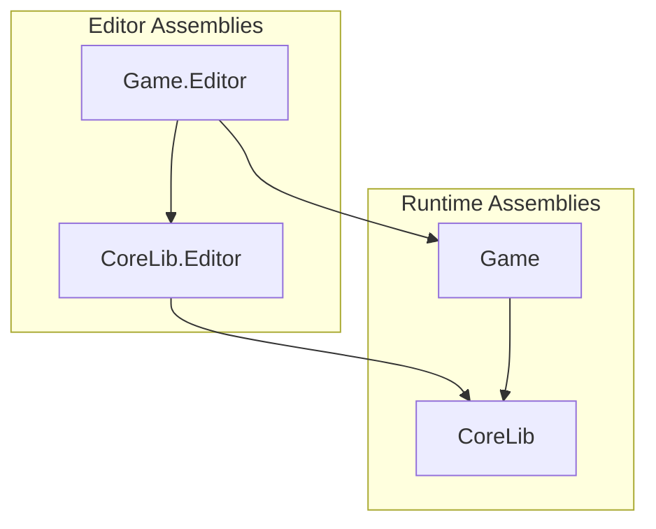
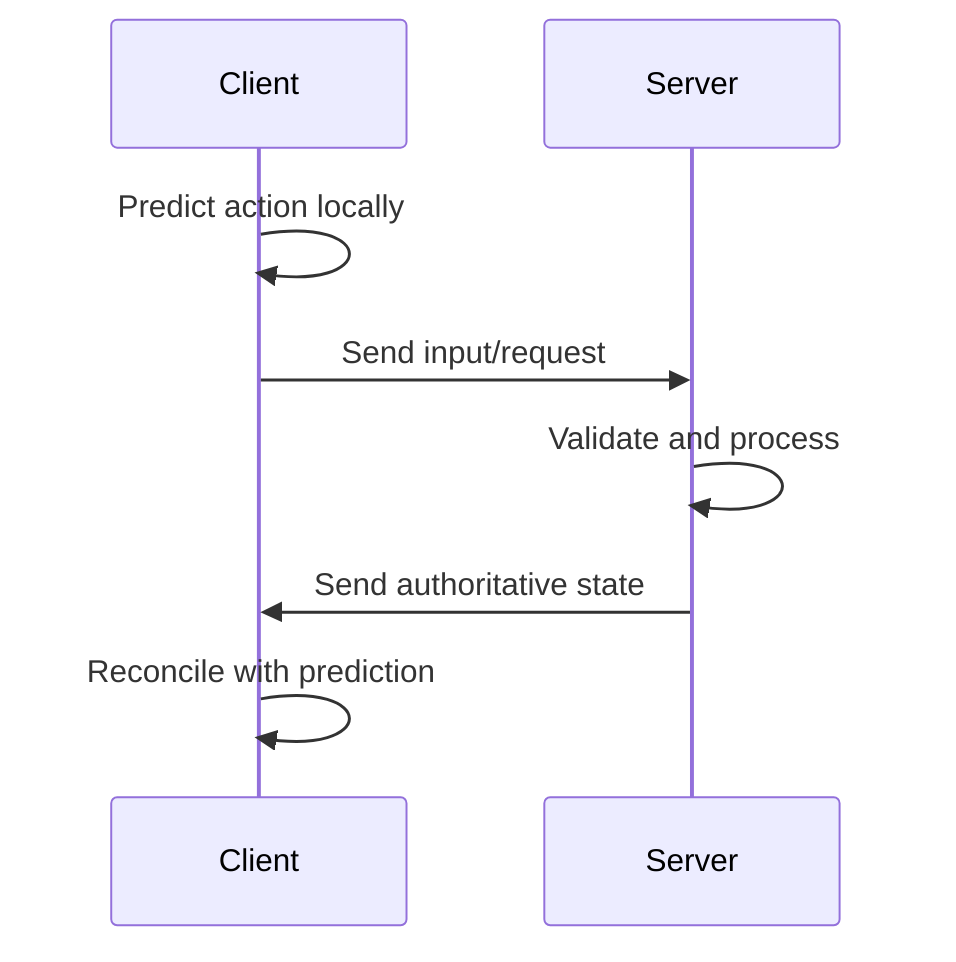
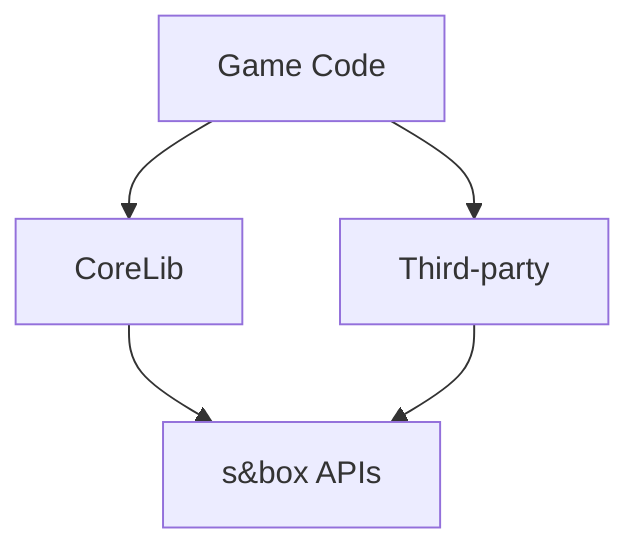

<Info>
This page documents the **architectural patterns and conventions** we follow when structuring systems and projects.
</Info>

---

## Assembly organisation

### Runtime vs Editor separation



<CardGroup cols={2}>
  <Card title="Runtime assemblies" icon="play">
    - Contain gameplay and system logic
    - No editor dependencies
    - Deployed to clients and servers
  </Card>
  <Card title="Editor assemblies" icon="window">
    - Contain tooling and inspectors
    - Can reference runtime assemblies
    - Only used in development
  </Card>
</CardGroup>

<Warning>
Runtime code must **never** reference editor assemblies. This separation must be enforced by assembly definitions.
</Warning>

---

## Namespace conventions

<Tip>
Namespaces **must** match folder structure exactly.
</Tip>

```
CoreLib/
├── Input/
│   ├── InputContext.cs           // CoreLib.Input
│   ├── InputBinding.cs           // CoreLib.Input
│   └── Editor/
│       └── InputEditor.cs        // CoreLib.Input.Editor
├── Interactions/
│   ├── InteractionProvider.cs    // CoreLib.Interactions
│   └── Editor/
│       └── InteractionEditor.cs  // CoreLib.Interactions.Editor
```

| Rule | Example |
|------|---------|
| Match folders | `CoreLib/Input/` → `CoreLib.Input` |
| Editor suffix | `CoreLib/Input/Editor/` → `CoreLib.Input.Editor` |
| No shortcuts | Don't flatten or skip levels |

---

## System architecture patterns

### The standard system shape

Most CoreLib systems follow this pattern:

<Tabs>
  <Tab title="Data layer">
    **Definitions and configuration**

    ```csharp
    // Authored in editor, validated at authoring time
    public class InteractionDefinition : Definition
    {
        public string Id { get; set; }
        public float Range { get; set; }
        public InteractionType Type { get; set; }
    }
    ```

    - Serialisable data classes
    - No behaviour logic
    - Validated before use
  </Tab>
  <Tab title="Runtime layer">
    **Behaviour and execution**

    ```csharp
    // Consumes validated data, handles runtime logic
    public class InteractionSystem
    {
        public void ProcessInteraction(InteractionDefinition def, Player player)
        {
            // Runtime behaviour here
        }
    }
    ```

    - Consumes definition data
    - Handles runtime logic
    - Server-authoritative where applicable
  </Tab>
  <Tab title="Editor layer">
    **Authoring and tooling**

    ```csharp
    // Provides UI for creating and editing data
    public class InteractionEditor : WorkbenchApp
    {
        // Editor tooling here
    }
    ```

    - Visual authoring
    - Real-time validation
    - Debug and inspection tools
  </Tab>
</Tabs>

---

## Server-client architecture

<CardGroup cols={2}>
  <Card title="Server authority" icon="server" color="#16A34A">
    - Owns game state
    - Validates all actions
    - Makes authoritative decisions
    - Sends state to clients
  </Card>
  <Card title="Client responsibility" icon="display" color="#3B82F6">
    - Prediction for responsiveness
    - Presentation and effects
    - Input collection
    - State interpolation
  </Card>
</CardGroup>

### Typical flow



<Note>
The client may predict outcomes for responsiveness, but the server is always the source of truth.
</Note>

---

## Component patterns

### Prefer composition

<Steps>
  <Step title="Define interfaces for capabilities">
    ```csharp
    public interface IDamageable
    {
        void TakeDamage(float amount, DamageInfo info);
    }
    ```
  </Step>
  <Step title="Implement on components">
    ```csharp
    public class HealthComponent : Component, IDamageable
    {
        public void TakeDamage(float amount, DamageInfo info)
        {
            // Implementation
        }
    }
    ```
  </Step>
  <Step title="Query for capabilities">
    ```csharp
    if (target.Components.TryGet<IDamageable>(out var damageable))
    {
        damageable.TakeDamage(10f, damageInfo);
    }
    ```
  </Step>
</Steps>

### When inheritance is acceptable

<Accordion title="Acceptable inheritance cases">
  - True "is-a" relationships (e.g., `Pistol : Weapon`)
  - Framework requirements (e.g., `Component` base class)
  - Template method patterns with clear override points

  Even in these cases, prefer shallow hierarchies (max 2-3 levels).
</Accordion>

---

## Dependency management

<Warning>
Circular dependencies between systems are not allowed.
</Warning>

### Dependency direction



| Layer | Can depend on |
|-------|--------------|
| Game code | CoreLib, Third-party, s&box |
| CoreLib | s&box APIs only |
| Third-party | s&box APIs only |

### Breaking circular dependencies

<Tabs>
  <Tab title="Events">
    Use events to invert dependencies:

    ```csharp
    // System A raises event
    public event Action<DamageEvent> OnDamageDealt;

    // System B subscribes without direct reference
    damageSystem.OnDamageDealt += HandleDamage;
    ```
  </Tab>
  <Tab title="Interfaces">
    Define interfaces at the lower level:

    ```csharp
    // In CoreLib
    public interface IScoreProvider
    {
        int GetScore(Player player);
    }

    // In Game code, implement and register
    public class GameScoreProvider : IScoreProvider { }
    ```
  </Tab>
</Tabs>

---

## Resource management

### Definition loading

<Steps>
  <Step title="Definitions authored in editor">
    Data is created and validated using editor tools
  </Step>
  <Step title="Definitions loaded at startup">
    All definitions loaded and indexed once
  </Step>
  <Step title="Runtime queries by ID">
    Systems look up definitions by stable ID

    ```csharp
    var weaponDef = Definitions.Get<WeaponDefinition>("weapon_pistol");
    ```
  </Step>
</Steps>

### Asset references

<CardGroup cols={2}>
  <Card title="Do" icon="check" color="#16A34A">
    - Reference assets through definitions
    - Validate references at authoring time
    - Use stable IDs for lookups
  </Card>
  <Card title="Don't" icon="xmark" color="#EF4444">
    - Hardcode asset paths in code
    - Load assets at arbitrary times
    - Store direct asset references in runtime state
  </Card>
</CardGroup>

---

## Error handling patterns

### Authoring time vs runtime

<Tabs>
  <Tab title="Authoring time">
    **Catch everything possible**

    ```csharp
    // In validation
    if (string.IsNullOrEmpty(definition.Id))
    {
        context.Error("Definition must have an ID");
    }
    ```

    - Validate aggressively
    - Show clear error messages
    - Prevent saving invalid data
  </Tab>
  <Tab title="Runtime">
    **Handle gracefully, log clearly**

    ```csharp
    // At runtime
    if (!TryGetDefinition(id, out var def))
    {
        Log.Warning($"Definition not found: {id}");
        return default;
    }
    ```

    - Fail gracefully where possible
    - Log with context
    - Don't crash for recoverable issues
  </Tab>
</Tabs>

<Note>
The goal is to catch all errors at authoring time so runtime can assume data is valid.
</Note>

---

## Summary

<CardGroup cols={2}>
  <Card title="Separation" icon="object-ungroup">
    Keep runtime, editor, and data concerns distinct
  </Card>
  <Card title="Direction" icon="arrow-down">
    Dependencies flow downward, never up or circular
  </Card>
  <Card title="Validation" icon="shield">
    Catch errors early, at authoring time
  </Card>
  <Card title="Authority" icon="server">
    Server owns truth, clients handle presentation
  </Card>
</CardGroup>

---

## Related pages

<CardGroup cols={2}>
  <Card title="Design Guidelines" icon="compass-drafting" href="/handbook/design-guidelines">
    Higher-level design principles
  </Card>
  <Card title="Folder Structure" icon="folder-tree" href="/reference/folder-structure">
    Detailed project layout conventions
  </Card>
</CardGroup>
