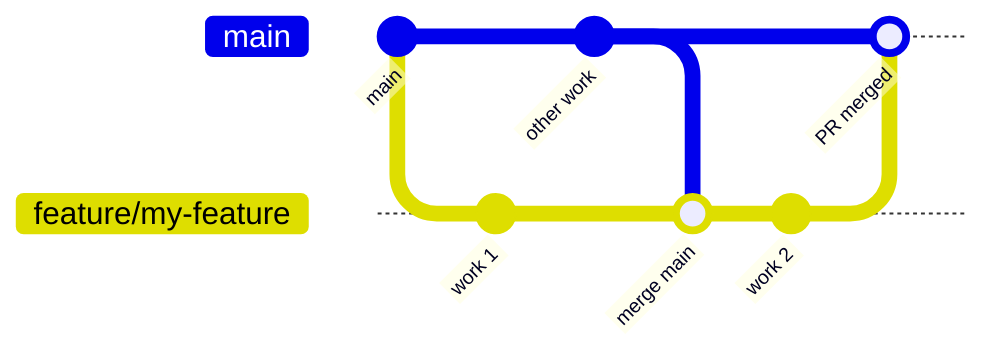
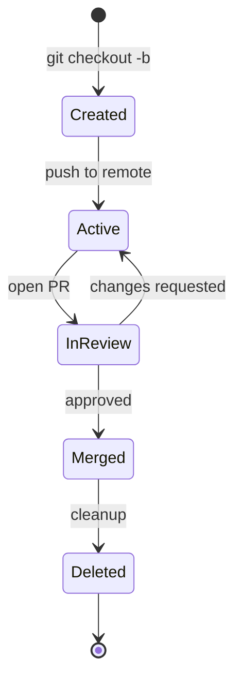

<Info>
This page describes our Git branching strategy. Consistency here reduces friction and makes collaboration smoother.
</Info>

---

## Branch types

<Tabs>
  <Tab title="main">
    **The primary branch**

    - Always deployable
    - Protected (requires PR)
    - Source of truth for releases

    ```
    main
    ```
  </Tab>
  <Tab title="feature/*">
    **New features and enhancements**

    - Branch from `main`
    - Merge back via PR
    - Delete after merge

    ```
    feature/enhanced-input-rebinding
    feature/interaction-ui-prompts
    ```
  </Tab>
  <Tab title="fix/*">
    **Bug fixes**

    - Branch from `main`
    - Focused on specific issues
    - Merge back via PR

    ```
    fix/input-context-leak
    fix/interaction-range-calculation
    ```
  </Tab>
  <Tab title="refactor/*">
    **Code improvements without behaviour change**

    - Branch from `main`
    - No functional changes
    - Merge back via PR

    ```
    refactor/input-system-cleanup
    refactor/extract-validation-logic
    ```
  </Tab>
</Tabs>

---

## Branch naming

<CardGroup cols={2}>
  <Card title="Format" icon="tag">
    `type/short-description`

    - Lowercase
    - Hyphens for spaces
    - Descriptive but concise
  </Card>
  <Card title="Examples" icon="list">
    - `feature/weapon-switching`
    - `fix/player-spawn-position`
    - `refactor/interaction-providers`
  </Card>
</CardGroup>

<Warning>
Avoid vague names like `feature/update`, `fix/stuff`, or `feature/johns-branch`.
</Warning>

---

## Workflow

### Creating a branch

<Steps>
  <Step title="Start from main">
    Always branch from an up-to-date `main`

    ```bash
    git checkout main
    git pull origin main
    ```
  </Step>
  <Step title="Create the branch">
    Use the appropriate prefix

    ```bash
    git checkout -b feature/my-feature
    ```
  </Step>
  <Step title="Work and commit">
    Make focused, well-described commits
  </Step>
  <Step title="Push and create PR">
    Push to remote and open a pull request

    ```bash
    git push -u origin feature/my-feature
    ```
  </Step>
</Steps>

### Keeping up to date



<Tabs>
  <Tab title="Merge (preferred)">
    ```bash
    git checkout feature/my-feature
    git fetch origin
    git merge origin/main
    ```

    - Preserves history
    - Easier to understand
    - Recommended for most cases
  </Tab>
  <Tab title="Rebase (clean history)">
    ```bash
    git checkout feature/my-feature
    git fetch origin
    git rebase origin/main
    ```

    - Cleaner linear history
    - Use only for local-only branches
    - Never rebase shared branches
  </Tab>
</Tabs>

---

## Branch lifecycle



<CardGroup cols={2}>
  <Card title="Do" icon="check" color="#16A34A">
    - Delete branches after merge
    - Keep branches focused
    - Update from main regularly
  </Card>
  <Card title="Don't" icon="xmark" color="#EF4444">
    - Let branches get stale
    - Mix unrelated changes
    - Keep long-lived feature branches
  </Card>
</CardGroup>

---

## Special situations

<AccordionGroup>
  <Accordion title="Hotfixes" icon="fire">
    For urgent production fixes:

    1. Branch from `main`: `fix/critical-issue`
    2. Fix the issue
    3. Fast-track PR review
    4. Merge to `main`
    5. Deploy immediately
  </Accordion>

  <Accordion title="Large features" icon="diagram-project">
    For features that take multiple PRs:

    1. Consider breaking into smaller, independent pieces
    2. If necessary, use a feature branch that others branch from
    3. Merge sub-branches into feature branch
    4. Merge feature branch into `main` when complete
  </Accordion>

  <Accordion title="Experiments" icon="flask">
    For exploratory work:

    - Use `experiment/description` prefix
    - May never be merged
    - Document findings even if abandoned
  </Accordion>
</AccordionGroup>

---

## Protected branches

### main branch rules

| Rule | Setting |
|------|---------|
| Require PR | Yes |
| Require approvals | 1+ |
| Require up-to-date | Yes |
| Allow force push | No |
| Allow deletion | No |

<Note>
These protections ensure `main` stays stable and changes are reviewed.
</Note>

---

## Commands reference

| Action | Command |
|--------|---------|
| Create branch | `git checkout -b type/name` |
| Push new branch | `git push -u origin type/name` |
| Update from main | `git merge origin/main` |
| Delete local branch | `git branch -d type/name` |
| Delete remote branch | `git push origin --delete type/name` |

---

## Related pages

<CardGroup cols={2}>
  <Card title="Commits and PRs" icon="code-commit" href="/handbook/commits-and-prs">
    How to write commits and handle pull requests
  </Card>
  <Card title="Releases" icon="rocket" href="/handbook/releases">
    How branches relate to releases
  </Card>
</CardGroup>
