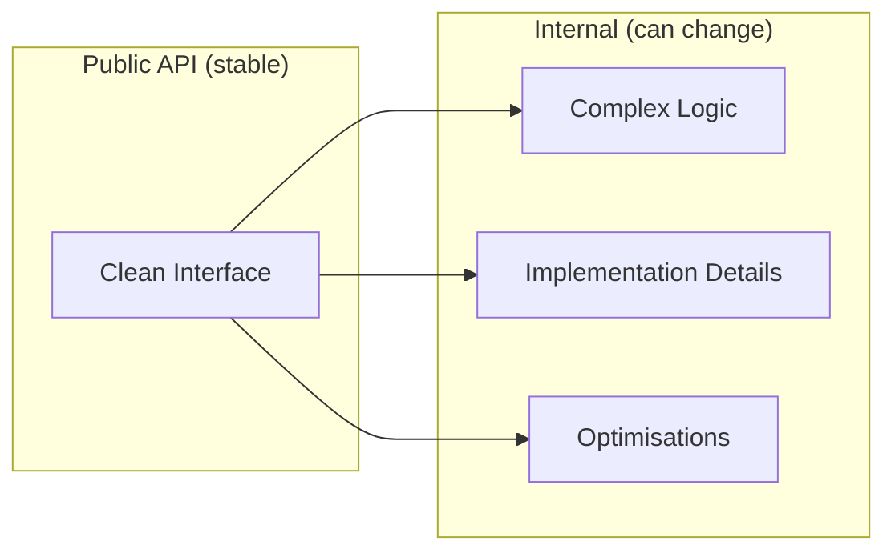

<Info>
These guidelines describe **how we approach system and API design**. They sit between the high-level Engineering Pillars and the specific Coding Standards.
</Info>

Use these when designing new systems, refactoring existing ones, or reviewing architectural changes.

---

## Design from the outside in

<Tip>
Design starts with **usage**, not implementation.
</Tip>

Before building a system, ask:

<CardGroup cols={3}>
  <Card title="Usage feel" icon="hand-pointer">
    What should using this feel like?
  </Card>
  <Card title="Simple path" icon="route">
    What does the simplest valid usage look like?
  </Card>
  <Card title="Error prevention" icon="shield">
    What mistakes should be hard or impossible?
  </Card>
</CardGroup>

APIs should be shaped by how they are consumed, not by how they are implemented internally.

---

## Prefer narrow, explicit APIs

Exposed APIs should:

| Property | Description |
|----------|-------------|
| **Single purpose** | Do one thing well |
| **Explicit intent** | Require clear, intentional usage |
| **Unambiguous** | Avoid behaviour that varies by context |

<Warning>
**Avoid:**
- "God objects" that do everything
- Large configuration surfaces
- Optional flags that radically change behaviour

If an API needs many switches to be usable, it's doing too much.
</Warning>

---

## Hide complexity behind stable boundaries



Internal complexity is acceptable if it is:
- Well-contained
- Not exposed to consumers
- Justified by simpler usage

<Note>
External-facing APIs should change slowly and intentionally. Internal implementations are free to evolve as needed.
</Note>

---

## Separate authoring, runtime, and validation

<Tabs>
  <Tab title="Authoring">
    **Data creation and editing**

    - Happens in the editor
    - Produces configuration and content
    - Should have good tooling
  </Tab>
  <Tab title="Validation">
    **Detecting invalid or inconsistent state**

    - Runs at authoring time
    - Catches errors before runtime
    - Provides clear feedback
  </Tab>
  <Tab title="Runtime">
    **Execution of behaviour**

    - Consumes validated data
    - Focuses on performance
    - Assumes data is correct
  </Tab>
</Tabs>

<Warning>
Mixing these concerns leads to fragile systems and poor tooling. Keep them distinct.
</Warning>

---

## Prefer composition over inheritance

<CardGroup cols={2}>
  <Card title="Composition" icon="check" color="#16A34A">
    - Easier to reason about
    - Easier to extend
    - Less tightly coupled
    - Flexible at runtime
  </Card>
  <Card title="Inheritance" icon="warning" color="#EAB308">
    - Acceptable for true "is-a" relationships
    - Should not be used for code reuse
    - Creates tight coupling
    - Hard to change later
  </Card>
</CardGroup>

---

## Avoid premature generalisation

<Steps>
  <Step title="Solve the concrete problem">
    Build what you need now, not what you might need later
  </Step>
  <Step title="Wait for patterns to emerge">
    Let the code tell you what wants to be abstracted
  </Step>
  <Step title="Generalise when proven">
    Once a pattern appears multiple times, formalise it
  </Step>
</Steps>

<Note>
Abstraction should be earned. Resist "frameworks" built for hypothetical future needs.
</Note>

---

## Design for observability

A system is incomplete if it cannot be inspected.

<CardGroup cols={2}>
  <Card title="Debug views" icon="eye">
    Visual representation of system state
  </Card>
  <Card title="Logging hooks" icon="file-lines">
    Structured logging at key points
  </Card>
  <Card title="Validation output" icon="circle-check">
    Clear feedback on data issues
  </Card>
  <Card title="Editor affordances" icon="window">
    Tooling for inspection and testing
  </Card>
</CardGroup>

<Tip>
If you can't easily tell *what a system is doing*, it's too opaque.
</Tip>

---

## Make invalid states unrepresentable

<Tabs>
  <Tab title="Ideal">
    Structure data so invalid combinations **cannot exist**:

    ```csharp
    // Good: State is always valid
    public enum ConnectionState { Disconnected, Connecting, Connected }
    ```
  </Tab>
  <Tab title="Acceptable">
    Validate aggressively at authoring time:

    ```csharp
    // Acceptable: Validate early
    public void SetConnection(string host, int port)
    {
        if (string.IsNullOrEmpty(host))
            throw new ArgumentException("Host required");
    }
    ```
  </Tab>
  <Tab title="Avoid">
    Relying on runtime error handling:

    ```csharp
    // Bad: Error only at usage time
    public void Connect()
    {
        if (_host == null) // Too late!
            Log.Error("No host configured");
    }
    ```
  </Tab>
</Tabs>

---

## Prefer clarity over cleverness

<Warning>
Clever solutions tend to age poorly.
</Warning>

| Prefer | Avoid |
|--------|-------|
| Readable control flow | Nested ternaries |
| Explicit naming | Abbreviations |
| Obvious data flow | Hidden side effects |
| Straightforward logic | "Elegant" one-liners |

<Tip>
If a design requires extensive explanation, it should probably be simplified.
</Tip>

---

## Applying these guidelines

These guidelines should be used to:
- Evaluate new system designs
- Guide refactors
- Review API changes

<Note>
They are not strict rules. When deviating, the reasoning should be clear and intentional.
</Note>

---

## Related pages

<CardGroup cols={2}>
  <Card title="Engineering Pillars" icon="columns" href="/handbook/pillars">
    The high-level values these guidelines support
  </Card>
  <Card title="Code Style" icon="code" href="/handbook/code-style">
    Specific conventions for writing code
  </Card>
  <Card title="Architecture Conventions" icon="sitemap" href="/handbook/architecture-conventions">
    Structural patterns we follow
  </Card>
</CardGroup>
