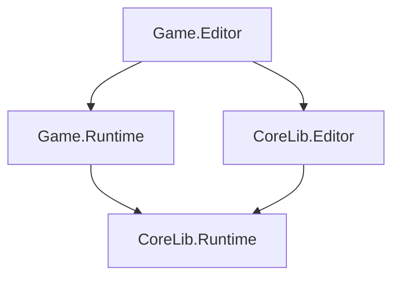

<Info>
This page documents the standard folder structure for Northbound projects.
</Info>

---

## CoreLib structure

```
CoreLib/
├── Runtime/
│   ├── Input/
│   │   ├── InputSystem.cs
│   │   ├── InputAction.cs
│   │   ├── InputBinding.cs
│   │   └── InputContext.cs
│   ├── Interactions/
│   │   ├── InteractionSystem.cs
│   │   ├── InteractionProvider.cs
│   │   └── IInteractable.cs
│   ├── State/
│   │   ├── SharedState.cs
│   │   ├── Events.cs
│   │   └── EventBus.cs
│   ├── Definitions/
│   │   ├── Definition.cs
│   │   ├── DefinitionRegistry.cs
│   │   └── Validation/
│   └── Shared/
│       └── Constants.cs
├── Editor/
│   ├── Workbench/
│   │   ├── WorkbenchApp.cs
│   │   ├── Dock.cs
│   │   └── WorkingCopy.cs
│   ├── Tools/
│   │   ├── InputEditor/
│   │   └── InteractionEditor/
│   └── Docks/
│       ├── HierarchyDock.cs
│       └── InspectorDock.cs
└── CoreLib.asmdef
```

---

## Game project structure

```
MyGame/
├── code/
│   ├── Runtime/
│   │   ├── Game.Runtime.asmdef
│   │   ├── GameManager.cs
│   │   ├── Player/
│   │   │   ├── PlayerController.cs
│   │   │   └── PlayerState.cs
│   │   ├── Weapons/
│   │   │   ├── WeaponSystem.cs
│   │   │   └── WeaponDefinition.cs
│   │   └── UI/
│   │       └── HUD.cs
│   └── Editor/
│       ├── Game.Editor.asmdef
│       └── Tools/
│           └── WeaponEditor.cs
├── definitions/
│   ├── weapons/
│   │   ├── pistol.json
│   │   └── rifle.json
│   ├── items/
│   │   └── health_pack.json
│   └── config/
│       └── game_settings.json
├── assets/
│   ├── models/
│   ├── textures/
│   ├── sounds/
│   └── ui/
└── .addon
```

---

## Key conventions

### Code organization

<Tabs>
  <Tab title="By feature">
    Group code by what it does:

    ```
    code/
    ├── Player/
    │   ├── PlayerController.cs
    │   ├── PlayerMovement.cs
    │   └── PlayerInventory.cs
    └── Weapons/
        ├── WeaponSystem.cs
        └── WeaponDefinition.cs
    ```

    **Use for:** Game-specific code
  </Tab>
  <Tab title="By layer">
    Group code by architecture layer:

    ```
    code/
    ├── Systems/
    │   ├── InputSystem.cs
    │   └── InteractionSystem.cs
    ├── Components/
    │   ├── PlayerController.cs
    │   └── InteractionProvider.cs
    └── Data/
        ├── WeaponDefinition.cs
        └── ItemDefinition.cs
    ```

    **Use for:** Shared library code
  </Tab>
</Tabs>

### Runtime vs Editor

```
code/
├── Runtime/            # Deploys to game
│   └── Game.Runtime.asmdef
└── Editor/             # Development only
    └── Game.Editor.asmdef
```

<Warning>
Runtime code must never reference Editor assemblies.
</Warning>

---

## Definitions folder

```
definitions/
├── weapons/
│   ├── pistols/
│   │   ├── pistol_basic.json
│   │   └── pistol_silenced.json
│   └── rifles/
│       ├── rifle_assault.json
│       └── rifle_sniper.json
├── items/
│   ├── consumables/
│   ├── equipment/
│   └── resources/
├── abilities/
├── npcs/
└── config/
    ├── game_settings.json
    └── balance.json
```

### Organization principles

| Principle | Example |
|-----------|---------|
| Group by type | `weapons/`, `items/` |
| Subgroup by category | `weapons/pistols/` |
| Flat when small | Don't over-nest |
| Config separate | `config/` for settings |

---

## Assets folder

```
assets/
├── models/
│   ├── weapons/
│   ├── characters/
│   └── environment/
├── textures/
│   ├── weapons/
│   └── ui/
├── sounds/
│   ├── weapons/
│   ├── ambient/
│   └── ui/
├── particles/
└── ui/
    ├── hud/
    └── menus/
```

---

## Namespace mapping

Namespaces must match folder structure:

| Folder | Namespace |
|--------|-----------|
| `CoreLib/Runtime/Input/` | `CoreLib.Input` |
| `CoreLib/Editor/Tools/` | `CoreLib.Editor.Tools` |
| `MyGame/code/Runtime/Player/` | `MyGame.Player` |
| `MyGame/code/Editor/Tools/` | `MyGame.Editor.Tools` |

```csharp
// File: CoreLib/Runtime/Input/InputSystem.cs
namespace CoreLib.Input
{
    public class InputSystem { }
}
```

---

## Assembly definitions

### CoreLib assemblies

```
CoreLib.Runtime.asmdef    // Runtime systems
CoreLib.Editor.asmdef     // Editor tooling
```

### Game assemblies

```
Game.Runtime.asmdef       // Game code
Game.Editor.asmdef        // Game editor tools
```

### Reference pattern



---

## File naming

| Element | Pattern | Example |
|---------|---------|---------|
| C# file | Match type | `WeaponDefinition.cs` |
| Definition | `{id}.json` | `weapon_pistol.json` |
| Model | snake_case | `weapon_pistol.vmdl` |
| Texture | snake_case | `weapon_pistol_diffuse.png` |
| Sound | snake_case | `weapon_fire_01.vsnd` |

---

## Creating new folders

<Steps>
  <Step title="Check if it exists">
    Look for existing similar folders
  </Step>
  <Step title="Follow conventions">
    Match the patterns documented here
  </Step>
  <Step title="Update namespace">
    Create matching namespace
  </Step>
  <Step title="Consider assembly">
    Does it need its own assembly?
  </Step>
</Steps>

---

## Related pages

<CardGroup cols={2}>
  <Card title="Naming Conventions" icon="tag" href="/handbook/naming">
    How to name files and code
  </Card>
  <Card title="Architecture" icon="sitemap" href="/handbook/architecture-conventions">
    Structural patterns
  </Card>
</CardGroup>
