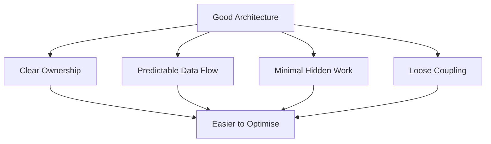

<Info>
This document describes **how we think about performance**, not a checklist of optimisations.
</Info>

Performance work is most effective when it is:
- Intentional
- Measured
- Aligned with real constraints

---

## Correctness and clarity first

<Steps>
  <Step title="Make it correct">
    The system must work properly before anything else
  </Step>
  <Step title="Make it clear">
    The code must be understandable and maintainable
  </Step>
  <Step title="Make it observable">
    You must be able to measure and debug it
  </Step>
  <Step title="Make it fast">
    Only then optimise, and only where needed
  </Step>
</Steps>

<Warning>
Optimising unclear or poorly structured code tends to lock in bad designs and makes future changes harder.
</Warning>

---

## Measure before optimising

<CardGroup cols={2}>
  <Card title="Identify the bottleneck" icon="magnifying-glass">
    Don't guess — profile and find the actual slow path
  </Card>
  <Card title="Confirm it's repeatable" icon="rotate">
    Ensure the problem isn't a one-off or edge case
  </Card>
  <Card title="Understand the impact" icon="chart-line">
    Know how this affects gameplay or user experience
  </Card>
  <Card title="Set a target" icon="bullseye">
    Define what "fast enough" means for this case
  </Card>
</CardGroup>

<Note>
If something is not measurably slow, it is probably not worth optimising yet.
</Note>

---

## Optimise where it matters

Not all code paths are equal:

| Focus performance effort on | Don't optimise aggressively |
|-----------------------------|-----------------------------|
| Hot runtime paths | Cold startup code |
| Per-frame logic | One-time setup |
| Player count scaling | Editor-only code |
| World complexity scaling | Debug utilities |

<Tip>
A 10% improvement in code that runs every frame is worth more than a 90% improvement in code that runs once at startup.
</Tip>

---

## Performance as a system concern

Performance is often a consequence of **architecture**, not individual lines of code.

<Note>
Well-designed systems are easier to optimise when needed. Fix the architecture before micro-optimising.
</Note>

---

## Tooling and observability

Performance problems are easier to solve when systems are observable.

<Tabs>
  <Tab title="Runtime">
    - Debug visualisation
    - Performance counters
    - Frame timing breakdown
    - Memory tracking
  </Tab>
  <Tab title="Editor">
    - Profiling integration
    - Validation performance
    - Asset pipeline metrics
    - Tool responsiveness
  </Tab>
</Tabs>

---

## Memory and allocation awareness

<Warning>
Unnecessary allocation in hot paths should be avoided.
</Warning>

Be mindful of:

| Issue | Example |
|-------|---------|
| Per-frame allocations | Creating lists every update |
| Large object churn | Frequently creating/destroying large objects |
| Hidden allocations | LINQ in hot paths, string concatenation |
| Boxing | Value types going through object |

<Note>
Allocation avoidance should not come at the cost of readability unless profiling demonstrates a real issue.
</Note>

---

## Server performance is critical

<CardGroup cols={2}>
  <Card title="Gameplay correctness" icon="check" color="#16A34A">
    Server performance directly affects game state accuracy
  </Card>
  <Card title="Scalability" icon="users" color="#16A34A">
    Player count is limited by server capacity
  </Card>
  <Card title="Player experience" icon="face-smile" color="#16A34A">
    Lag and desync ruin gameplay
  </Card>
  <Card title="Compounding issues" icon="warning" color="#EAB308">
    Server problems affect all clients simultaneously
  </Card>
</CardGroup>

Server-side systems should be:
- Predictable
- Authoritative
- Resistant to misuse

<Warning>
Client-side performance issues are often recoverable; server-side issues compound quickly.
</Warning>

---

## Optimisation is iterative

<Steps>
  <Step title="Measure baseline">
    Know where you're starting from
  </Step>
  <Step title="Make one change">
    Isolate variables for clear cause-and-effect
  </Step>
  <Step title="Measure again">
    Verify the improvement
  </Step>
  <Step title="Validate correctness">
    Ensure you didn't break anything
  </Step>
  <Step title="Repeat if needed">
    Continue until you hit your target
  </Step>
</Steps>

<Note>
Each optimisation should be understandable and reversible. Avoid large, risky rewrites unless clearly justified.
</Note>

---

## Trade-offs are explicit

Every performance optimisation has a cost:

| Gain | Potential cost |
|------|----------------|
| Speed | Readability |
| Memory efficiency | Code complexity |
| Cache friendliness | Flexibility |
| Parallelism | Debugging difficulty |

<Tip>
When making trade-offs, be explicit about what is being gained and lost. Undocumented trade-offs become future maintenance problems.
</Tip>

---

## Summary

At Northbound, performance is treated as:

<CardGroup cols={3}>
  <Card title="A design concern" icon="compass-drafting">
    Architecture enables performance
  </Card>
  <Card title="A measurement problem" icon="ruler">
    Data drives decisions
  </Card>
  <Card title="An ongoing process" icon="rotate">
    Continuous improvement
  </Card>
</CardGroup>

<Note>
We aim to build systems that are *naturally performant*, and only reach for aggressive optimisation when the data supports it.

If performance work feels urgent or unclear, that's usually a sign the system needs better structure or observability first.
</Note>
