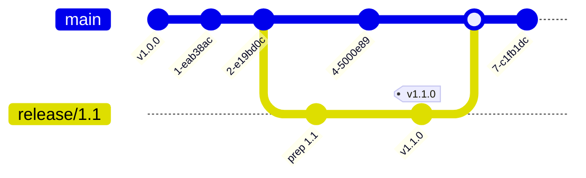
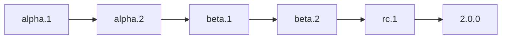

<Info>
This page describes how we handle releases for CoreLib and game projects.
</Info>

---

## Release philosophy

<CardGroup cols={3}>
  <Card title="Stable main" icon="shield">
    Main branch is always releasable
  </Card>
  <Card title="Versioned" icon="tag">
    Releases have clear version numbers
  </Card>
  <Card title="Documented" icon="file-lines">
    Changes are tracked and communicated
  </Card>
</CardGroup>

---

## Versioning

We use [Semantic Versioning](https://semver.org/) (SemVer):

```
MAJOR.MINOR.PATCH
```

<Tabs>
  <Tab title="MAJOR">
    **Breaking changes**

    Increment when making incompatible API changes.

    ```
    1.0.0 → 2.0.0
    ```

    - Renamed public APIs
    - Removed functionality
    - Changed behaviour
  </Tab>
  <Tab title="MINOR">
    **New features**

    Increment when adding backwards-compatible functionality.

    ```
    1.0.0 → 1.1.0
    ```

    - New systems
    - New APIs
    - New editor tools
  </Tab>
  <Tab title="PATCH">
    **Bug fixes**

    Increment for backwards-compatible bug fixes.

    ```
    1.0.0 → 1.0.1
    ```

    - Bug fixes
    - Performance improvements
    - Documentation updates
  </Tab>
</Tabs>

---

## Release process

### CoreLib releases

<Steps>
  <Step title="Prepare changelog">
    Document all changes since last release

    ```markdown
    ## [1.2.0] - 2024-01-15

    ### Added
    - Input rebinding UI system
    - Interaction validation rules

    ### Changed
    - Improved input context switching performance

    ### Fixed
    - Memory leak in interaction provider
    ```
  </Step>
  <Step title="Update version">
    Bump version number in appropriate files
  </Step>
  <Step title="Create release PR">
    PR titled `release: v1.2.0` with changelog updates
  </Step>
  <Step title="Merge and tag">
    After approval, merge and create a Git tag

    ```bash
    git tag v1.2.0
    git push origin v1.2.0
    ```
  </Step>
  <Step title="Notify dependents">
    Communicate release to game projects
  </Step>
</Steps>

### Game releases

<Steps>
  <Step title="Feature freeze">
    Stop adding features, focus on stability
  </Step>
  <Step title="Testing period">
    Internal testing and bug fixing
  </Step>
  <Step title="Version bump">
    Update version and create changelog
  </Step>
  <Step title="Release build">
    Create release build from main
  </Step>
  <Step title="Deploy">
    Deploy to appropriate environment
  </Step>
</Steps>

---

## Changelog format

We follow [Keep a Changelog](https://keepachangelog.com/) format:

```markdown
# Changelog

## [Unreleased]

### Added
- New features

### Changed
- Changes to existing functionality

### Deprecated
- Features to be removed

### Removed
- Removed features

### Fixed
- Bug fixes

### Security
- Security fixes
```

<Tip>
Write changelog entries as you make changes, not all at once before release.
</Tip>

---

## Release branches



<Tabs>
  <Tab title="Standard release">
    Most releases come directly from main:

    1. Ensure main is stable
    2. Tag the release commit
    3. No release branch needed
  </Tab>
  <Tab title="Release branch">
    Use when stabilisation is needed:

    1. Create `release/X.Y` from main
    2. Only bug fixes allowed
    3. Merge back to main after release
  </Tab>
</Tabs>

---

## Hotfix releases

<Warning>
Hotfixes are for critical issues only. Use standard releases for normal bug fixes.
</Warning>

<Steps>
  <Step title="Identify critical issue">
    Confirm the issue is severe enough for a hotfix
  </Step>
  <Step title="Create hotfix branch">
    Branch from the release tag

    ```bash
    git checkout v1.2.0
    git checkout -b hotfix/1.2.1
    ```
  </Step>
  <Step title="Fix and test">
    Minimal changes to fix the issue
  </Step>
  <Step title="Release">
    Tag and release the hotfix

    ```bash
    git tag v1.2.1
    ```
  </Step>
  <Step title="Forward port">
    Merge fix into main to prevent regression
  </Step>
</Steps>

---

## Pre-release versions

For testing before stable release:

| Type | Format | Example |
|------|--------|---------|
| Alpha | `X.Y.Z-alpha.N` | `2.0.0-alpha.1` |
| Beta | `X.Y.Z-beta.N` | `2.0.0-beta.3` |
| Release candidate | `X.Y.Z-rc.N` | `2.0.0-rc.1` |



<Note>
Pre-release versions are for internal testing. Don't depend on pre-release CoreLib versions in production game builds.
</Note>

---

## Release checklist

<CardGroup cols={2}>
  <Card title="Before release" icon="clipboard-check">
    - [ ] All tests passing
    - [ ] Changelog updated
    - [ ] Version bumped
    - [ ] Documentation updated
    - [ ] Breaking changes documented
  </Card>
  <Card title="After release" icon="flag-checkered">
    - [ ] Tag created
    - [ ] Release notes published
    - [ ] Dependents notified
    - [ ] Deployment verified
  </Card>
</CardGroup>

---

## Breaking changes

<Warning>
Breaking changes require extra care and communication.
</Warning>

### Handling breaking changes

<Steps>
  <Step title="Document clearly">
    Explain what changed and why

    ```markdown
    ### Breaking Changes

    - `InputContext` renamed to `InputScope`
      - Reason: Better reflects the concept
      - Migration: Find/replace in your codebase
    ```
  </Step>
  <Step title="Provide migration guide">
    Help users update their code
  </Step>
  <Step title="Consider deprecation">
    If possible, deprecate before removing

    ```csharp
    [Obsolete("Use InputScope instead. Will be removed in 3.0.")]
    public class InputContext { }
    ```
  </Step>
  <Step title="Bump major version">
    Breaking changes require a major version bump
  </Step>
</Steps>

---

## Related pages

<CardGroup cols={2}>
  <Card title="Upgrading CoreLib" icon="arrow-up" href="/handbook/upgrading-corelib">
    How to update to new CoreLib versions
  </Card>
  <Card title="Branching Strategy" icon="code-branch" href="/handbook/branching-strategy">
    Branch conventions that support releases
  </Card>
</CardGroup>
