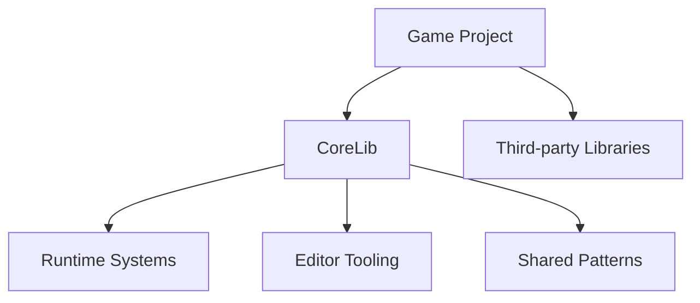

## Northbound at a glance

<Info>
Northbound builds games with a strong emphasis on **shared systems**, **clean architecture**, and **editor-first workflows**.
</Info>

Rather than solving the same problems differently in every project, we invest heavily in:

<CardGroup cols={3}>
  <Card title="Reusable systems" icon="recycle">
    Core functionality that works across all projects
  </Card>
  <Card title="Strong tooling" icon="wrench">
    Editor tools that speed up iteration
  </Card>
  <Card title="Clear conventions" icon="ruler">
    Guardrails that keep code consistent
  </Card>
</CardGroup>

This allows individual games to stay focused on **gameplay and content**, not infrastructure.

---

## CoreLib at the centre

At the heart of our projects is **CoreLib** — a shared library that provides:

<Tabs>
  <Tab title="Runtime Systems">
    - **Enhanced Input** — Contextual, rebindable input handling
    - **Interactions** — Discoverable player-world interactions
    - **State & Events** — Shared state management and event dispatching
    - **Definitions** — Type-safe data authoring with stable IDs
  </Tab>
  <Tab title="Editor Tooling">
    - **Workbench** — Framework for building editor applications
    - **Input Editor** — Visual input configuration
    - **Interaction Editor** — Author and test interactions
    - **Debug Tools** — Runtime inspection and diagnostics
  </Tab>
  <Tab title="Patterns">
    - Server-authoritative architecture
    - Data vs behaviour separation
    - Validation-first authoring
    - Composition over inheritance
  </Tab>
</Tabs>

<Note>
CoreLib is **not** a general-purpose framework. It exists to solve *our* recurring problems in a consistent, maintainable way.
</Note>

### How games use CoreLib

Games are expected to:
- **Depend** on CoreLib
- **Extend** it where appropriate
- **Avoid modifying** it directly unless improving it for all projects

---

## Our design philosophy

<AccordionGroup>
  <Accordion title="Editor-first" icon="window">
    If a system benefits from authoring or inspection, it should have proper editor tooling. We don't tolerate "edit the JSON manually" workflows.
  </Accordion>

  <Accordion title="Clean APIs over convenience" icon="broom">
    We do more work inside the library to keep external usage simple and explicit. Complex internals are acceptable if they enable clean consumption.
  </Accordion>

  <Accordion title="Data vs behaviour" icon="split">
    Data is authored and validated in the editor. Behaviour lives in code. Mixing the two creates systems that are hard to understand and maintain.
  </Accordion>

  <Accordion title="Server-authoritative by default" icon="server">
    Gameplay-affecting systems treat the server as the source of truth. Clients handle prediction and presentation.
  </Accordion>

  <Accordion title="Build on s&box, don't fight it" icon="handshake">
    CoreLib extends and standardises s&box patterns rather than replacing them. We work with the platform, not against it.
  </Accordion>
</AccordionGroup>

These principles are expanded in the [Handbook](/handbook/pillars).

---

## How projects are structured

| Layer | Responsibility | Examples |
|-------|---------------|----------|
| **CoreLib** | Shared systems, editor tooling, architectural conventions | Input, Interactions, Workbench |
| **Third-party** | External libraries that complement CoreLib | GameEvents, utilities |
| **Game code** | Game-specific logic, content, rules, presentation | Weapons, AI, UI |
| **Editor extensions** | Game-specific tooling built on Workbench | Custom inspectors |

This separation keeps projects scalable and makes it easier to move improvements "up" into shared code.

---

## Next steps

<CardGroup cols={2}>
  <Card title="Engineering Pillars" icon="compass" href="/handbook/pillars">
    Understand the values that guide our technical decisions
  </Card>
  <Card title="CoreLib Architecture" icon="diagram-project" href="/corelib/architecture">
    Learn how CoreLib is structured and why
  </Card>
  <Card title="How We Work" icon="people-arrows" href="/home/how-we-work">
    Day-to-day engineering practices at Northbound
  </Card>
  <Card title="Projects" icon="folder-open" href="/home/projects">
    Overview of games and shared libraries
  </Card>
</CardGroup>
