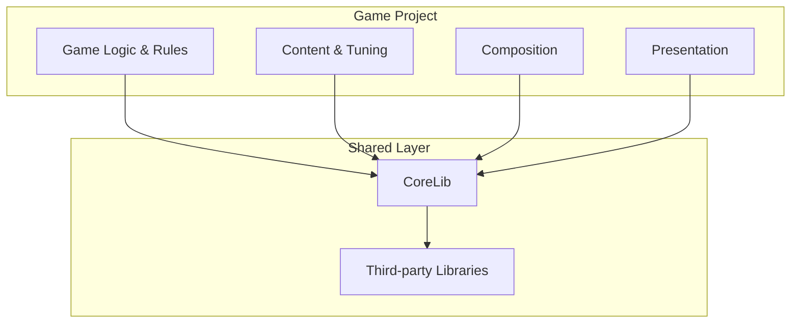

## Overview

<Info>
Northbound builds **games**, supported by a small number of **shared libraries**.
</Info>

Projects are expected to be long-lived and evolve over time. Shared infrastructure exists to:

<CardGroup cols={3}>
  <Card title="Reduce duplication" icon="copy">
    Solve problems once, use everywhere
  </Card>
  <Card title="Enforce consistency" icon="check-double">
    Same patterns across all projects
  </Card>
  <Card title="Enable improvement sharing" icon="share">
    Enhancements benefit all games
  </Card>
</CardGroup>

---

## Shared libraries

### CoreLib

<Card title="CoreLib" icon="cubes" href="/corelib/index">
  The primary shared library used across all Northbound projects
</Card>

CoreLib provides:

<Tabs>
  <Tab title="Runtime">
    - Input handling
    - Interaction system
    - State management
    - Data definitions
  </Tab>
  <Tab title="Editor">
    - Workbench framework
    - Authoring tools
    - Debug utilities
  </Tab>
  <Tab title="Patterns">
    - Architectural conventions
    - Validation workflows
    - Server-authoritative patterns
  </Tab>
</Tabs>

<Note>
CoreLib is versioned and reused across projects rather than forked. Improvements made for one game benefit others.
</Note>

---

## Games

Northbound games are built **on top of CoreLib**, not alongside it.

### Game composition

### What games contain

| Layer | Description |
|-------|-------------|
| **Game logic** | Rules, mechanics, AI |
| **Content** | Assets, tuning data |
| **Composition** | How shared systems are wired together |
| **Presentation** | UI, effects, audio |

### What games should avoid

<Warning>
Games should **not** reimplement:
- Infrastructure
- Generic systems
- Editor tooling that exists in CoreLib

If a game needs broadly useful functionality, that's a sign CoreLib should be extended.
</Warning>

---

## Project boundaries

<Tabs>
  <Tab title="CoreLib owns">
    - Reusable systems
    - Editor tooling
    - Architectural conventions
    - Shared patterns
  </Tab>
  <Tab title="Games own">
    - Gameplay rules
    - Content decisions
    - System composition
    - Game-specific presentation
  </Tab>
</Tabs>

<Tip>
Blurring these boundaries makes future reuse and maintenance harder. Keep them clear.
</Tip>

---

## Adding a new project

<Steps>
  <Step title="Depend on CoreLib">
    Treat CoreLib as a required dependency with optional modules
  </Step>
  <Step title="Follow conventions">
    Project structure should match existing patterns
  </Step>
  <Step title="Document deviations">
    Any intentional differences should be recorded
  </Step>
  <Step title="Invest early">
    Structure and tooling investments pay off quickly as projects grow
  </Step>
</Steps>

---

## Evolving projects

Projects change over time. As requirements evolve:

<AccordionGroup>
  <Accordion title="Identify patterns" icon="magnifying-glass">
    Watch for repeated solutions that could be shared
  </Accordion>
  <Accordion title="Improve, don't copy" icon="arrow-up">
    Enhance shared systems rather than duplicating them
  </Accordion>
  <Accordion title="Update documentation" icon="pen">
    Keep docs in sync with code changes
  </Accordion>
</AccordionGroup>

<Note>
The goal is not to freeze architecture, but to keep it **coherent** as it evolves.
</Note>

---

## Keeping this page current

<Info>
This page intentionally avoids deep detail.
</Info>

If you add:
- A new shared library
- A major new game project
- A significant structural change

...update this page to reflect that reality. It should always provide an accurate high-level snapshot of Northbound's ecosystem.
